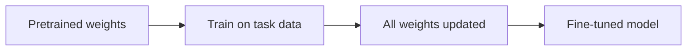
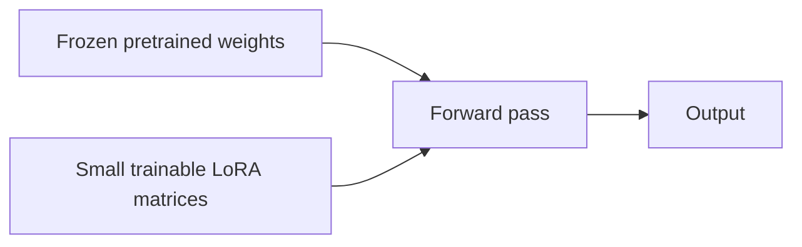
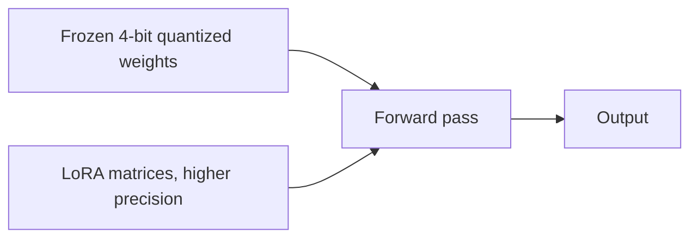

# What is Fine-tuning?

A pretrained model's weights encode everything it learned during training, and fine-tuning updates those weights further on a smaller, task-specific dataset so the model gets better at exactly what a particular application needs, a tone of voice, a domain's vocabulary, a specific output format. This is a different lever than RAG. RAG changes what the model sees at inference time, fine-tuning changes what the model actually knows.

# The shared problem

Every fine-tuning approach exists to answer the same underlying need, adapting a pretrained model's weights to a new task without needing anywhere near the compute or data it took to pretrain the model in the first place.

Many approaches have been built to answer that problem, but three are worth knowing well, full fine-tuning, LoRA, and QLoRA, each trading off cost against how much of the model actually gets updated. LoRA and QLoRA both fall under PEFT, parameter-efficient fine-tuning, the umbrella term for any approach that adapts a model by training far fewer parameters than the full model contains.

One number makes the difference between these three concrete rather than abstract, how much GPU memory it takes to fine-tune the same 7 billion parameter model on a single card. A common consumer or prosumer GPU has 24 GB of VRAM. Whether that 7B model fits at all, and how much room is left over for anything else, is where these three approaches stop looking alike.

# Full Fine-tuning

Full fine-tuning updates every weight in the model during training, the same way pretraining did, just on a smaller, task-specific dataset and usually for far fewer steps. It gives the model the most room to adapt, since nothing is frozen, but it costs as much memory as pretraining a model of that size.



Standard model training is exactly what its conventions follow.

- Every parameter has a gradient computed and an optimizer state stored for it, which for an optimizer like Adam means multiple times the memory of the weights alone.
- A much smaller learning rate is used than pretraining, since the goal is to nudge an already-capable model, not relearn its knowledge from scratch.
- Catastrophic forgetting is a real risk, updating every weight on a narrow dataset can degrade the model's general capabilities outside that narrow task.

The 24 GB budget is where this gets concrete. The 7B model's weights alone take roughly 14 GB in 16-bit precision. Adam then needs its own copy of the gradients, plus two optimizer moments per parameter, on top of that.

```python
model = AutoModelForCausalLM.from_pretrained("base-model")
optimizer = AdamW(model.parameters(), lr=2e-5)

for batch in dataloader:
    loss = model(**batch).loss
    loss.backward()
    optimizer.step()
    optimizer.zero_grad()
```

Weights, gradients, and Adam's two moments together land somewhere around 70 to 100 GB for a 7B model, several times over what a single 24 GB card holds. Full fine-tuning at this size needs multiple GPUs or a lot of gradient offloading before it runs at all, which is exactly the gap PEFT methods like LoRA exist to close.

# LoRA

LoRA, low-rank adaptation, freezes the entire pretrained model and instead trains a small pair of low-rank matrices injected alongside specific weight layers, usually the attention projections. The original weights never change, only these small added matrices do, and they are added back to the frozen weights at inference time.



How small a footprint the trainable parameters can be is the whole point.

- A rank, typically somewhere between 4 and 64, controls the size of the injected matrices. A lower rank means fewer trainable parameters and a smaller adapter file.
- Only the LoRA matrices need gradients and optimizer states, often under one percent of the base model's parameter count, which is what makes training fit on a single consumer GPU.
- The trained adapter is a small file, often tens of megabytes, that can be merged into the base weights or kept separate and swapped at inference time depending on the task.

Setting up LoRA on the attention projections takes only a rank and a target module list.

```python
from peft import LoraConfig, get_peft_model

config = LoraConfig(r=8, lora_alpha=16, target_modules=["q_proj", "v_proj"], lora_dropout=0.05)
model = get_peft_model(base_model, config)
model.print_trainable_parameters()  # a small fraction of the base model
```

The frozen 7B base still has to sit in memory at roughly 14 GB in 16-bit precision, since freezing it skips gradients and optimizer states but not the weights themselves. The LoRA matrices and their own gradients and optimizer states add only a few hundred megabytes on top of that. The total fits inside a 24 GB card, but not with much room left over for a large batch size or long sequences.

A low rank can genuinely limit how much the model can adapt, though. Some tasks that need to shift the model's behavior substantially still need a higher rank or full fine-tuning to get there.

# QLoRA

QLoRA combines LoRA with quantization. The frozen base model is loaded in 4-bit precision instead of the usual 16 or 32-bit, cutting its memory footprint further, while the small LoRA adapter matrices are still trained in higher precision on top of it.



LoRA's approach gets extended with the specifics of quantization.

- The base model is quantized using a scheme like NF4, normalized float 4-bit, chosen specifically because it matches the distribution pretrained weights tend to follow.
- Double quantization compresses the quantization constants themselves a second time, squeezing out additional memory savings on top of the 4-bit weights.
- Since the base weights stay frozen, quantizing them to 4-bit only affects the forward pass's precision, not what gets trained, which is why QLoRA can match full-precision LoRA's quality closely despite the far smaller memory footprint.

Loading the base model in 4-bit and attaching LoRA on top takes only a few more lines than plain LoRA.

```python
from transformers import BitsAndBytesConfig
from peft import LoraConfig, get_peft_model

bnb_config = BitsAndBytesConfig(load_in_4bit=True, bnb_4bit_quant_type="nf4", bnb_4bit_compute_dtype="bfloat16")
base_model = AutoModelForCausalLM.from_pretrained("base-model", quantization_config=bnb_config)

lora_config = LoraConfig(r=8, lora_alpha=16, target_modules=["q_proj", "v_proj"])
model = get_peft_model(base_model, lora_config)
```

The same 7B model that took 14 GB frozen for plain LoRA now takes roughly 4 GB quantized to 4-bit, with the LoRA matrices adding the same small amount on top. That leaves most of a 24 GB card free for larger batches, longer sequences, or simply a lot of headroom, and it is what makes fine-tuning a 65B-class model fit on a single high-memory GPU where full fine-tuning or even plain LoRA never could.

That memory saving is not entirely free. The 4-bit quantization adds a small amount of numerical error, and dequantizing on the fly during the forward pass adds a real, if modest, slowdown compared to LoRA on a base model already sitting in full precision.

# How to choose

Full fine-tuning fits a team with serious GPU infrastructure and a task different enough from the base model's training that every weight genuinely needs room to shift.

LoRA fits the common case, adapting a model to a narrower task or style with limited compute, without needing to touch every weight in the model.

QLoRA fits fine-tuning a large model on hardware that could never hold it at full precision otherwise, a single consumer or prosumer GPU taking on a task that would normally require a multi-GPU server.

# What gets traded away

Full fine-tuning trades away accessibility. The memory cost of updating and storing gradients and optimizer state for every parameter puts it out of reach without serious infrastructure.

LoRA trades away some adaptation capacity for that accessibility, a low rank can cap how much the model's behavior can actually shift for a task that needs deep change, and the frozen base model still has to fit in memory at full precision.

QLoRA trades away a small amount of numerical precision and training speed for the ability to fine-tune a model that would not fit in memory any other way.
