# What are Orchestration Frameworks and Harnesses?

An LLM call on its own only answers one prompt. Two different problems sit past that limit, coordinating several such calls into one task, and actually running the whole thing to completion once that coordination is figured out.

They're related, but distinct enough that most agentic systems need to answer both. One is about the building blocks for wiring calls together, the other is about the finished, running form that decides what actually happens when the model asks for a tool.

# Orchestration Frameworks

Orchestration is the half of the problem about coordination, managing multiple LLM calls, tool calls, and decision points into one coherent task, and tracking what has already happened along the way.

# Starting small

Consider a task solved with two LLM calls in a row, summarize a document, then translate that summary, each call hardcoded to run right after the other.

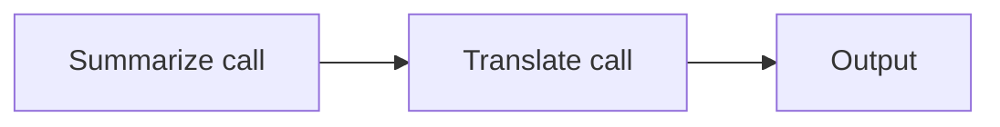

For a fixed two-step task this is enough, there's no branching or retry to account for.

# Where it breaks

A real task needs to branch on what the model decides, retry a step until a check passes, or hand off to a different agent entirely, none of which a hardcoded sequence can express without its own tangle of ad hoc conditionals.

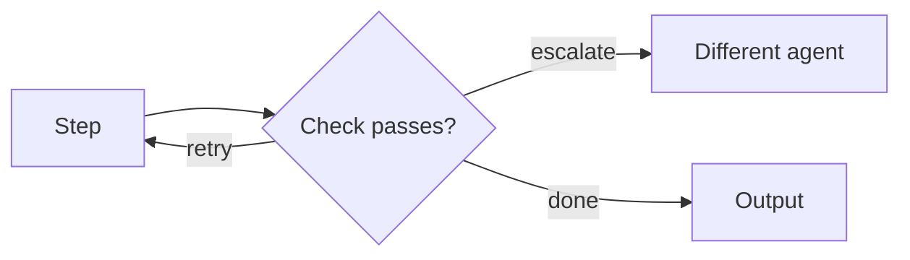

Coordinating that branching, retrying, and handoff without hand-rolling it from scratch each time is what the frameworks below solve differently.

# The shared problem

Every orchestration framework exists to answer the same underlying need, coordinating multiple LLM calls, tool calls, and decision points into one coherent task, while keeping track of what has already happened.

Many frameworks have been built to answer that problem, but seven are worth knowing well, LangChain, LangGraph, CrewAI, AutoGen, LlamaIndex, Semantic Kernel, and n8n, each favored for a different shape of coordination problem.

# LangChain

LangChain provides a set of composable abstractions for building LLM applications, prompt templates, chains, memory, tool calling, and retrieval, wired together through a common interface. A chain is simply a sequence of steps, format a prompt, call the model, parse the output, then feed the result into the next step.

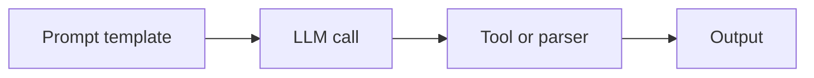

Composing small, reusable pieces rather than writing one large function is the whole design.

- Chains are composed with LCEL, LangChain Expression Language, using the pipe operator to connect a prompt, a model, and an output parser into one runnable.
- Prompt templates are kept separate from application logic, so the same chain can be reused with a different prompt without touching the surrounding code.
- Memory objects attach conversation history to a chain, so a multi-turn conversation does not need to be threaded through manually on every call.

A one-sentence summarizer is about as small as an LCEL chain gets.

```python
from langchain_openai import ChatOpenAI
from langchain_core.prompts import ChatPromptTemplate
from langchain_core.output_parsers import StrOutputParser

prompt = ChatPromptTemplate.from_template("Summarize this in one sentence: {text}")
model = ChatOpenAI(model="gpt-4o")
chain = prompt | model | StrOutputParser()

result = chain.invoke({"text": "Long article text goes here."})
```

That LCEL pipeline is inherently linear or tree-shaped. Once a workflow needs to loop, branch conditionally, or let an agent decide to revisit an earlier step, the abstraction starts to strain, which is exactly the gap LangGraph was built to close.

# LangGraph

LangGraph models a workflow as a graph of nodes and edges instead of a linear chain, where each node is a step and edges define what runs next, including cycles. State is explicit and persisted between steps, so an agent can loop, backtrack, or pause for human input without losing context.

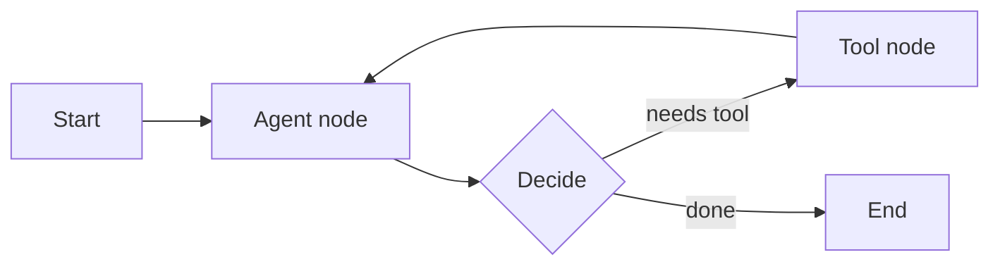

Explicit state rather than implicit chaining is what its conventions revolve around.

- A graph is built from a StateGraph, where the state is a typed object every node reads from and writes back to.
- Conditional edges route execution based on the current state, which is how an agent decides to call a tool again versus finishing.
- Checkpointing persists state between steps, which is what allows a human-in-the-loop pause or a resumed run after a crash.

A small looping agent graph needs an agent node, a tool node, and a condition deciding between them.

```python
from langgraph.graph import StateGraph, END

def agent_node(state):
    ...

def tool_node(state):
    ...

def should_continue(state):
    return "tool" if state["needs_tool"] else END

graph = StateGraph(dict)
graph.add_node("agent", agent_node)
graph.add_node("tool", tool_node)
graph.add_conditional_edges("agent", should_continue, {"tool": "tool", END: END})
graph.add_edge("tool", "agent")
graph.set_entry_point("agent")

app = graph.compile()
```

That explicit state and cycle support is what makes LangGraph a better fit for genuinely agentic workflows than a plain LangChain chain, at the cost of more upfront structure to define before the first run.

# CrewAI

CrewAI organizes a task around a crew of agents, each given a role, a goal, and a backstory, then coordinates them through a process, sequential or hierarchical, where one agent's output becomes another's input.

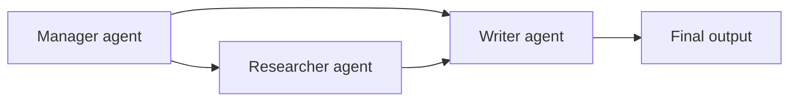

CrewAI reads closer to describing a team than describing a workflow.

- Each Agent is defined with a role, goal, and backstory, which shapes how it responds even before a task is assigned.
- Tasks are assigned to specific agents and chained into a Crew, which runs them in the configured process.
- A hierarchical process adds a manager agent that delegates tasks, closer to how a human team lead assigns work.

A two-agent crew needs each agent defined first, then a task assigned to each.

```python
from crewai import Agent, Task, Crew

researcher = Agent(role="Researcher", goal="Find accurate facts", backstory="...")
writer = Agent(role="Writer", goal="Write a clear summary", backstory="...")

research_task = Task(description="Research the topic", agent=researcher)
writing_task = Task(description="Write a summary from the research", agent=writer)

crew = Crew(agents=[researcher, writer], tasks=[research_task, writing_task])
result = crew.kickoff()
```

That role-based framing makes CrewAI easier to reason about for straightforward multi-agent tasks, but less flexible than LangGraph once the coordination logic itself gets complicated.

# AutoGen

AutoGen frames multi-agent collaboration as a conversation, agents are chat participants that send messages to each other, and a task is solved through that back-and-forth rather than a predefined graph of steps.

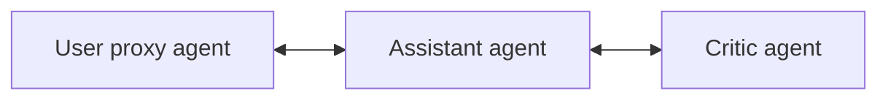

Chat roles rather than graph nodes are what it is built around.

- A UserProxyAgent can execute code or represent a human in the loop, while an AssistantAgent generates responses from the LLM.
- Group chats let more than two agents participate, with a manager deciding which agent speaks next.
- Termination conditions, a specific phrase or a message count, decide when the conversation ends, rather than a graph reaching an end node.

Starting a two-agent conversation needs only the two agents and an opening message.

```python
from autogen import AssistantAgent, UserProxyAgent

assistant = AssistantAgent(name="assistant")
user_proxy = UserProxyAgent(name="user_proxy", code_execution_config={"use_docker": False})

user_proxy.initiate_chat(assistant, message="Write a Python function that reverses a string.")
```

Framing collaboration as a conversation makes AutoGen a natural fit for tasks that genuinely look like a discussion, code review, debate, brainstorming, but the lack of an explicit graph can make the control flow harder to predict once more than a couple of agents are involved.

# LlamaIndex

LlamaIndex is built primarily around retrieval, ingesting documents, chunking them, embedding them, and indexing them so a query can pull back the most relevant pieces before an LLM ever sees the question. Agent and workflow features exist on top of that retrieval core, rather than being the starting point the way they are for LangGraph or CrewAI.

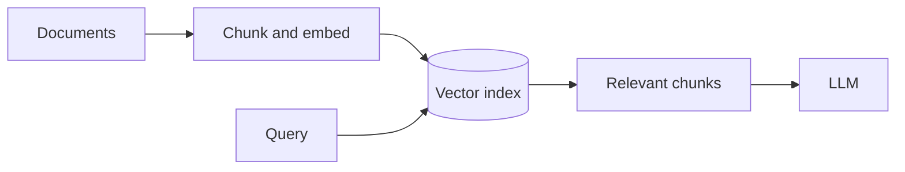

The retrieval pipeline comes first here, before anything else.

- Documents are loaded through a data connector, then split into nodes, the retrievable unit LlamaIndex indexes and ranks.
- A VectorStoreIndex is the default index type, backed by a pluggable vector store, Pinecone, Chroma, pgvector, and others.
- A query engine wraps retrieval and generation into a single call, so a RAG pipeline is usually just a few lines to stand up.

Loading a folder of documents and querying it takes only four lines end to end.

```python
from llama_index.core import VectorStoreIndex, SimpleDirectoryReader

documents = SimpleDirectoryReader("data").load_data()
index = VectorStoreIndex.from_documents(documents)
query_engine = index.as_query_engine()

response = query_engine.query("What does the document say about pricing?")
```

That retrieval-first design is why LlamaIndex is usually the first choice for a RAG pipeline specifically, even on projects that use LangChain or LangGraph for the surrounding orchestration.

# Semantic Kernel

Semantic Kernel is Microsoft's SDK for embedding LLM calls into an existing application, built around plugins, reusable functions the model can call, and a kernel that wires those plugins, memory, and a chosen model together. It targets teams already standardized on .NET or Azure as much as it targets pure Python LLM development.

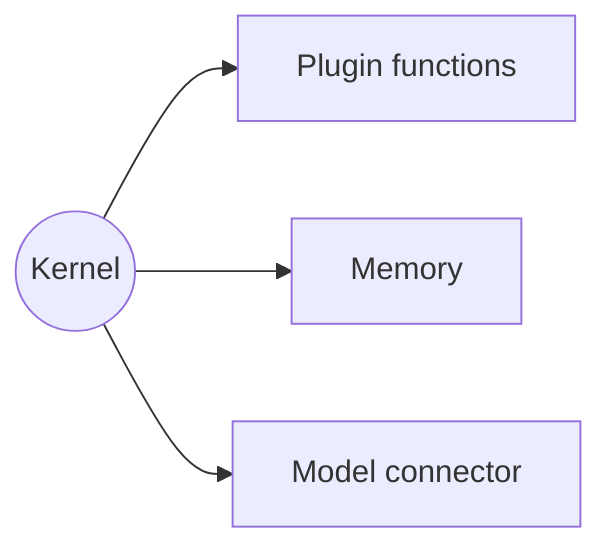

Its enterprise, multi-language roots carry over directly into its conventions.

- A plugin is a class whose methods are decorated as kernel functions, which the model can then call the same way it would call a tool in LangChain.
- Planners let the kernel decide which plugin functions to call and in what order, similar in spirit to an agent loop, but scoped tightly to registered plugins.
- The same kernel abstraction works across C#, Python, and Java, which matters for teams with an existing multi-language codebase rather than a Python-only one.

Registering a plugin is a matter of decorating a method and adding it to the kernel.

```python
import semantic_kernel as sk
from semantic_kernel.functions import kernel_function

class MathPlugin:
    @kernel_function(description="Add two numbers")
    def add(self, a: int, b: int) -> int:
        return a + b

kernel = sk.Kernel()
kernel.add_plugin(MathPlugin(), plugin_name="math")
```

That multi-language, enterprise-first design is Semantic Kernel's real differentiator, not raw capability. Most teams building purely in Python have less reason to reach for it over LangChain.

# n8n

n8n is a general-purpose workflow automation tool, closer in spirit to Zapier or Make than to a code library, where a workflow is built visually by connecting nodes on a canvas rather than writing a chain in code. An AI Agent node or a model provider node is just one node type among hundreds, HTTP requests, database writes, webhooks, sitting alongside whatever LLM calls the workflow needs.

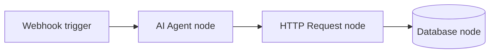

Being visual and general-purpose first, LLM-specific second, is where its conventions start.

- A workflow is a directed graph of nodes built on a visual canvas, exported and version-controlled as a JSON file rather than as source code.
- Credentials for each integration, an LLM provider, a database, a SaaS API, are stored once and reused across any node that needs them.
- A Code node exists as an escape hatch for logic that doesn't fit a pre-built node, running a small JavaScript or Python snippet inline within an otherwise visual workflow.

The canvas above compiles down to plain JSON underneath.

```json
{
  "nodes": [
    { "name": "Webhook", "type": "n8n-nodes-base.webhook", "parameters": { "path": "summarize" } },
    { "name": "AI Agent", "type": "n8n-nodes-base.openAi", "parameters": { "prompt": "Summarize: {{$json.text}}" } }
  ],
  "connections": {
    "Webhook": { "main": [[{ "node": "AI Agent", "type": "main", "index": 0 }]] }
  }
}
```

That visual, node-based model is what makes n8n approachable for a team without dedicated engineers building the workflow, but it trades away the flexibility and testability of an actual codebase once the logic gets complicated enough to need real control flow.

# Harness

A framework hands over the primitives for that coordination, chains or graphs, tool calling, persisted state, but still leaves open what tools actually exist, what the system prompt says, and whether the whole thing keeps running until the task is actually done. A harness is that decided, already-running form, whether it's built on top of one of the frameworks above or hand-rolled without one at all.

# Starting small

Consider a single tool call handled inline, right after the model's response, one `if` branch deciding whether to execute it.

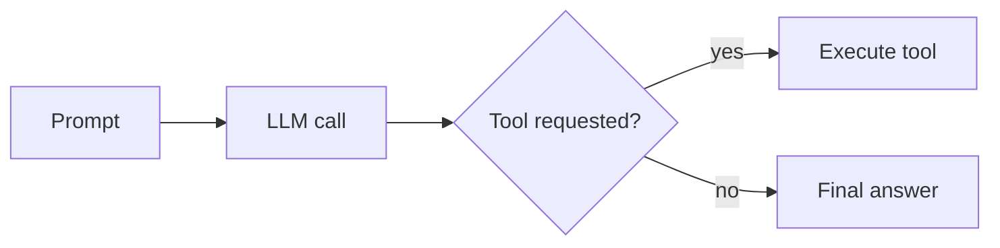

For a task needing exactly one possible tool call, this inline branch is enough on its own.

# Where it breaks

A real task needs a second tool call depending on the first one's result, then a third, and something has to decide when the loop is actually done rather than running forever.

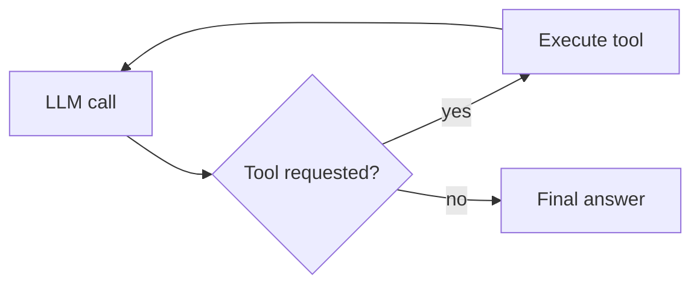

# The Loop

Each iteration appends to the same running conversation, the model's own message, the tool call it requested, and the tool's result, so the next call in the loop sees everything that already happened rather than starting from a blank slate.

```
messages = [
    {"role": "user", "content": "..."},
    {"role": "assistant", "tool_call": "search(query=...)"},
    {"role": "tool", "content": "<search results>"},
]
```

That growing list is what gets sent back to the model on every single call, which is also why a long-running loop eventually has to worry about the conversation outgrowing the model's own context window.

# Knowing When to Stop

A loop needs an explicit reason to end, not just an absence of further instructions, otherwise a model that keeps finding one more thing to check never hands control back at all.

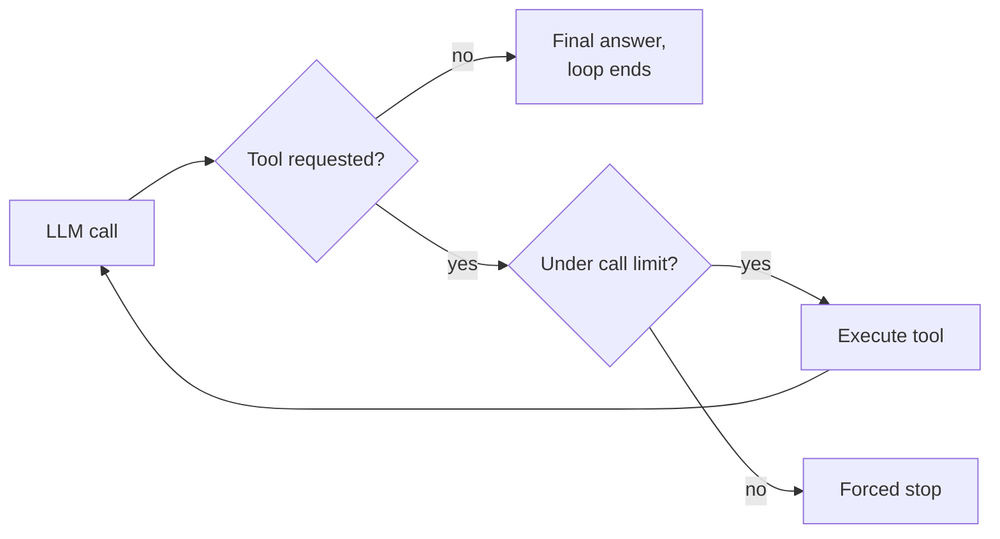

The natural stop is the model simply not asking for a tool anymore. The forced stop is a hard cap on how many iterations the loop is allowed to take, a safety net for the case where the model never reaches the natural one on its own.

That is exactly the point where hand-rolling the loop directly starts to strain, and reaching for one of the frameworks above to supply the state and control flow starts to pay off.

# How to choose

LangChain fits a straightforward pipeline, retrieval plus a single LLM call plus formatting, without complex looping or multi-agent coordination.

LangGraph fits an agent that needs to loop, call tools repeatedly, and revisit earlier decisions based on new information, with state persisted between steps.

CrewAI fits a task that naturally splits into distinct roles, a researcher, a writer, a reviewer, where each agent's responsibility is clear upfront.

AutoGen fits a task that genuinely looks like a conversation or debate between agents, or one where a human needs to sit in the loop as a chat participant.

LlamaIndex fits any project where the core problem is retrieval quality itself, regardless of what orchestrates the surrounding workflow.

Semantic Kernel fits an existing enterprise codebase in .NET or a multi-language stack that needs to add LLM calls without rewriting it in Python.

n8n fits a team without dedicated engineering resources that still needs to wire an LLM call into a broader automation, triggered by a webhook, a form submission, or a schedule, alongside non-AI integrations.

A harness built directly, without a framework underneath, fits a loop simple enough that a framework's state and control-flow machinery would be pure overhead.

# What gets traded away

LangChain trades away built-in support for cyclic, stateful agent loops, which is exactly the gap LangGraph exists to fill.

LangGraph trades away simplicity, defining explicit state and conditional edges upfront is more work than writing a linear chain for a task that never actually needs to loop.

CrewAI trades away fine-grained control over coordination logic, the role-based framing is easy to read but harder to bend once the task does not cleanly split into distinct roles.

AutoGen trades away predictability, a conversation between agents can wander in ways an explicit graph would not, which makes debugging a failed run harder.

LlamaIndex trades away general-purpose orchestration, it is not really built to coordinate multi-agent workflows the way LangGraph or CrewAI are.

Semantic Kernel trades away the size of its community and plugin ecosystem compared to LangChain, since it is a smaller, more enterprise-focused project.

n8n trades away code-level flexibility and testability, complex conditional logic that a few lines of Python handle easily can turn into an unwieldy tangle of nodes on a visual canvas.

A hand-rolled harness trades away a framework's ready-made state handling and control flow, staying free of a dependency the loop never actually needed.
