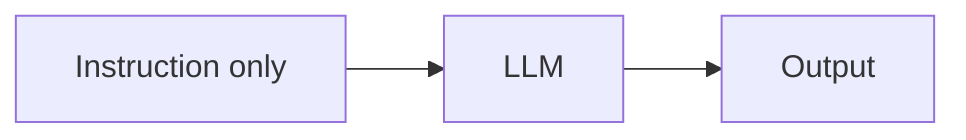
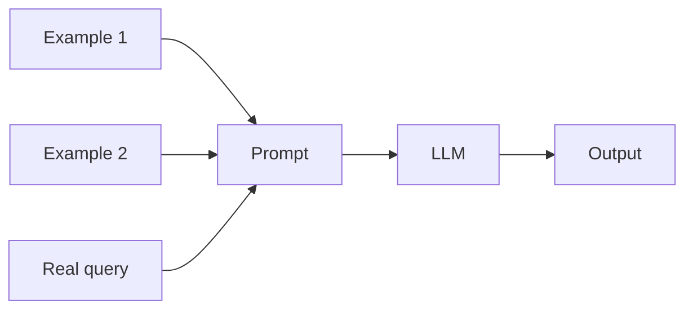
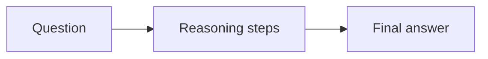
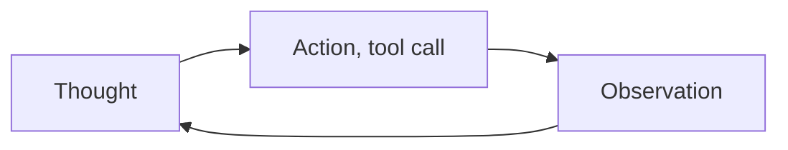

# What is In-Context Learning?

Fine-tuning changes what a model knows by updating its weights. In-context learning changes what a model does without touching a single weight, everything happens through what gets put in the prompt itself, instructions, examples, or a demonstrated reasoning pattern that the model picks up on for just that one call.

# The shared problem

Every in-context learning technique exists to answer the same underlying need, getting a model to perform a new task correctly using only what fits in the prompt, with no training step and no permanent change to the model at all.

Many techniques have been built to answer that problem, but four are worth knowing well, zero-shot prompting, few-shot prompting, chain-of-thought prompting, and ReAct, each adding a bit more structure to the prompt in exchange for better task performance.

# Zero-shot Prompting

Zero-shot prompting gives the model only an instruction, no worked examples at all, and relies entirely on what the model already learned during pretraining to interpret the task correctly.



The instruction carries the full weight of the task here.

- The instruction itself specifies the task, its format, and any constraints, since there is no example to fall back on if the wording is ambiguous.
- Zero-shot works best on tasks close to what the model saw often during pretraining, general knowledge questions, common formatting requests, rather than a narrow or unusual task.
- A system prompt is often used to set persistent instructions once, so every individual user message does not need to repeat the same framing.

A sentiment-classification prompt needs nothing more than the instruction itself.

```python
prompt = "Classify the sentiment of this review as positive, negative, or neutral.\n\nReview: The battery life is disappointing."
answer = llm.generate(prompt)
```

Zero-shot costs the fewest tokens and is the simplest to write, but it gives the model the least guidance. A task that is even slightly unusual or ambiguously worded often needs an example to actually land correctly.

# Few-shot Prompting

Few-shot prompting includes a handful of worked examples, input-output pairs demonstrating the task, directly in the prompt before the real query, so the model can infer the pattern from those examples rather than from the instruction wording alone.



Choosing and ordering examples deliberately is what its conventions come down to.

- Examples are chosen to be representative of the range of inputs the real query might look like, not just the easiest case.
- The order of examples can measurably affect output quality, later examples tend to carry more influence, so the most representative example is often placed last.
- Few-shot examples consume real context window and cost real tokens on every call, unlike a fine-tuned model, which pays that cost once during training instead of on every request.

The same sentiment task gets two worked examples ahead of the real one.

```python
prompt = """Classify the sentiment as positive, negative, or neutral.

Review: Fast shipping and great quality.
Sentiment: positive

Review: Arrived broken and support never replied.
Sentiment: negative

Review: The battery life is disappointing.
Sentiment:"""
answer = llm.generate(prompt)
```

Few-shot reliably improves task accuracy over zero-shot for narrow or unusual tasks, but every example added is tokens spent on every single call, and a genuinely complex task can need more examples than comfortably fit in context.

# Chain-of-thought Prompting

Chain-of-thought prompting asks the model to reason through intermediate steps out loud before giving a final answer, rather than jumping straight to a conclusion, which measurably improves accuracy on tasks that require multi-step reasoning, arithmetic, logic, multi-part questions.



Eliciting the reasoning explicitly is the whole point here.

- The simplest version is a single added phrase, "think step by step", appended to the prompt, which alone measurably improves accuracy on reasoning-heavy tasks.
- Few-shot chain-of-thought combines both techniques, the worked examples show the reasoning steps, not just the final answer, teaching the model the expected reasoning pattern as well as the task.
- The reasoning text is often stripped out of what gets shown to the end user, since it exists to improve the model's own accuracy, not necessarily to be read.

Sentiment classification does not need this, arithmetic does.

```python
prompt = """A store had 23 apples, sold 15, then received a shipment of 8 more.
How many apples does the store have now? Think step by step before giving the final answer."""
answer = llm.generate(prompt)
```

Chain-of-thought reliably improves accuracy on reasoning-heavy tasks, but it costs more output tokens and more latency for every response. On tasks that do not actually need multi-step reasoning, the extra reasoning text is pure overhead with no accuracy benefit.

# ReAct

ReAct, reasoning and acting, interleaves chain-of-thought style reasoning with concrete actions, typically tool calls, so a model reasons about what it needs, takes an action to get it, observes the result, and reasons again, looping until it has enough to answer.



A fixed three-part cycle is what its conventions are built around.

- Each cycle follows the same structure, a thought explaining what is needed next, an action that fetches it, and an observation recording what came back.
- The reasoning trace is what lets a model recover from a bad tool result, since the next thought explicitly reacts to what the observation actually contained.
- This pattern is the prompting-level foundation underneath most agent frameworks. LangGraph and AutoGen both implement a version of this same thought, action, observation loop under the hood.

Neither sentiment classification nor arithmetic needs an external lookup, a weather question does.

```
Thought: I need the current weather in Jakarta to answer this.
Action: get_weather(city="Jakarta")
Observation: 31C, thunderstorms expected this afternoon.
Thought: I now have enough information to answer.
Answer: It's 31C in Jakarta with thunderstorms expected this afternoon.
```

ReAct's explicit reasoning trace makes an agent's tool-use decisions far easier to debug than a black-box tool call, but every thought step is an extra round trip to the model, which adds latency and cost that a simpler, non-reasoning tool call would not.

# How to choose

Zero-shot fits a task close to common knowledge or formatting the model has seen extensively during pretraining, where the instruction alone is unambiguous.

Few-shot fits a narrower or more unusual task, where showing the pattern is more reliable than describing it, and where a few extra hundred tokens per call is an acceptable cost.

Chain-of-thought fits any task that genuinely requires multi-step reasoning, arithmetic, or multi-part logic, rather than a single lookup or classification.

ReAct fits an agentic task that needs to call tools and adapt based on what those tools return, rather than a single-shot question with no external actions involved.

# What gets traded away

Zero-shot trades away reliability on anything unusual or ambiguous for the lowest possible token cost and the simplest prompt to write.

Few-shot trades away token cost and context space for better reliability on narrow tasks, every example is paid for again on every single call.

Chain-of-thought trades away response latency and output tokens for better accuracy on reasoning-heavy tasks, and gives nothing back on tasks that never needed reasoning in the first place.

ReAct trades away speed and cost for debuggability and adaptability, each thought-action-observation cycle is another round trip to the model before a final answer arrives.
