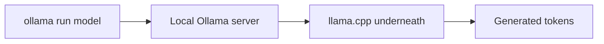
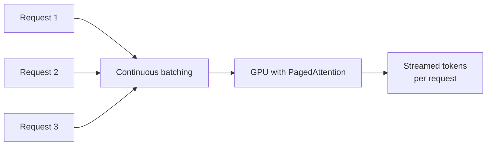

# What is an Inference Engine?

Training or fine-tuning a model produces a set of weights, but those weights on their own do not answer requests. An inference engine is the runtime that loads those weights and actually serves predictions, batching concurrent requests, managing GPU memory, and streaming tokens back as they are generated, the layer between having a model and having something an application can call.

# The shared problem

Every inference engine exists to answer the same underlying need, serving a model's predictions as fast and as cheaply as possible for the hardware available, without the caller needing to manage batching, memory, or hardware-specific optimization by hand.

Many engines have been built to answer that problem, but three are worth knowing well, llama.cpp, Ollama, and vLLM, each favored for a different deployment target.

One scenario shows what actually separates them, fifty requests arriving at roughly the same time, from fifty different users. Whether those fifty requests get served in parallel or one at a time is where these three stop looking alike.

# llama.cpp

llama.cpp is a C and C++ inference engine built to run models with no dependency on Python or a full machine learning framework, optimized specifically for running quantized models efficiently on CPUs and consumer hardware, including phones and laptops without a dedicated GPU.


Portability and quantization are what its conventions are built around.

- Models are converted to GGUF, a file format bundling the weights and metadata needed to run inference without any external framework installed.
- Quantization compresses weights from 16-bit down to as little as 2 to 4 bits per parameter, trading a small amount of quality for a large cut in memory footprint.
- The same binary runs across CPUs, Apple Silicon, and CUDA GPUs, with no Python runtime required at all, which is what makes it embeddable inside other applications directly.

Running a single quantized model from the command line needs one line.

```bash
./llama-cli -m model.Q4_K_M.gguf -p "Explain quantization in one sentence."
```

Fifty requests arriving at once mostly just queue. A single llama.cpp process is built around serving one request, or a small handful, efficiently on one machine's CPU or GPU, not fanning fifty generations out in parallel. The forty-ninth caller waits for everyone ahead of them to finish.

That framework-free, CPU-friendly design is what makes llama.cpp the default choice for running a model locally on a laptop or phone, but it is not built for serving many concurrent users at once the way a GPU-first server engine is.

# Ollama

Ollama wraps llama.cpp behind a simple local server and command-line interface, so pulling and running a model locally is a single command instead of manually converting weights and configuring a runtime.



Ease of use on top of llama.cpp's engine is the whole idea.

- Models are pulled from a registry by name, `ollama pull llama3`, with quantization and packaging already handled, rather than sourcing and converting GGUF files by hand.
- A Modelfile lets a custom system prompt, parameters, or a fine-tuned adapter be packaged into a named model that behaves consistently across runs.
- A local REST API is exposed automatically, so any application can call the running model over HTTP without embedding the runtime directly.

Pulling and running a model from the command line is a single command.

```bash
ollama run llama3 "Explain quantization in one sentence."
```

The same model is just as reachable over HTTP, from any application rather than a terminal.

```python
import requests
response = requests.post(
    "http://localhost:11434/api/generate",
    json={"model": "llama3", "prompt": "Explain quantization in one sentence."},
)
```

Fifty requests against a local Ollama server hit the same wall as raw llama.cpp underneath, the REST API makes it easy to send fifty calls, but the engine serving them still processes requests with the same limited concurrency, since Ollama adds a friendlier interface without changing that core serving model.

Ollama trades a small amount of llama.cpp's raw configurability for a dramatically simpler day-to-day experience, which is why it has become the default way individual developers run models locally, even though it inherits llama.cpp's same limits on serving many concurrent requests.

# vLLM

vLLM is a GPU-first inference server built for high-throughput serving of many concurrent requests, built around PagedAttention, a memory management scheme that treats the key-value cache like paged virtual memory to avoid wasting GPU memory on unused space.



Maximizing GPU throughput under concurrent load is the design center.

- PagedAttention allocates the key-value cache in fixed-size blocks rather than one contiguous region per request, which avoids the memory fragmentation a naive implementation wastes under variable-length generations.
- Continuous batching adds new requests into a running batch as soon as a GPU slot frees up, rather than waiting for an entire batch to finish before starting the next one.
- It exposes an OpenAI-compatible API server out of the box, so an application already calling OpenAI's API can point at a self-hosted vLLM server with no code changes.

Standing up that server is one command.

```bash
python -m vllm.entrypoints.openai.api_server --model meta-llama/Llama-3-8b
```

Calling it looks identical to calling OpenAI's own API, just pointed at a different host.

```python
from openai import OpenAI

client = OpenAI(base_url="http://localhost:8000/v1", api_key="not-needed")
response = client.chat.completions.create(
    model="meta-llama/Llama-3-8b",
    messages=[{"role": "user", "content": "Explain quantization in one sentence."}],
)
```

The same fifty requests land in a running batch as GPU slots free up, rather than queuing behind each other. PagedAttention is what makes packing that many variable-length generations into GPU memory at once viable without fragmenting it into unusable gaps.

vLLM's throughput under concurrent load far exceeds llama.cpp or Ollama, but it needs a real GPU to run at all, and its memory-management sophistication is solving a problem, serving fifty simultaneous users, that a single local developer running one model at a time simply does not have.

# How to choose

llama.cpp fits embedding inference directly inside an application with no GPU and no Python dependency, a desktop app, a mobile app, or a CPU-only server.

Ollama fits an individual developer or small team that wants to run a model locally with minimal setup, without needing to serve many concurrent users.

vLLM fits a production deployment serving many concurrent users off a GPU, where throughput and GPU memory efficiency under load are the actual bottleneck.

# What gets traded away

llama.cpp trades away serving throughput for portability. It is not designed to efficiently batch many simultaneous requests on a GPU the way vLLM is.

Ollama trades away some of llama.cpp's raw configurability for its simplicity, and inherits the same concurrency limits underneath.

vLLM trades away the ability to run without a GPU at all, its entire design assumes GPU memory is the scarce resource being optimized.
