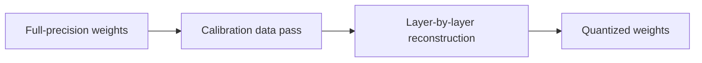
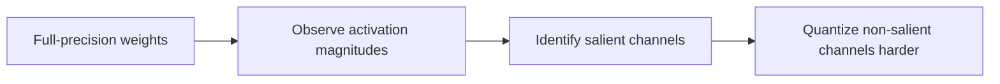
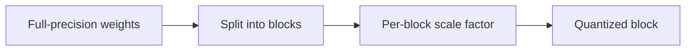
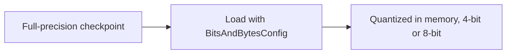

# What is Quantization?

Model weights are normally stored as 16-bit or 32-bit floating point numbers. Quantization represents them using fewer bits instead, 8-bit, 4-bit, sometimes lower, cutting memory and compute cost at the price of some numerical precision. The same weight matrix that needs 14 GB at 16-bit precision can often fit in under 4 GB at 4-bit, without a proportional loss in output quality if the quantization scheme is chosen carefully.

# The shared problem

Every quantization method exists to answer the same underlying need, representing a model's weights in fewer bits while losing as little output quality as possible, and deciding how much calibration effort that compression is worth.

Many methods have been built to answer that problem, but four are worth knowing well, GPTQ, AWQ, GGUF, and bitsandbytes, each trading calibration effort against deployment target in a different way.

# GPTQ

GPTQ quantizes a model layer by layer after training is done, using a calibration dataset to solve for the quantized weights that minimize the error introduced in that layer's output, rather than just rounding each weight independently.



GPTQ's conventions center on calibration-driven, layer-by-layer reconstruction:

- A small calibration dataset, a few hundred samples, is run through the model once to capture how each layer actually behaves, rather than quantizing purely from the weight values alone.
- Quantization is solved one layer at a time, using the previous layer's already-quantized output as input, so later layers compensate for error introduced earlier.
- GPTQ typically targets 4-bit or 3-bit weights for GPU inference, paired with a kernel that dequantizes on the fly during the forward pass.

Quantizing a model with GPTQ looks like this.

```python
from auto_gptq import AutoGPTQForCausalLM, BaseQuantizeConfig

quantize_config = BaseQuantizeConfig(bits=4, group_size=128)
model = AutoGPTQForCausalLM.from_pretrained("base-model", quantize_config)
model.quantize(calibration_dataset)
model.save_quantized("base-model-gptq-4bit")
```

GPTQ's calibration-based approach preserves quality well at 4-bit, but the calibration pass itself takes real compute time and a representative dataset. Quantizing blind without calibration data would not reach the same accuracy.

# AWQ

AWQ, activation-aware weight quantization, observes that a small fraction of weight channels matter disproportionately to output quality, the ones that see large activation magnitudes, and protects exactly those channels from precision loss while quantizing the rest more aggressively.



AWQ's conventions are built around protecting salient channels rather than reconstructing layer by layer:

- Salience is measured by activation magnitude, not weight magnitude, since a large activation flowing through a small weight can still dominate the output.
- Rather than storing protected channels at a different bit-width, AWQ rescales the whole channel so the standard quantization grid preserves more precision on it automatically.
- Because it does not solve a layer-by-layer reconstruction problem, AWQ quantizes faster than GPTQ for a comparable quality level.

Quantizing a model with AWQ looks like this.

```python
from awq import AutoAWQForCausalLM

model = AutoAWQForCausalLM.from_pretrained("base-model")
model.quantize(tokenizer, quant_config={"zero_point": True, "q_group_size": 128, "w_bit": 4})
model.save_quantized("base-model-awq-4bit")
```

AWQ generally holds up as well as or better than GPTQ at the same bit-width with less calibration compute, but it is a newer format with less universal support across inference engines than GPTQ.

# GGUF

GGUF is the quantization and packaging format used by llama.cpp, built around block-wise quantization, weights are grouped into small blocks and each block gets its own scaling factor, rather than one scale for an entire tensor.



GGUF's conventions are built around portability and block-wise scaling:

- Naming like Q4_K_M encodes the bit-width, four bits, and the specific quantization variant, K-quant, medium, each variant trading a bit more size for a bit more accuracy.
- Block-wise scaling keeps outlier weights within one block from distorting the whole tensor's precision, at the cost of storing a scale factor per block.
- GGUF bundles the quantized weights with model metadata and tokenizer information into a single portable file, which is why llama.cpp and Ollama both load it directly.

Converting a model to GGUF looks like this.

```bash
python convert_hf_to_gguf.py base-model/ --outfile model.gguf --outtype q4_k_m
```

GGUF's block-wise scheme is built for portability and CPU-friendly inference more than squeezing out the last bit of GPU throughput, which is why GPTQ and AWQ remain more common for pure GPU-server deployments.

# bitsandbytes

bitsandbytes is the quantization library behind QLoRA, providing on-the-fly quantization that loads a model straight into 4-bit or 8-bit precision inside a standard Hugging Face transformers pipeline, without a separate offline conversion step.



bitsandbytes's conventions are built around dynamic, load-time quantization:

- Quantization happens at load time, directly inside `from_pretrained`, rather than requiring a separately produced quantized checkpoint file.
- NF4, normalized float 4-bit, is the default 4-bit type, chosen to match the roughly normal distribution pretrained weights tend to follow.
- Because quantization is dynamic and library-integrated rather than a fixed file format, it is the natural fit for QLoRA, where the base model needs to be quantized specifically to make room for training the LoRA adapter on top of it.

Loading a model with bitsandbytes looks like this.

```python
from transformers import AutoModelForCausalLM, BitsAndBytesConfig

bnb_config = BitsAndBytesConfig(load_in_4bit=True, bnb_4bit_quant_type="nf4", bnb_4bit_compute_dtype="bfloat16")
model = AutoModelForCausalLM.from_pretrained("base-model", quantization_config=bnb_config)
```

bitsandbytes trades away GPTQ and AWQ's calibration-tuned accuracy for convenience, loading any checkpoint in quantized form with no offline preparation step, which is exactly why QLoRA builds on it rather than a pre-quantized format.

# How to choose

GPTQ fits a GPU deployment where a calibration dataset is available and squeezing out maximum accuracy at 4-bit matters enough to justify an offline quantization step.

AWQ fits the same GPU-deployment case as GPTQ, when a faster quantization process or slightly better retained quality at the same bit-width outweighs GPTQ's slightly wider tooling support.

GGUF fits running a model with llama.cpp or Ollama, on a CPU, a laptop, or any environment without a dedicated GPU.

bitsandbytes fits fine-tuning, especially QLoRA, or any case where quantizing on the fly at load time is more convenient than maintaining a separately quantized checkpoint.

# What gets traded away

GPTQ trades away quantization speed for accuracy, the calibration and layer-by-layer reconstruction process takes real time compared to simpler methods.

AWQ trades away the widest tooling support, it is newer and not every inference engine or checkpoint hosting convention treats it as the default the way GPTQ often is.

GGUF trades away peak GPU throughput for portability, it is not the format of choice for a GPU server trying to maximize concurrent request throughput.

bitsandbytes trades away the calibration-tuned accuracy of GPTQ or AWQ for the convenience of quantizing on the fly with no offline step.
