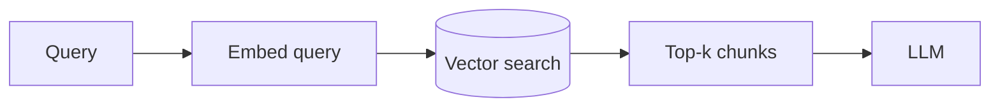
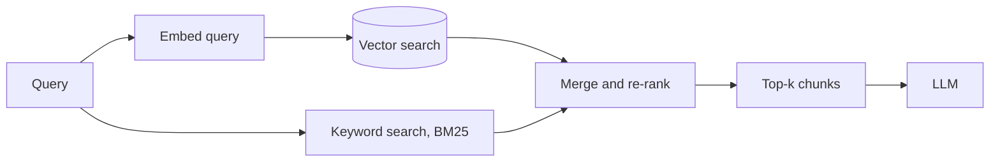
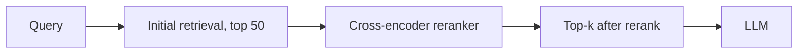
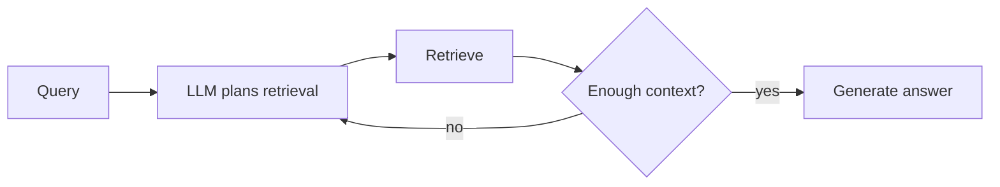

# What is RAG?

A language model only knows what was baked into its weights during training, which means it cannot answer questions about private documents, data that changed after training, or anything too niche to have been memorized. Retrieval-augmented generation, RAG, fixes this by retrieving relevant text from an external source at query time and handing it to the model as context, so the answer is grounded in something the model can actually point to, rather than relying purely on what it memorized.

# The shared problem

Every RAG approach exists to answer the same underlying need, finding the right pieces of external information and getting them in front of the model before it generates an answer, without retrieving so much that the model gets lost, or so little that it misses what it needed.

Many approaches have been built to answer that problem, but four are worth knowing well, naive RAG, hybrid search RAG, reranked RAG, and agentic RAG, each trading simplicity against retrieval quality in a different way.

# Naive RAG

Naive RAG embeds a query, searches a vector index for the most similar chunks, and stuffs those chunks directly into the prompt alongside the question. It is the simplest version of the pattern and the one most tutorials teach first.



Naive RAG's conventions are built around a single retrieval pass:

- Documents are chunked once, usually by a fixed token or character count with some overlap, and embedded ahead of time into a vector index.
- A query is embedded with the same model used for the documents, since comparing embeddings from different models produces meaningless similarity scores.
- The top-k most similar chunks are retrieved and concatenated into the prompt, with k usually fixed at a small number like three to five.

A minimal naive RAG query looks like this.

```python
query_embedding = embed(query)
chunks = vector_index.search(query_embedding, top_k=5)
context = "\n\n".join(chunk.text for chunk in chunks)
prompt = f"Answer using only this context:\n{context}\n\nQuestion: {query}"
answer = llm.generate(prompt)
```

Pure similarity search retrieves whatever is closest in embedding space, which is not always what is actually relevant. A query using different wording than the source document can miss a chunk that a keyword search would have caught immediately.

# Hybrid Search RAG

Hybrid search combines vector similarity search with traditional keyword search, usually BM25, and merges the two ranked lists before selecting the final chunks. This catches exact terms, product codes, names, acronyms, that an embedding model can blur together with semantically similar but wrong terms.



Hybrid search's conventions revolve around combining two different ranking signals:

- Vector search and BM25 run independently against the same chunk store, then their scores are merged with a weighting scheme, often reciprocal rank fusion.
- Reciprocal rank fusion combines two ranked lists using each chunk's rank position rather than its raw score, which avoids needing to normalize two differently-scaled scoring systems.
- Most managed vector databases, Weaviate, Elasticsearch, now support hybrid search natively, rather than requiring two separate systems wired together manually.

Combining two ranked lists with reciprocal rank fusion looks like this.

```python
def reciprocal_rank_fusion(vector_results, keyword_results, k=60):
    scores = {}
    for rank, doc in enumerate(vector_results):
        scores[doc.id] = scores.get(doc.id, 0) + 1 / (k + rank)
    for rank, doc in enumerate(keyword_results):
        scores[doc.id] = scores.get(doc.id, 0) + 1 / (k + rank)
    return sorted(scores.items(), key=lambda x: x[1], reverse=True)
```

Hybrid search catches exact-term matches that pure vector search can miss, but it still retrieves a fixed top-k in one pass, which is not enough when the answer actually requires connecting facts spread across several chunks.

# Reranked RAG

Reranked RAG retrieves a larger initial pool of candidate chunks with a cheap method, vector search or hybrid search, then runs a more expensive cross-encoder model over that pool specifically to re-score relevance before picking the final top-k to send to the LLM.



Reranking's conventions center on a two-stage retrieval pipeline:

- The first stage retrieves a wide net, often the top 50 to 100 candidates, prioritizing recall over precision since a cross-encoder narrows it down next.
- A cross-encoder scores the query and each candidate chunk together in one forward pass, rather than comparing precomputed embeddings, which is far more accurate but too slow to run over an entire index.
- Only the reranked top-k, usually three to five, actually reaches the LLM, keeping the final prompt small even though the initial candidate pool was large.

Reranking a candidate pool looks like this.

```python
candidates = vector_index.search(query_embedding, top_k=50)
scored = reranker.predict([(query, c.text) for c in candidates])
top_chunks = [c for c, _ in sorted(zip(candidates, scored), key=lambda x: x[1], reverse=True)[:5]]
```

Reranking meaningfully improves precision over a single-pass retrieval, but it adds real latency. A cross-encoder pass over fifty candidates is far slower than a vector search, and it still only ever does one retrieval round, which is not enough for questions that need multiple hops of reasoning.

# Agentic RAG

Agentic RAG lets the model decide how to retrieve, rather than retrieving once before generation starts. The model can rewrite the query, issue multiple retrieval calls, or decide the retrieved context is insufficient and search again with a refined query, looping until it has enough to answer.



Agentic RAG's conventions borrow directly from the orchestration frameworks that implement it:

- A retrieval step is exposed to the model as a tool call, the same way any other tool would be, rather than being a fixed step that always runs once before generation.
- The model itself decides whether to decompose a complex question into several simpler retrieval queries, run one after another.
- This pattern is usually built on top of an orchestration framework with cycle support, LangGraph, for instance, rather than a single linear RAG pipeline.

A minimal agentic retrieval loop looks like this.

```python
def agentic_rag(query, max_hops=3):
    context = ""
    for _ in range(max_hops):
        result = llm.generate(f"Context so far:\n{context}\n\nQuestion: {query}\nDo you have enough to answer, or what should be searched next?")
        if result.has_enough_context:
            return llm.generate(f"Context:\n{context}\n\nAnswer: {query}")
        context += retrieve(result.next_query)
    return llm.generate(f"Context:\n{context}\n\nAnswer as best you can: {query}")
```

Letting the model control retrieval handles multi-hop questions a single-pass pipeline cannot, but every additional hop costs another round trip to the model, and a model that decides to keep searching indefinitely needs a hard cap to avoid runaway latency and cost.

# How to choose

Naive RAG fits a small, well-organized knowledge base where questions map closely to the wording used in the source documents, an internal FAQ or a single product's documentation, for instance.

Hybrid search fits a knowledge base with a lot of exact terminology, product codes, legal citations, proper names, that an embedding model alone tends to blur.

Reranked RAG fits a use case where answer quality matters enough to justify the added latency, customer-facing support, for instance, where a wrong or irrelevant answer costs more than the extra few hundred milliseconds.

Agentic RAG fits genuinely multi-hop questions, ones that need facts pulled from more than one place and connected together, where a single retrieval pass structurally cannot succeed no matter how good the ranking is.

# What gets traded away

Naive RAG trades away precision for simplicity, a single retrieval pass will occasionally miss the right chunk or include an irrelevant one with no way to correct course.

Hybrid search trades away some of that simplicity for better recall on exact terms, needing two retrieval systems, or one that supports both, kept in sync with the same underlying chunk store.

Reranked RAG trades away latency and infrastructure, a cross-encoder is an extra model to host and run on every query, and it adds a real, noticeable delay compared to vector search alone.

Agentic RAG trades away predictable cost and latency, a question might resolve in one hop or spiral into several, which makes both response time and API cost harder to bound in advance.
