# STL Containers

Every container here is really just a different answer to the same underlying question, namely how elements should be laid out in memory, and what that layout makes cheap or expensive to do. A `vector` commits to one contiguous block, buying O(1) indexing at the cost of expensive inserts anywhere but the end. A tree commits to a branching structure, buying automatic sorted order at the cost of O(log n) for everything. A hash table commits to bucketed scattering, buying average-case O(1) access by giving up ordering entirely. Each section below opens with the actual struct behind the container, since seeing the layout is what makes the trade-off obvious instead of memorized.

`map` and `set` are the actual ordered containers in the STL. `unordered_map` and `unordered_set` are their hash-based counterparts. Separately, the ten sections below run in dependency order, since `deque` comes before `stack` and `queue` because it is their default underlying container, and `vector` comes before `priority_queue` for the same reason. A second tier, Related & Specialized Containers, follows afterward for the ones reached for less often.

## 1. vector

A vector is a raw heap buffer paired with two counters, one tracking how many elements are in use and one tracking how many the buffer can hold before it needs to grow.

```cpp
struct Vector {
    int* data;       // pointer to a contiguous heap block
    size_t size;     // elements actually in use
    size_t capacity; // elements the block can hold before reallocating
};
```

Declaring one in real code hides all of that struct plumbing behind a single line, with a few common forms:

```cpp
#include <vector>
using namespace std;

vector<int> v;                 // empty, size 0
vector<int> v(5);              // 5 elements, default-initialized to 0
vector<int> v(5, 10);          // 5 elements, all set to 10
vector<int> v = {1, 2, 3};     // initializer list
```

Laid out in memory, three real values followed by two unused slots look like this:

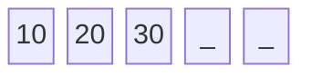

Index access is just pointer arithmetic on `data`, so `v[i]` resolves in constant time regardless of size.

- `push_back` writes into `data[size]` and increments `size`, staying constant time only while `size < capacity`.
- Once the buffer fills, it allocates a new block (typically double the old capacity), copies every element across, frees the old block, and only then appends. That single call is linear, but it happens rarely enough that the average cost per `push_back` still comes out constant, which is why it is called amortized rather than worst-case O(1).
- Inserting or erasing anywhere but the end shifts every following element by one slot, so both cost time proportional to how many elements sit after the target.

| Operation | Complexity | Why |
|---|---|---|
| Access by index | O(1) | direct pointer arithmetic |
| Search by value | O(n) | no ordering to exploit, must scan |
| Insert/delete at back | O(1) amortized | occasional reallocation, rare enough to average out |
| Insert/delete elsewhere | O(n) | shifts every following element |

Space complexity is O(n), plus whatever slack sits unused between `size` and `capacity`.

Beyond `operator[]` and the constructors above, a handful of methods cover most day-to-day use:

| Method | Returns | What it does |
|---|---|---|
| `push_back(x)` | `void` | appends `x` at the end |
| `pop_back()` | `void` | removes the last element |
| `size()` | `size_t` | number of elements in use |
| `empty()` | `bool` | true if `size() == 0` |
| `front()` / `back()` | `int&` | reference to the first / last element |
| `at(i)` | `int&` | bounds-checked access, throws on out-of-range |
| `clear()` | `void` | removes all elements, `size()` becomes 0 |
| `insert(it, x)` / `erase(it)` | iterator | insert/remove at an iterator position, shifting the rest |
| `begin()` / `end()` | iterator | iterators for range-based `for` and algorithms |

## 2. deque (double-ended queue)

A deque is not one contiguous block like a vector. It keeps a map, meaning an array of pointers to fixed-size blocks, so growing either end just means allocating one more block rather than moving everything.

```cpp
struct Deque {
    int** map;          // array of pointers to fixed-size blocks
    size_t mapSize;     // number of block pointers currently in use
    size_t blockSize;   // elements per block, implementation-defined
    size_t startBlock;  // index of the block holding the first element
    size_t startOffset; // offset of the first element within that block
    size_t size;        // elements actually in use
};
```

Declaring one looks identical to a vector, since the block-based layout stays hidden behind the same interface:

```cpp
#include <deque>
using namespace std;

deque<int> dq;                 // empty
deque<int> dq(5);              // 5 elements, default-initialized to 0
deque<int> dq(5, 10);          // 5 elements, all set to 10
deque<int> dq = {1, 2, 3};     // initializer list
```

Since the elements live across separate blocks rather than one strip of memory, the internal layout looks more like a chain of small arrays:

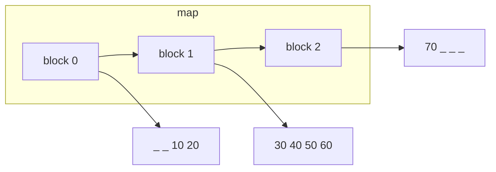

Index access has to first work out which block holds index `i` and what offset within that block, a small division and modulo against `blockSize`, then dereference. That is still constant time, just with a higher constant factor than a vector's raw pointer arithmetic.

Pushing to either end only needs a new block allocated once the edge block fills up, and every existing element stays exactly where it is, since nothing has to shift or get copied. That is what makes both ends constant time, unlike a vector, where only the back is cheap. Inserting or erasing in the middle still has to shift elements across block boundaries, so it remains linear.

| Operation | Complexity | Why |
|---|---|---|
| Access by index | O(1) | block-and-offset arithmetic, still constant time |
| Push/pop front | O(1) amortized | new block allocated only when the front block fills |
| Push/pop back | O(1) amortized | new block allocated only when the back block fills |
| Insert/delete in middle | O(n) | shifts elements across block boundaries |

Space complexity is O(n), plus the map array and any partially-filled edge blocks.

The interface mirrors a vector's, with the front gaining the same rights as the back:

| Method | Returns | What it does |
|---|---|---|
| `push_back(x)` / `push_front(x)` | `void` | appends at the back / prepends at the front |
| `pop_back()` / `pop_front()` | `void` | removes the last / first element |
| `front()` / `back()` | `int&` | reference to the first / last element |
| `at(i)` | `int&` | bounds-checked access, throws on out-of-range |
| `size()` / `empty()` | `size_t` / `bool` | number of elements / whether there are none |
| `begin()` / `end()` | iterator | iterators for range-based `for` and algorithms |

## 3. string (contiguous char buffer)

A string is a `vector<char>` with text-specific conveniences layered on top, the same contiguous heap buffer, the same size-and-capacity pair, the same doubling growth strategy.

```cpp
struct String {
    char* data;       // pointer to a contiguous heap block
    size_t size;      // characters in use, not counting the null terminator
    size_t capacity;  // characters the block can hold before reallocating
};
```

Declaring one reads almost like a vector, with string literals accepted directly:

```cpp
#include <string>
using namespace std;

string s;                        // empty
string s(5, 'x');                // 5 characters, all 'x'
string s = "hello";              // from a C-string literal
string s = "hel" + string("lo"); // concatenation, needs at least one std::string operand
```

Laid out in memory, it looks exactly like the vector diagram from earlier, just with characters instead of integers:

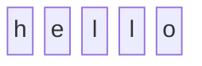

Index access is the same pointer arithmetic as a vector's, and appending follows the same amortized doubling. Most implementations add one more trick on top, where short strings (typically under 15-22 characters, implementation-defined) are stored directly inside the string object itself rather than on the heap at all, a scheme called small string optimization, so short strings avoid a heap allocation entirely.

| Operation | Complexity | Why |
|---|---|---|
| Access by index | O(1) | same pointer arithmetic as a vector |
| Substring search (`find`) | O(n) typical | most standard libraries use a fast substring search, not naive comparison |
| Append at back | O(1) amortized | same doubling strategy as a vector |
| Insert/delete elsewhere | O(n) | shifts every following character |

Space complexity is O(n), plus slack up to `capacity`, except for short strings small enough to skip the heap entirely under small string optimization.

Beyond the vector-like methods, a few text-specific ones cover most use:

| Method | Returns | What it does |
|---|---|---|
| `substr(pos, len)` | `string` | copies out the range `[pos, pos + len)` |
| `find(sub)` | `size_t` | index of the first match, or `string::npos` if absent |
| `c_str()` | `const char*` | null-terminated view, for interop with C APIs |
| `append(s)` / `+=` | `string&` | appends another string at the end |
| `size()` / `empty()` | `size_t` / `bool` | number of characters / whether there are none |

## 4. map (red-black tree)

A map is a self-balancing binary search tree where each node carries a key and a value.

```cpp
struct Node {
    int key;
    int value;
    bool isRed; // red-black balance bit
    Node* left;
    Node* right;
    Node* parent;
};
```

In practice, the key-value tree above sits behind array-like syntax, so `operator[]` looks like plain indexing even though it is really a tree walk:

```cpp
#include <map>
using namespace std;

map<int, int> m;                          // empty
map<int, int> m = {{1, 10}, {2, 20}};     // initializer list
m[1] = 10;                                // insert if absent, else overwrite
m.insert({3, 30});                        // insert only if key absent
```

Once those inserts land, the tree rebalances itself into something like this:


Every lookup, insertion, or deletion walks from the root toward a leaf, comparing the target key against the current node and moving left or right accordingly. The red-black balancing rules rebalance the tree through rotations and recoloring on insert and delete, which keeps the tree height proportional to the log of the element count, so every operation costs O(log n).

An in-order traversal, meaning left subtree then node then right subtree, visits keys in sorted order automatically. That is why iterating a map comes out sorted by key, and why range queries such as `lower_bound` and `upper_bound` are cheap, since they only need to walk down to the boundary rather than scan everything.

| Operation | Complexity | Why |
|---|---|---|
| Find by key | O(log n) | tree height bounded by balancing |
| Insert | O(log n) | find the spot, then rebalance |
| Delete | O(log n) | find the node, remove, then rebalance |
| Sorted iteration | O(n) total | in-order traversal, no extra sort needed |

Space complexity is O(n), plus the per-node overhead of the color bit and three pointers.

The tree walk from earlier surfaces through these methods:

| Method | Returns | What it does |
|---|---|---|
| `operator[](key)` | `int&` | reference to `key`'s value, default-constructing an entry if absent |
| `at(key)` | `int&` | bounds-checked access, throws if `key` is absent, unlike `operator[]` |
| `insert({k, v})` | `pair<iterator, bool>` | inserts only if `k` is absent, leaves an existing entry untouched |
| `erase(key)` | `size_t` | number of entries removed, 0 or 1 |
| `find(key)` | iterator | points to the entry, or `end()` if absent |
| `count(key)` | `size_t` | 0 or 1, since keys are unique |
| `size()` / `empty()` | `size_t` / `bool` | number of entries / whether there are none |
| `lower_bound(key)` / `upper_bound(key)` | iterator | first entry not less than / strictly greater than `key` |

## 5. set (red-black tree)

A set uses the exact same red-black tree machinery as a map, minus the value field, since only membership of a key matters, not any payload attached to it.

```cpp
struct Node {
    int key;
    bool isRed;
    Node* left;
    Node* right;
    Node* parent;
};
```

Since there is no value field to fill in, declaring one only ever supplies keys:

```cpp
#include <set>
using namespace std;

set<int> s;                    // empty
set<int> s = {5, 1, 3};        // stored sorted internally: 1, 3, 5
s.insert(10);
```

The same balancing settles a handful of inserted keys into a tree shaped like this:

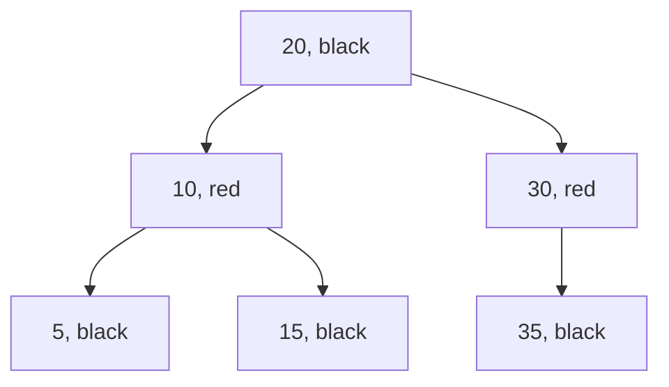

Because the tree shape and balancing rules are identical to a map's, the walk-down-and-compare behavior for `find`, `insert`, and `erase` is the same, and in-order traversal still yields sorted output.

| Operation | Complexity | Why |
|---|---|---|
| Find | O(log n) | tree height bounded by balancing |
| Insert | O(log n) | find the spot, then rebalance |
| Delete | O(log n) | find the node, remove, then rebalance |
| Sorted iteration | O(n) total | in-order traversal, no extra sort needed |

Space complexity is O(n), plus the per-node overhead of the color bit and three pointers, one field lighter than a map's node since there is no value.

With no value to fetch, the method set trims down to membership and ordering queries:

| Method | Returns | What it does |
|---|---|---|
| `insert(key)` | `pair<iterator, bool>` | inserts only if `key` is absent |
| `erase(key)` | `size_t` | number of keys removed, 0 or 1 |
| `find(key)` | iterator | points to `key`, or `end()` if absent |
| `count(key)` | `size_t` | 0 or 1, since keys are unique |
| `size()` / `empty()` | `size_t` / `bool` | number of keys / whether there are none |
| `lower_bound(key)` / `upper_bound(key)` | iterator | first key not less than / strictly greater than `key` |

## 6. unordered_map (hash table)

An unordered_map is backed by an array of buckets, where each bucket holds a small linked list of key-value pairs, a scheme called separate chaining.

```cpp
struct HashMap {
    vector<list<pair<int,int>>> buckets; // buckets.size() = table capacity
};
```

The declaration syntax looks identical to `map`, since the bucket array is just as hidden as the tree was, only the ordering guarantee is gone:

```cpp
#include <unordered_map>
using namespace std;

unordered_map<int, int> um;                      // empty
unordered_map<int, int> um = {{1, 10}, {2, 20}}; // initializer list
um[1] = 10;                                      // insert if absent, else overwrite
```

Under the hood, those keys land in whichever buckets their hashes happen to point to:

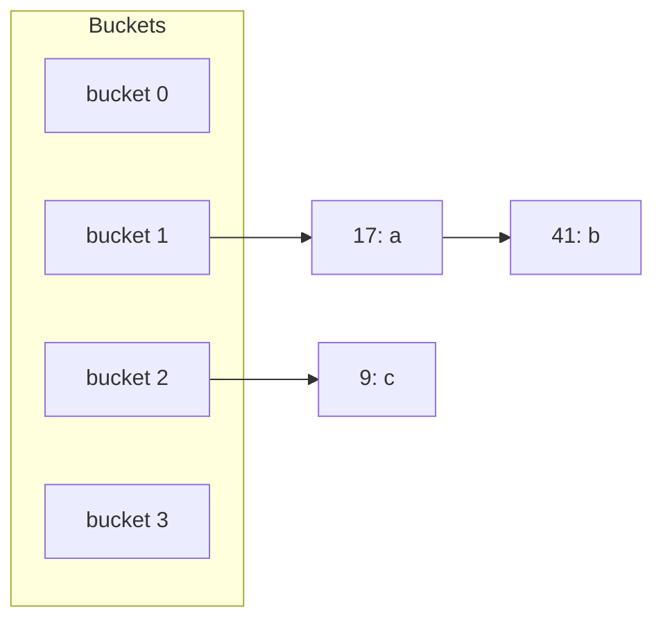

A lookup computes `hash(key) % buckets.size()` to jump straight to the relevant bucket, then linearly scans the short chain inside it for a matching key.

- When the hash function spreads keys evenly across buckets, each chain stays close to constant length, so lookup, insertion, and deletion all run in constant time on average.
- If many keys collide into the same bucket, whether from a poor hash function or an adversary crafting inputs on purpose, that chain grows long and the operation degrades toward a linear scan.
- Once the table's load factor crosses a threshold, it rehashes, allocating a larger bucket array, recomputing every key's bucket, and reinserting everything, which mirrors the same amortization idea as a vector's reallocation.

Iteration order depends only on how keys landed in buckets, not on insertion order or key value, so no ordering guarantee exists.

| Operation | Complexity | Why |
|---|---|---|
| Find | O(1) average, O(n) worst | bucket jump plus short chain scan, unless collisions pile up |
| Insert | O(1) average, O(n) worst | same bucket mechanics, occasional rehash |
| Delete | O(1) average, O(n) worst | locate in chain, unlink |

Space complexity is O(n), plus slack in the bucket array itself.

The method names read the same as `map`'s, but two extras expose the bucket machinery underneath:

| Method | Returns | What it does |
|---|---|---|
| `operator[](key)` | `int&` | reference to `key`'s value, default-constructing an entry if absent |
| `at(key)` | `int&` | bounds-checked access, throws if `key` is absent |
| `insert({k, v})` | `pair<iterator, bool>` | inserts only if `k` is absent |
| `erase(key)` | `size_t` | number of entries removed, 0 or 1 |
| `find(key)` | iterator | points to the entry, or `end()` if absent |
| `count(key)` | `size_t` | 0 or 1, since keys are unique |
| `bucket_count()` | `size_t` | current number of buckets, grows on rehash |
| `load_factor()` | `float` | average chain length, `size() / bucket_count()` |

## 7. unordered_set (hash table)

An unordered_set uses the same bucket-and-chaining structure as an unordered_map, except each bucket holds just keys rather than key-value pairs.

```cpp
struct HashSet {
    vector<list<int>> buckets;
};
```

Declaring one reads just like `set`, but nothing here promises the elements come back out in the order given:

```cpp
#include <unordered_set>
using namespace std;

unordered_set<int> us;             // empty
unordered_set<int> us = {5, 1, 3}; // order not guaranteed
us.insert(10);
```

The same hashing scatters keys across buckets, just without any value riding along:

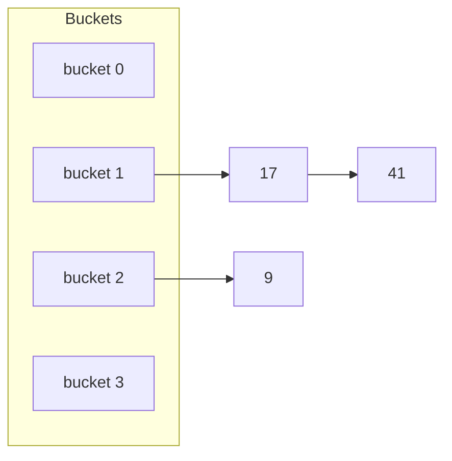

The same bucket-jump-then-chain-scan behavior applies for `find`, `insert`, and `erase`, so the complexity profile matches unordered_map exactly, and the same rehashing and worst-case collision behavior applies.

| Operation | Complexity | Why |
|---|---|---|
| Find | O(1) average, O(n) worst | bucket jump plus short chain scan, unless collisions pile up |
| Insert | O(1) average, O(n) worst | same bucket mechanics, occasional rehash |
| Delete | O(1) average, O(n) worst | locate in chain, unlink |

Space complexity is O(n), plus slack in the bucket array itself.

Same story as `unordered_map` above, minus anything that touches a value:

| Method | Returns | What it does |
|---|---|---|
| `insert(key)` | `pair<iterator, bool>` | inserts only if `key` is absent |
| `erase(key)` | `size_t` | number of keys removed, 0 or 1 |
| `find(key)` | iterator | points to `key`, or `end()` if absent |
| `count(key)` | `size_t` | 0 or 1, since keys are unique |
| `bucket_count()` | `size_t` | current number of buckets, grows on rehash |
| `load_factor()` | `float` | average chain length, `size() / bucket_count()` |

## 8. stack (container adapter)

A stack is not its own data structure. It is a thin wrapper that restricts an underlying container, a deque by default, to operations on one end only, giving last-in-first-out access.

```cpp
struct Stack {
    deque<int> data; // underlying container, deque by default
};
```

Declaring one wraps whichever container is passed in, defaulting to a deque if none is given:

```cpp
#include <stack>
using namespace std;

stack<int> st;              // empty, backed by a deque
stack<int> st(deq);         // built from an existing deque
```

After a few pushes, the underlying deque presents itself as an ordinary stack from the outside:

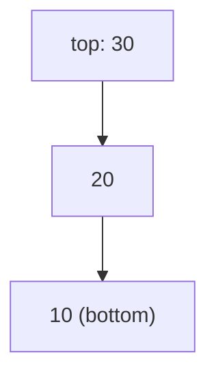

Every operation just forwards to the underlying container's back, so `push` calls `data.push_back`, `pop` calls `data.pop_back`, and `top` reads `data.back()`. Whatever complexity the underlying container offers at its back carries straight through, which for a deque is constant time.

| Operation | Complexity | Why |
|---|---|---|
| Push | O(1) amortized | same as the underlying container's back insert |
| Pop | O(1) | same as the underlying container's back erase |
| Top | O(1) | direct reference, no traversal |

Space complexity is O(n), inherited entirely from the underlying container, since a stack stores no data of its own.

Only the top element is ever reachable, so the method list stays short:

| Method | Returns | What it does |
|---|---|---|
| `push(x)` | `void` | delegates to `data.push_back(x)` |
| `pop()` | `void` | delegates to `data.pop_back()` |
| `top()` | `int&` | reference to the most recently pushed element |
| `empty()` / `size()` | `bool` / `size_t` | whether there are elements / how many |

There is no `find`, no iteration, and no access to anything beneath the top, by design.

## 9. queue (container adapter)

A queue is the same kind of wrapper as a stack, except it splits the two ends apart, where insertion happens at the back and removal happens at the front, giving first-in-first-out access.

```cpp
struct Queue {
    deque<int> data; // underlying container, deque by default
};
```

Declaring one takes the same shape as a stack, just interpreted with two active ends instead of one:

```cpp
#include <queue>
using namespace std;

queue<int> q;               // empty, backed by a deque
queue<int> q(deq);          // built from an existing deque
```

After a few pushes, the same underlying deque separates cleanly into a front and a back:

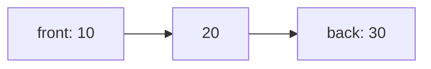

`push` calls `data.push_back`, while `pop` calls `data.pop_front`, so the two ends of the underlying deque are never touched by the same operation. A deque supports constant-time insertion and removal at both ends, which is exactly what makes it the default choice here, unlike a vector, whose front operations are linear.

| Operation | Complexity | Why |
|---|---|---|
| Push | O(1) amortized | back insert on a deque |
| Pop | O(1) | front erase on a deque |
| Front / Back | O(1) | direct reference, no traversal |

Space complexity is O(n), inherited entirely from the underlying deque.

The method list mirrors a stack's, just split across both ends:

| Method | Returns | What it does |
|---|---|---|
| `push(x)` | `void` | delegates to `data.push_back(x)` |
| `pop()` | `void` | delegates to `data.pop_front()` |
| `front()` / `back()` | `int&` | reference to the next element to leave / the last one pushed |
| `empty()` / `size()` | `bool` / `size_t` | whether there are elements / how many |

## 10. priority_queue (binary heap)

A priority_queue is not an adapter in the thin sense above. It stores its elements in a vector but keeps them arranged as a binary heap, a complete binary tree packed into contiguous memory where index `i`'s children sit at `2i + 1` and `2i + 2`, and every parent is greater than or equal to its children by default.

```cpp
struct PriorityQueue {
    vector<int> data; // data[0] is the max, heap-ordered
};
```

Declaring one looks like the other adapters, but the second template argument names the real underlying container, and a comparator can flip the ordering:

```cpp
#include <queue>
using namespace std;

priority_queue<int> pq;                            // empty, max-heap by default
priority_queue<int, vector<int>, greater<int>> pq; // min-heap variant
```

After a few pushes, the underlying vector settles into heap order, largest element first:

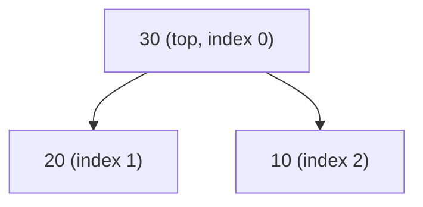

Because the tree is complete, its height is always O(log n), and that height is what bounds the cost of restoring the heap after a change. Pushing appends the new element at the end of the vector, then repeatedly swaps it with its parent while it is larger, a walk called sift-up that climbs at most one path from leaf to root. Popping swaps the root with the last element, shrinks the vector by one, then repeatedly swaps the new root with its larger child while that child exceeds it, a walk called sift-down that descends at most one path from root to leaf.

| Operation | Complexity | Why |
|---|---|---|
| Push | O(log n) | sift-up along one root-to-leaf path |
| Pop | O(log n) | sift-down along one root-to-leaf path |
| Top | O(1) | the max always sits at `data[0]` |

Space complexity is O(n), same contiguous storage as the vector underneath it.

Only three methods matter, since the heap invariant does the rest of the work automatically:

| Method | Returns | What it does |
|---|---|---|
| `push(x)` | `void` | appends `x`, then sifts it up into place |
| `pop()` | `void` | removes the max, then sifts the replacement root down |
| `top()` | `const int&` | reference to the current max, `data[0]` |
| `empty()` / `size()` | `bool` / `size_t` | whether there are elements / how many |

# Related & Specialized Containers

These round out the STL but see less everyday use than the ten above, either because a more common container already covers most of what they offer, or because their value only shows up in a narrower set of problems.

## 1. list (doubly linked list)

A list gives up contiguous memory entirely. Every element is its own node holding pointers to its neighbors, so nothing has to shift when something is inserted or removed.

```cpp
struct Node {
    int value;
    Node* prev;
    Node* next;
};

struct List {
    Node* head;
    Node* tail;
    size_t size;
};
```

Declaring one looks the same as any other sequence container:

```cpp
#include <list>
using namespace std;

list<int> l;
list<int> l = {1, 2, 3};
```

The nodes chain together through pointers rather than sitting in one memory block:

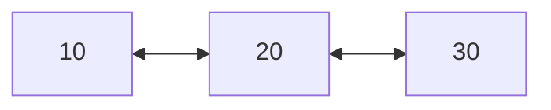

Given an iterator to a node, inserting or erasing there is just a pointer relink, no shifting, no reallocation, true O(1) regardless of position. The cost shows up on the other side, since there is no way to jump straight to the k-th element, reaching it means walking k links one at a time from an end, which is exactly why a list's iterator is bidirectional rather than random access, the same category as `map`'s and `set`'s in [iterator.md](iterator.md).

| Operation | Complexity | Why |
|---|---|---|
| Access by position | O(n) | must walk link by link from an end |
| Insert/delete at a known iterator | O(1) | pointer relink, nothing shifts |
| Search by value | O(n) | no ordering or indexing to exploit |

Space complexity is O(n), plus two pointers of overhead per element, heavier per-element than a vector's or deque's.

| Method | Returns | What it does |
|---|---|---|
| `push_back(x)` / `push_front(x)` | `void` | appends at the back / prepends at the front, O(1) |
| `pop_back()` / `pop_front()` | `void` | removes the last / first element, O(1) |
| `insert(it, x)` / `erase(it)` | iterator | O(1) at the given position, no shifting |
| `splice(it, other)` | `void` | moves nodes from another list in, O(1), no copying |
| `size()` / `empty()` | `size_t` / `bool` | number of elements / whether there are none |

## 2. array (fixed-size)

An array is a `vector` with its size frozen at compile time and baked directly into the type, `array<int, 5>` and `array<int, 10>` are different types entirely.

```cpp
struct Array {
    int data[N]; // N is a compile-time constant, part of the type
};
```

Declaring one takes the same forms as a vector, minus anything that could change its size afterward:

```cpp
#include <array>
using namespace std;

array<int, 5> a;                   // 5 elements, uninitialized
array<int, 5> a = {1, 2, 3, 4, 5}; // initializer list
```

Laid out in memory, there is no unused slack at all, every cell is a real element:

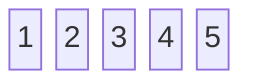

With no capacity to track and no growth to support, it usually lives entirely on the stack rather than the heap, and every value-level operation a vector supports, indexing, iteration, works identically, since underneath it is just a safer wrapper around a raw C array.

| Operation | Complexity | Why |
|---|---|---|
| Access by index | O(1) | direct pointer arithmetic, no indirection at all |
| Insert/delete | not supported | size is fixed at compile time, nothing can grow or shrink |

Space complexity is exactly O(n), with no slack and no heap bookkeeping at all, the entire point of the type.

| Method | Returns | What it does |
|---|---|---|
| `operator[](i)` / `at(i)` | `int&` | positional access, `at` bounds-checked |
| `size()` | `size_t` | always `N`, known at compile time |
| `fill(x)` | `void` | assigns `x` to every element |
| `begin()` / `end()` | iterator | iterators for range-based `for` and algorithms |

## 3. bitset (fixed-size bit array)

A bitset packs bits 64 at a time into machine words rather than spending a byte or more per element, the fixed-size, bitwise-operator-equipped cousin of the bit-packing `vector<bool>` already does internally.

```cpp
struct Bitset {
    unsigned long words[N / 64 + 1]; // N bits packed into 64-bit words
};
```

Declaring one accepts a few different forms depending on how the bits are specified:

```cpp
#include <bitset>
using namespace std;

bitset<8> b;          // 8 bits, all 0
bitset<8> b(0b1010);  // from a binary literal
bitset<8> b("1010");  // from a string of '0'/'1' characters
```

Laid out in memory, those 8 bits pack into a single word, one bit per position rather than one byte:

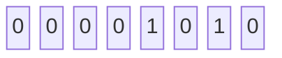

Because bits live packed inside words rather than as separate elements, operations that touch the whole set, `&`, `|`, `^`, `count()`, work one machine word at a time instead of one bit at a time, so an operation over `n` bits costs roughly `n / 64` word-level steps rather than `n` individual ones.

| Operation | Complexity | Why |
|---|---|---|
| Access/set/reset a single bit | O(1) | direct word-and-offset arithmetic |
| `count()` (popcount) | O(n / 64) | one hardware popcount instruction per word |
| `&` / `\|` / `^` with another bitset | O(n / 64) | one instruction per word pair, not per bit |

Space complexity is O(n / 8) bytes, eight times denser than one byte per element.

| Method | Returns | What it does |
|---|---|---|
| `set(i)` / `reset(i)` / `flip(i)` | `bitset&` | sets / clears / toggles bit `i`, or every bit with no argument |
| `test(i)` | `bool` | value of bit `i`, bounds-checked |
| `count()` | `size_t` | number of set bits |
| `any()` / `none()` / `all()` | `bool` | whether any, none, or all bits are set |
| `to_string()` | `string` | `"0"`/`"1"` character rendering |

## 4. multiset & multimap

`multiset` and `multimap` run on the exact same red-black tree as `set` and `map`, with one constraint lifted, since `insert` never rejects a key that already exists, it just adds another node with an equal key alongside the others. The tree, the balancing, the O(log n) bound, and the sorted iteration all carry over unchanged.

```cpp
#include <set>
#include <map>
using namespace std;

multiset<int> ms = {1, 1, 2, 3}; // duplicates kept

multimap<int, string> mm;
mm.insert({1, "a"});
mm.insert({1, "b"}); // both survive, unlike map's m[1] = "b" overwriting the first
```

Since a key can now appear more than once, `find` only ever returns the first match it walks to, and `count(key)` is no longer capped at 0 or 1. `equal_range(key)` is the method that earns its keep here, returning the full range of every entry matching `key` in one O(log n) lookup rather than repeating `find` in a loop.

| Method | Returns | What it does |
|---|---|---|
| `insert(key)` | iterator | always succeeds, even if `key` already exists |
| `count(key)` | `size_t` | number of matching entries, not capped at 1 |
| `equal_range(key)` | `pair<iterator, iterator>` | the full range of entries matching `key` |

## 5. unordered_multiset & unordered_multimap

The same relationship holds on the hash-table side, with identical bucket-and-chaining machinery as `unordered_set`/`unordered_map`, and the uniqueness constraint dropped, so a bucket's chain can hold several nodes sharing the same key.

```cpp
#include <unordered_set>
#include <unordered_map>
using namespace std;

unordered_multiset<int> ums = {1, 1, 2, 3}; // duplicates kept

unordered_multimap<int, string> umm;
umm.insert({1, "a"});
umm.insert({1, "b"}); // both survive, same as multimap
```

`count(key)` and `equal_range(key)` mean the same thing here as they do for `multiset`/`multimap`, just reached through a bucket jump and chain scan instead of a tree walk, so they stay O(1) average rather than O(log n).
