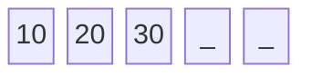
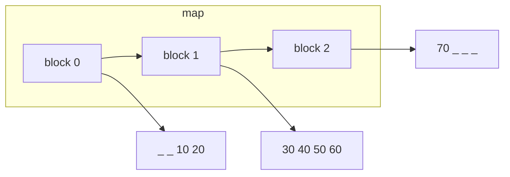
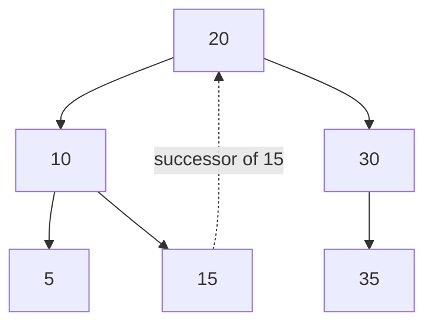
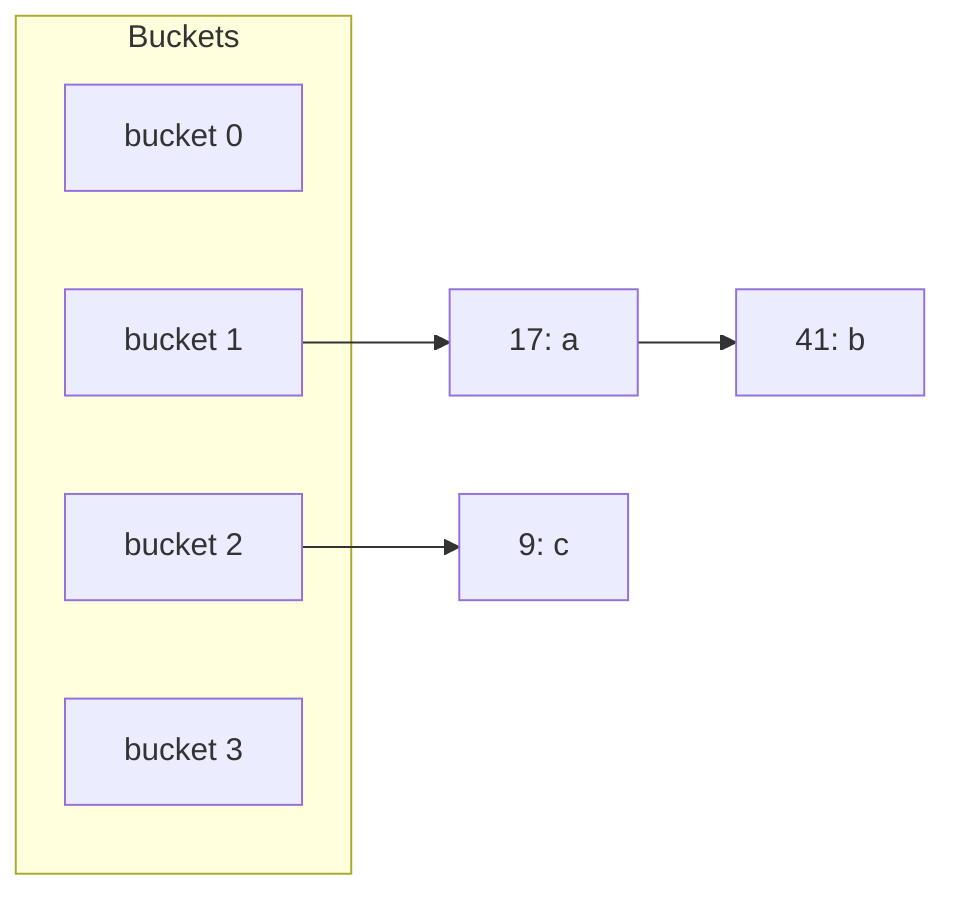

# Iterators

An iterator is a generalized pointer into a container. Every iterator supports the same small interface, dereferencing with `*it` to read the element, advancing with `++it`, and comparing with `==`/`!=` to check position, but what those three operations actually do underneath depends entirely on how the container it belongs to is laid out in memory.

```cpp
auto it = m.find(5);
if (it != m.end()) {
    cout << it->second;  // access the value paired with key 5
    m.erase(it);          // erase using the iterator directly, no second lookup
}
```

What `*it` actually hands back depends on what the iterator points to. For a `vector<int>` or `set<int>`, an element is just an `int`, so `*it` is the value itself. For a `map<K, V>`, an element is a `pair<const K, V>`, since the container bundles key and value together, so `*it` gives back that whole pair, and `.first`/`.second` reach into it from there. `it->second` is shorthand for `(*it).second`, the same arrow-implies-dereference convention a raw pointer to a struct would use.

For a `vector`, `auto` and the spelled-out type resolve to exactly the same thing:

```cpp
vector<int> v = {10, 20, 30};

auto vit = v.begin();                   // compiler infers vector<int>::iterator
vector<int>::iterator vit2 = v.begin(); // same type, spelled out
int x = *vit;                           // 10, the element itself
```

A `set` follows the identical pattern, just with its own iterator type:

```cpp
set<int> s = {10, 20, 30};

auto sit = s.begin();                // compiler infers set<int>::iterator
set<int>::iterator sit2 = s.begin(); // same type, spelled out
int y = *sit;                        // 10, same story, an element is just an int
```

A `map`'s spelled-out type is where `auto` starts earning its keep, and this is also where dereferencing returns a pair instead of a plain value:

```cpp
map<int, string> m = {{1, "a"}, {2, "b"}};

auto mit = m.begin();                        // compiler infers map<int, string>::iterator
map<int, string>::iterator mit2 = m.begin(); // same type, spelled out

pair<const int, string> p = *mit; // {1, "a"}, the whole key-value pair
int key = mit->first;             // 1, shorthand for (*mit).first
string val = mit->second;         // "a", shorthand for (*mit).second
```

Every pair above compiles to the exact same type on both lines, `auto` is resolved at compile time, not a dynamic type, it just saves typing the full name out.

`end()` is not a real element. It is a sentinel, "one past the last element," that exists purely so it can be compared against. `find(key) == container.end()` means "not found," and that is the only meaning `end()` carries.

The reason `find` returns an iterator rather than a `bool` or the element itself is that it answers two questions at once, namely whether the key exists, by comparing to `end()`, and where it sits, so it can be dereferenced, modified in place, or handed straight to `erase()` without searching again.

## Iterator by container

Since `*it`, `++it`, and `it == other` compile down to very different machine operations depending on the container, the fastest way to understand an iterator is to look at what it wraps.

### vector

A vector's iterator is, quite literally, a raw pointer into the contiguous buffer.



`*it` is a pointer dereference, `++it` is pointer arithmetic (`ptr + 1`), and jumping ahead by `n` with `it + n` is a single addition. All of it is O(1), with no indirection beyond the one the CPU already pays for reading memory.

### deque

A deque's iterator carries a pointer to the current block plus an offset within that block, since elements are not contiguous across the whole container, only within each block.



`++it` usually just bumps the offset, but once the offset runs past the end of a block, the iterator has to follow the map to the next block pointer and reset its offset to zero. Still O(1), just with a branch and a possible extra pointer hop that a vector's iterator never pays.

### map / set

A map or set iterator wraps a pointer to a tree node. `++it` walks to that node's in-order successor by going right once if a right subtree exists, then left as far as possible, or by climbing back up through parent pointers if there is no right subtree at all.



This walk is why iterating a map or set from `begin()` to `end()` always comes out in sorted key order, and it is also why `--it` works just as well as `++it`, walking to the in-order predecessor instead. A single step costs O(1) amortized, since a full traversal touches each edge at most twice, but no single step is guaranteed O(1) in the worst case, an unlucky node might climb several parent links before finding its successor.

### unordered_map / unordered_set

A hash-based iterator wraps a pointer to a node inside a bucket's chain. `++it` moves to the next node in that same chain, or, once the chain is exhausted, jumps ahead to the first node of the next non-empty bucket.



There is no meaningful order to walk toward, no key comparison decides where `++it` goes next, only "keep going until something is there." That is also why there is no `--it` for these iterators at all, since the underlying bucket array has no notion of a previous element to walk back to.

## Iterator categories

The C++ standard groups these behaviors into categories, and it matters because generic algorithms declare which category they need.

| Container | Category | Supports |
|---|---|---|
| vector, deque | random access | `++`, `--`, and jumping by `n` in O(1) |
| map, set | bidirectional | `++` and `--`, no arbitrary jump |
| unordered_map, unordered_set | forward | `++` only, no `--`, no jump |

`std::sort` requires random access iterators, since it needs to jump around freely to partition and swap, which is why it compiles for `vector` and `deque` but not for `map`, `set`, or either hash-based container. Sorting one of those means copying its elements out into something like a `vector` first.

## For loops

Every loop style below is ultimately built on the same three iterator operations, `*it`, `++it`, and `!=`, just with different amounts of that machinery exposed or hidden.

### Index-based

```cpp
vector<int> v = {10, 20, 30};
for (int i = 0; i < v.size(); i++) {
    cout << v[i]; // v[i] is positional: the element at index i
}
```

This form relies entirely on `operator[]` meaning "the element at this position," which only random access containers provide. `map` also defines `operator[]`, but `m[k]` means something completely different there, since it looks up (or default-inserts) the value for key `k`, not "the k-th element," so this loop shape never translates to `map`, `set`, or either hash-based container at all.

### Iterator-based

```cpp
for (auto it = v.begin(); it != v.end(); ++it) {
    cout << *it;
}

for (vector<int>::iterator it = v.begin(); it != v.end(); ++it) { // same loop, type spelled out
    cout << *it;
}

for (auto it = m.begin(); it != m.end(); ++it) {
    cout << it->first << ": " << it->second;
}

for (map<int, string>::iterator it = m.begin(); it != m.end(); ++it) { // same loop, type spelled out
    cout << it->first << ": " << it->second;
}
```

Because this only depends on `++it`, `*it`, and `!=`, the three operations every iterator category guarantees, it works identically on all six containers regardless of category. It is also the form to reach for when the loop body needs to erase the current element mid-traversal, since `erase(it)` returns the next valid iterator to catch, `it = m.erase(it);`, something a range-based for loop has no syntax for.

### Range-based

```cpp
for (int x : v) { /* ... */ }        // copies each element into x
for (int& x : v) { /* ... */ }       // reference: mutating x mutates v
for (const int& x : v) { /* ... */ } // reference, read-only, no copy

for (auto& [k, v] : m) {
    cout << k << ": " << v;
}

for (pair<const int, string>& kv : m) { // same loop, no structured bindings
    cout << kv.first << ": " << kv.second;
}
```

A range-based for loop is sugar, since the compiler expands it into exactly the iterator-based loop above, where `begin()` and `end()` are each called once, then the loop advances with `++it` and reads with `*it`. Writing `int x` copies the element out on every iteration, `int&` binds a reference directly to it so mutating `x` mutates the container, and `const int&` is the usual default, no copy and the compiler rejects any attempt to modify it. For a `map`, `auto& [k, v] : m` uses structured bindings (C++17) to unpack the `pair<const K, V>` that `*it` gives back into two named variables, a naming convenience over writing `it->first` and `it->second` by hand.

Structured bindings are a special case, since the `[k, v]` syntax only ever follows `auto`, there is no way to spell out `pair<const int, string>` in that same slot. Dropping structured bindings entirely and binding the whole pair under one name, `kv` above, is the only "no `auto`" alternative, and it trades the two convenient names back for `kv.first`/`kv.second`.

| Loop style | Requires | Works on |
|---|---|---|
| Index-based, `v[i]` | random access `operator[]` | vector, deque |
| Iterator-based, `*it` | any iterator category | all six containers |
| Range-based, `for (x : v)` | any iterator category | all six containers |
