# What are Authentication and Authorization?

Authentication confirms who is making a request. Authorization confirms what that identity is allowed to do once it's confirmed.

They're different problems, but almost every real system has to answer both, one right after the other. A third, practical problem sits alongside them, keeping two servers that speak different auth languages in sync about the same session.

# Authentication

Authentication is the half of the problem that comes first, and the classic one-line version of it is "who are you," proving a request actually comes from who it claims to come from, before anything downstream, including authorization, gets to matter at all.

# Starting small

Consider a single internal service calling another, authenticated with one hardcoded API key checked on every request.

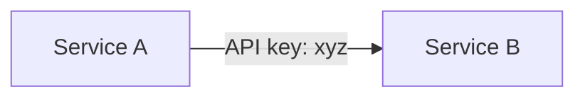

For one service calling another, this is enough, there's exactly one caller and one key to check.

# Where it breaks

Real users need to log in individually, have sessions that expire, and log out on demand, none of which a single shared key can express, since a shared key doesn't distinguish one user from another at all.

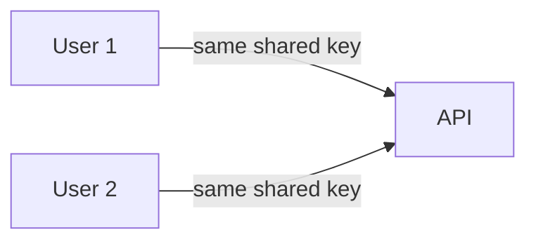

Identifying individual users, and letting each of their sessions be created and revoked independently, is what the approaches below solve differently.

# Session-Based Authentication

Session-based authentication creates a session record on the server after a successful login, and gives the client a session ID in a cookie, checked against that server-side record on every subsequent request.

A cookie itself is just a small piece of data the server asks the browser to store, sent once via a `Set-Cookie` response header. The browser then attaches it automatically to every later request to that same domain, as a `Cookie` request header, with no application code needed to resend it manually.

A few attributes control how safely that cookie behaves. `HttpOnly` keeps JavaScript from reading it at all, `Secure` limits it to HTTPS, and `SameSite` restricts whether it's sent along with requests originating from another site.

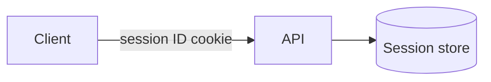

Creating and reading that session record is two ordinary calls.

```python
session_id = create_session(user_id)  # stored server-side, e.g. in Redis
response.set_cookie("session_id", session_id)
```

Revoking a session is immediate and simple, deleting the server-side record instantly invalidates it.

That same server-side lookup is the cost. Every request needs a round trip to the session store, and that store has to be shared across every server in a horizontally scaled deployment rather than living in one machine's memory.

# Token-Based Authentication (JWT)

Token-based authentication issues a signed token after login, a JWT, JSON Web Token, carrying claims like user ID, roles, and an expiry directly inside it, verified by checking its signature rather than looking anything up.

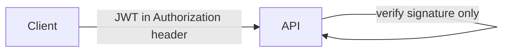

Issuing and verifying the token are two independent calls, needing nothing shared but the signing key.

```python
token = jwt.encode({"user_id": 42, "exp": time.time() + 3600}, secret_key)
payload = jwt.decode(token, secret_key)  # raises if signature invalid or expired
```

Not needing a server-side lookup at all is the appeal. Any server holding the signing key can verify a token independently, which scales cleanly across many servers.

The cost shows up at revocation. A JWT is valid until it expires no matter what happens server-side afterward, so revoking one before its natural expiry means maintaining a blocklist, which reintroduces the same server-side check the token was meant to avoid.

# OAuth

OAuth solves a different problem than the other two, letting a third-party application act on a user's behalf without that application ever seeing the user's actual password, "Log in with Google" being the common example.

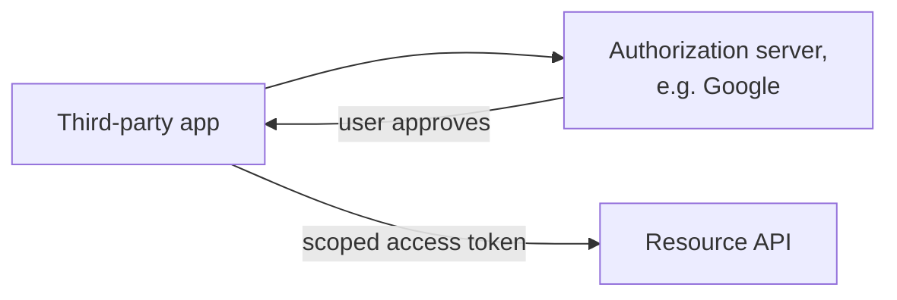

The user authenticates directly with the authorization server, Google, in the example, which then issues the third-party app a scoped access token, good only for the specific permissions the user approved, rather than full account access.

```
GET /authorize?client_id=app123&scope=read_profile&redirect_uri=...
```

That delegation is exactly what session and token auth don't solve on their own, a user granting one specific app limited access without ever handing that app a password it could reuse elsewhere.

The cost is complexity. OAuth's authorization flows involve more moving parts, redirect steps, and scopes to configure correctly than either session or token auth alone.

# Authorization

Authorization is the half that comes after, and the classic one-line version of it is "what are you allowed to do," deciding what an already-confirmed identity is actually permitted to act on.

# Starting small

Consider a small app with a single boolean check, `is_admin`, gating a handful of privileged actions.

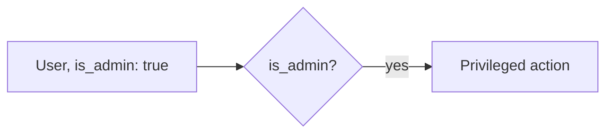

With only two tiers of user, admin and everyone else, this is all the granularity the app actually needs.

# Where it breaks

Permissions get more specific than a single flag can express, a user who can edit their own posts but not someone else's, a moderator who can hide content but not delete an account, and a single boolean has no way to represent that many distinct, overlapping rules.

# Role-Based Access Control

RBAC groups permissions into named roles, admin, editor, viewer, and assigns each user one or more roles, so a permission check asks whether any of the user's roles grants the needed permission.

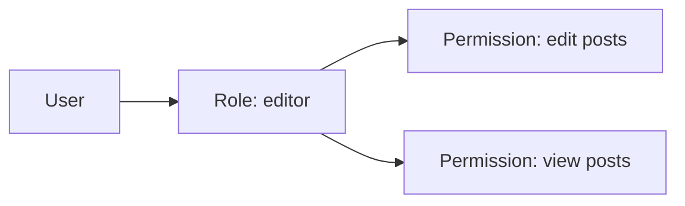

Checking a permission is a lookup across whichever roles the user holds.

```python
def can(user, permission):
    return any(permission in ROLE_PERMISSIONS[role] for role in user.roles)
```

Reasoning about who can do what is straightforward here, a role's permission list is fixed and easy to audit.

What it can't express cleanly is a rule that depends on the specific resource being acted on. Editing your own post versus anyone's post needs a role check plus extra logic bolted on, since the role itself has no concept of ownership.

# Attribute-Based Access Control

ABAC evaluates a permission dynamically, based on attributes of the user, the resource, and the context of the request, rather than a fixed role's fixed permission list.

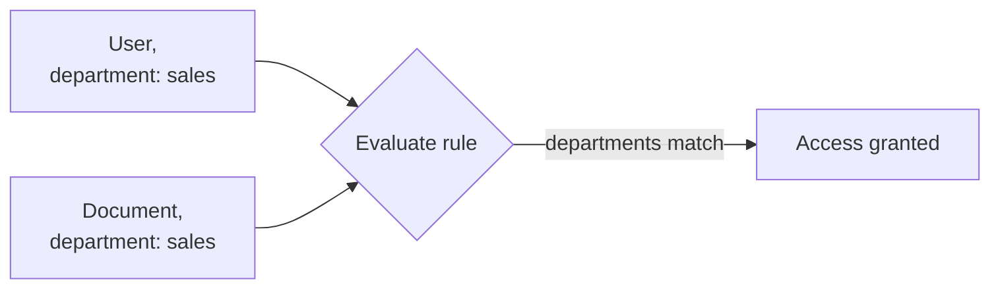

The rule itself is just a function evaluating whatever attributes matter.

```python
def can_edit(user, document):
    return user.department == document.department and is_business_hours()
```

That flexibility lets a single rule express exactly the ownership or context-dependent logic RBAC needed extra code to bolt on, department matches, time of day, resource state, all evaluated together.

The cost is auditability. A rule combining several dynamic attributes is harder to reason about at a glance than a fixed list of role-to-permission mappings, and tracing why a specific request was allowed or denied means evaluating the same conditions the system did, not just reading a table.

# Syncing Sessions Across Auth Mechanisms

Two servers speaking genuinely different auth languages, one checking a cookie, one verifying a JWT, still need to agree on the same underlying session, the same user, the same current permissions, at the same moment.

Neither mechanism gets there alone. A cookie's session ID only means something to the server holding its own session store, and a JWT's signature only proves the token itself wasn't tampered with, not that the session behind it still matches what the other server currently knows.

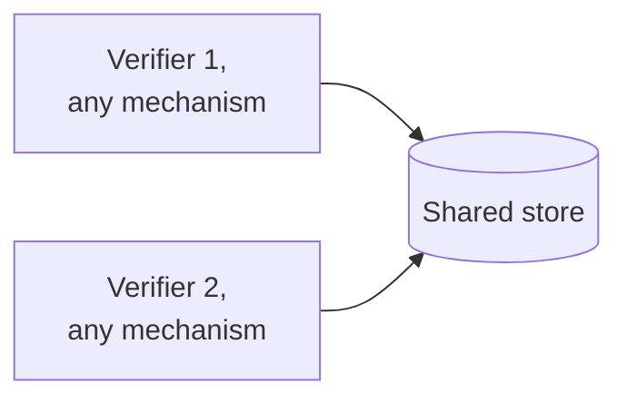

The concrete case this most often shows up as is exactly that pairing, a legacy cookie-based service and a newer JWT-based one, both needing to read the same session rather than two disconnected ones.

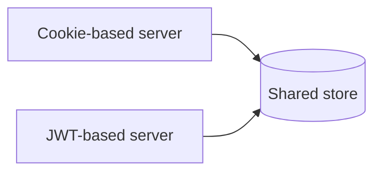

The fix ties both servers to the same identifier instead of each keeping its own idea of the session. The credential carries a unique ID, a `jti` claim on a JWT, a session ID in a cookie, matching one record in a shared store both servers read from and write to.

```
session_id = "sess_9f8e2a"
shared_store["sess_9f8e2a"] = { "user_id": 42, "role": "editor", "revoked": false }
```

| Store | Lookup speed | Fits |
|---|---|---|
| Redis | Fast, in-memory | The common default, since this check runs on nearly every request |
| Database table | Slower per lookup | Structurally the same fix, fine when request volume doesn't need Redis's speed |

Redis holds this as a simple hash, keyed directly by the session ID.

```
HSET sess_9f8e2a user_id 42 role editor revoked false
```

A database table expresses the exact same record as an ordinary row instead.

```sql
CREATE TABLE sessions (session_id TEXT PRIMARY KEY, user_id INT, role TEXT, revoked BOOLEAN);
```

Updating that one record keeps both servers in agreement immediately, a role change, a logout, a ban, whichever changed is visible to both on their very next check, regardless of which mechanism either one uses to verify the credential in the first place.

Revocation is just the most common single case of that same sync.

That shared store also answers a related question, how a JWT-based app gets a JWT in the first place when the user already has a valid session somewhere else, a PHP app authenticating with a cookie, say, and a React app that hasn't issued a token yet.

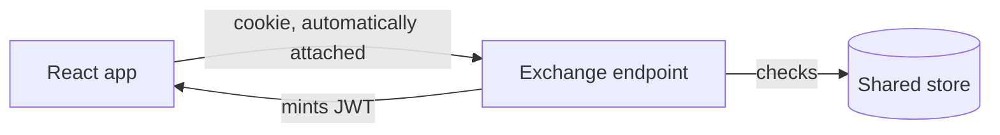

Because the cookie is scoped to the shared domain, the browser attaches it automatically to a request React makes back to that domain, no code on React's side has to go fetch it.

An exchange endpoint reads that cookie, validates the session it points to against the shared store, and mints a fresh JWT for the React app to use from then on.

```python
def exchange_session_for_jwt(request):
    session_id = request.cookies["session_id"]
    session = shared_store.get(session_id)
    if not session or session["revoked"]:
        raise Unauthorized()
    return jwt.encode({"user_id": session["user_id"], "role": session["role"]}, secret_key)
```

React still needs its own login screen for a user arriving with no session at all. What the exchange endpoint saves is only the case of a user who already authenticated through PHP, letting React skip straight to minting a token and carrying it from then on the same way `Token-Based Authentication (JWT)` already describes.

# How to choose

Session-based auth fits a traditional web application where immediate, reliable revocation matters and the deployment can share one session store across its servers.

Token-based auth fits a stateless API or a system with many independently scaling servers, where avoiding a server-side lookup on every request matters more than instant revocation.

OAuth fits letting a third-party application or service act on a user's behalf with limited, user-approved permissions, not a system's own first-party login.

RBAC fits permissions that map cleanly onto a small, fixed set of roles, most applications' actual needs.

ABAC fits permissions that genuinely depend on resource ownership or request context, where RBAC's fixed roles would need extra logic bolted on for every such case anyway.

A shared session store fits the moment more than one server, speaking more than one auth mechanism, needs to agree on the same session's current state, something a token's signature alone can never express on its own.

# What gets traded away

Session-based auth trades away easy horizontal scaling for simple, immediate revocation.

Token-based auth trades away easy revocation for a server-side lookup it never needs to make.

OAuth trades away simplicity for the ability to delegate limited access safely to a third party.

RBAC trades away fine-grained, context-aware rules for permissions that are easy to define and audit.

ABAC trades away that same auditability for rules flexible enough to express ownership and context RBAC cannot on its own.

A shared session store trades away a stateless token's whole appeal, no server-side lookup, for both servers seeing the same session state, revocation included, the instant either one changes.
