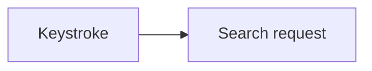
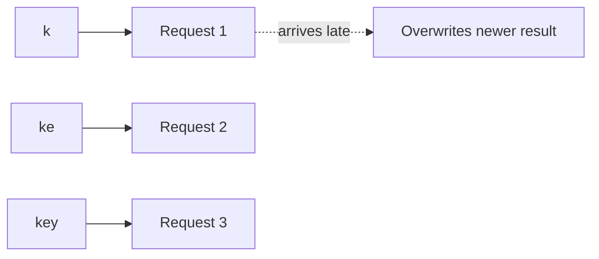
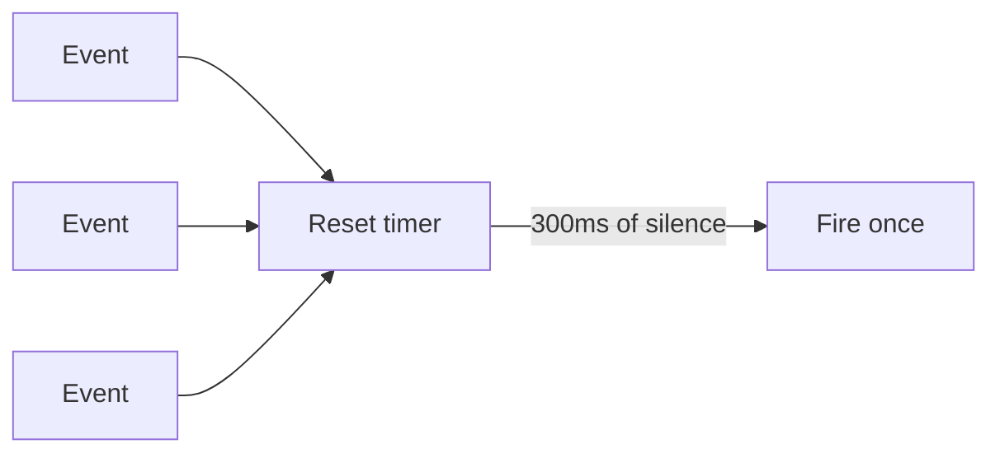
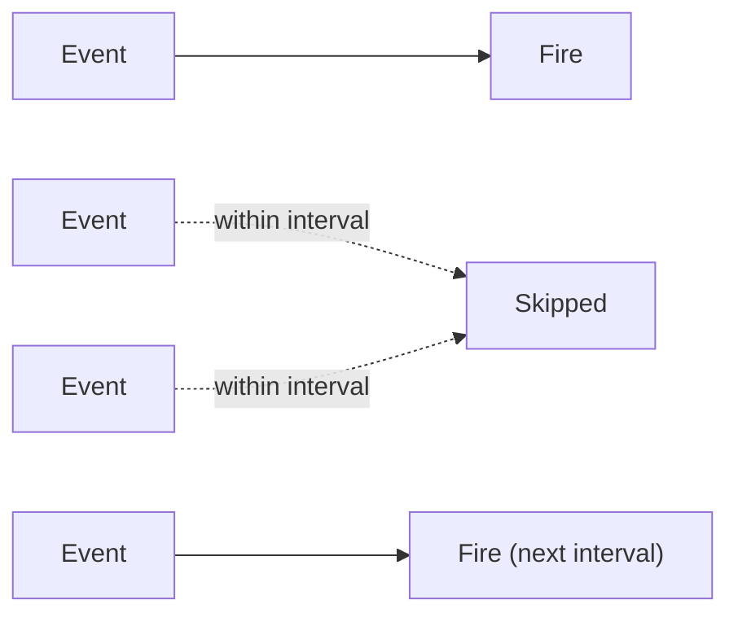

# What are Debounce and Throttle?

`rate-limiting.md` protects a server from a client sending too many requests. Debounce and throttle solve the mirror-image problem from the client's own side, controlling how often the client fires a request or callback in response to a rapid stream of events in the first place.

# Starting small

Consider a search-as-you-type box that sends a request to the server on every single keystroke.



Typed slowly, one letter at a time with pauses, this sends one request per letter and each response arrives before the next keystroke, no problem.

# Where it breaks

A user types a whole word quickly, firing a dozen requests within a second, one for every partial, mostly meaningless prefix along the way. Most of those requests are wasted, only the final one, for the complete word, actually matters, and slower earlier responses can even arrive after faster later ones, briefly showing stale results on top of fresher ones.



Debounce and throttle both cut down how often that stream of events actually triggers a request, just by different rules for when to let one through.

# Debounce

Debounce waits for a pause in the incoming events before acting, resetting its timer on every new event, so it only fires once the events actually stop for a moment.



Implementing it needs just a timer reset on every call.

```javascript
function debounce(fn, delay) {
  let timer;
  return (...args) => {
    clearTimeout(timer);
    timer = setTimeout(() => fn(...args), delay);
  };
}

searchInput.addEventListener("input", debounce(runSearch, 300));
```

Applied to search-as-you-type, this means no request fires at all until the user stops typing for 300 milliseconds, at which point exactly one request goes out for the final query. That's ideal when only the end state matters, but it also means nothing happens at all while typing continues, which is the wrong tradeoff for something that should show continuous feedback rather than a single final result.

# Throttle

Throttle guarantees a function runs at most once per fixed interval, no matter how many events arrive in between, rather than waiting for events to stop entirely.



The implementation just checks elapsed time instead of resetting a timer.

```javascript
function throttle(fn, interval) {
  let lastRun = 0;
  return (...args) => {
    const now = Date.now();
    if (now - lastRun >= interval) {
      lastRun = now;
      fn(...args);
    }
  };
}

window.addEventListener("scroll", throttle(updatePosition, 100));
```

Applied to a scroll handler, this means the handler runs at a steady cadence throughout continuous scrolling, roughly every 100 milliseconds, rather than not at all until scrolling stops, which is exactly the continuous feedback a scroll position indicator needs and debounce would never provide.

# How to choose

Debounce fits an action where only the final state matters, search-as-you-type, saving a draft after a user stops editing, validating a form field after a user stops typing.

Throttle fits an action that needs to keep running periodically throughout a continuous stream of events, a scroll position tracker, a resize handler redrawing a layout, a mousemove handler updating a tooltip's position.

# What gets traded away

Debounce trades away any feedback during the activity itself for firing exactly once, at the end, which wastes nothing but shows nothing until the pause happens.

Throttle trades away that single final call's precision for steady, continuous feedback, it fires on a fixed cadence, which means the very last event before activity stops might not get its own immediate call.
