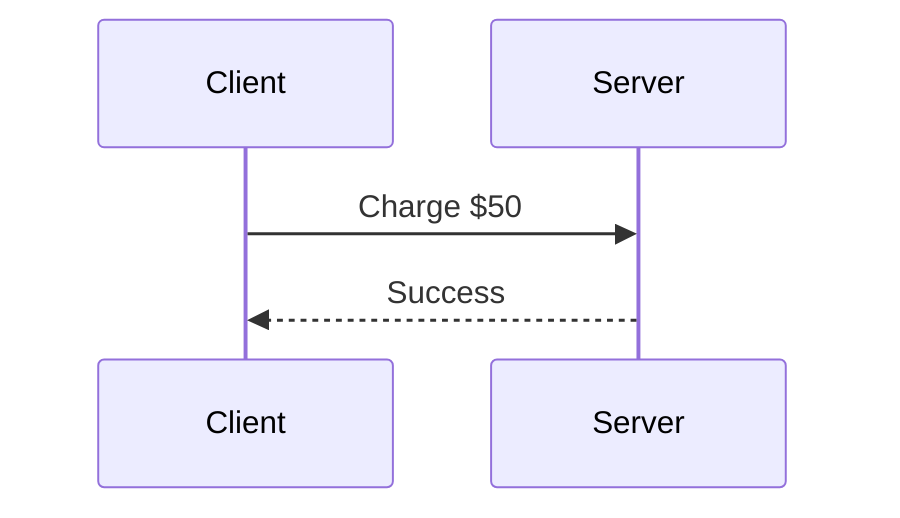
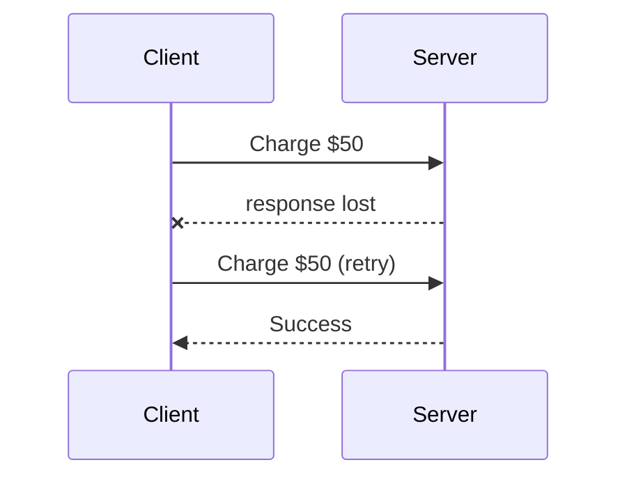
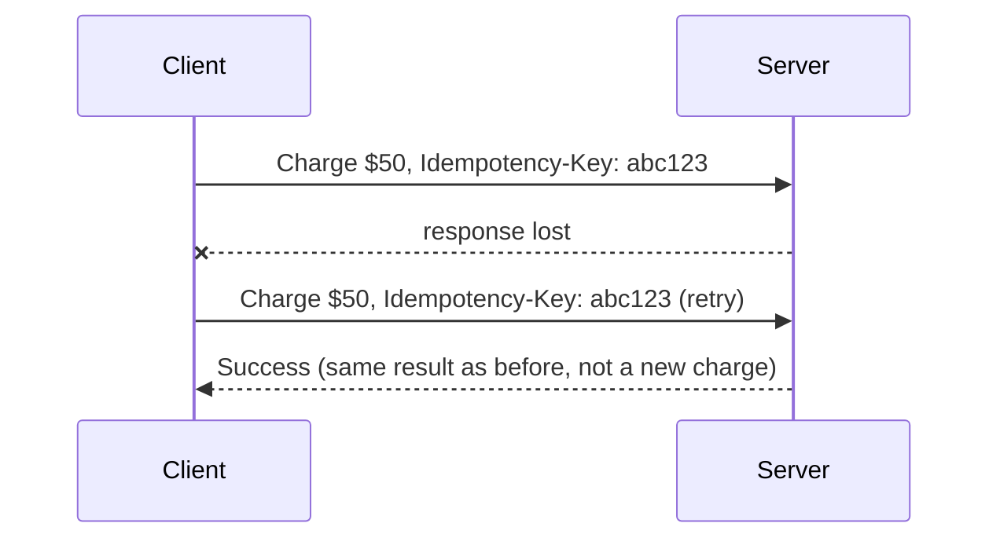
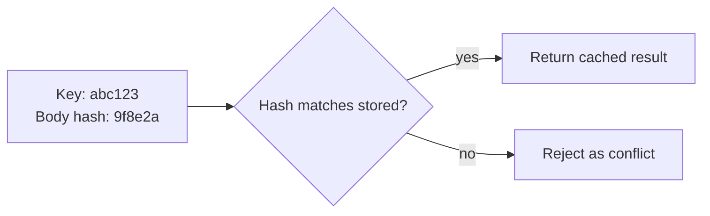

# What is Idempotency?

An idempotent operation produces the same result no matter how many times it runs. Reading a value is naturally idempotent, asking twice returns the same answer. Charging a payment is not, asking twice can charge twice.

# Starting small

Consider a client calling an API to charge a customer's card, sending the request once and getting a success response back.



That single round trip works exactly as intended, one request, one charge.

# Where it breaks

The network times out after the server has already processed the charge but before its response reaches the client. The client, with no way to know whether the charge actually went through, does the reasonable thing and retries.



Without anything to recognize that retry as a repeat of the same request, the server processes it as a brand-new charge, and the customer is billed twice for one purchase.

# Idempotency Keys

An idempotency key is a unique value the client generates once per logical operation, not once per HTTP attempt, and sends with the request and every retry of that same request.



The server stores each key alongside the result it produced the first time that key was seen, and on any later request carrying the same key, it returns that stored result directly instead of executing the operation again.

# What Counts as the Same Request

Recognizing a key is not enough on its own, the server also has to guard against the same key being reused for a genuinely different request, a client bug sending a different amount under a key it already used for something else.

A safe implementation stores a hash of the original request body alongside the result, so the stored record carries enough to catch a mismatch, not just the result itself.

```
idempotency_store["abc123"] = {
    "body_hash": "9f8e2a...",
    "result": { "charge_id": "ch_1", "status": "succeeded" }
}
```

A later request reusing that same key is then judged against the hash it stored, not just its presence.



# What gets traded away

Idempotency keys trade away a little storage and a lookup on every request for the guarantee that a retry never repeats a side effect. Choosing how long to keep a key matters too, a short TTL frees up storage sooner but risks a slow, legitimate retry arriving after the key already expired and being treated as brand new, while a long TTL keeps that safety net longer at the cost of storing more keys for longer.
