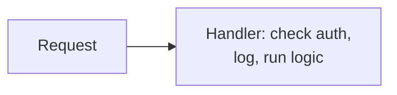
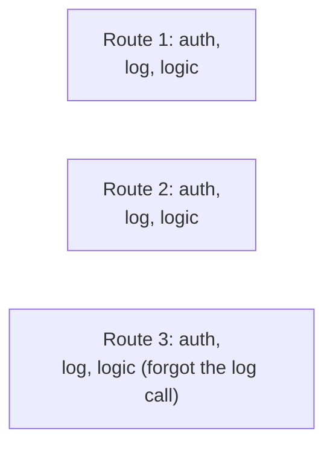
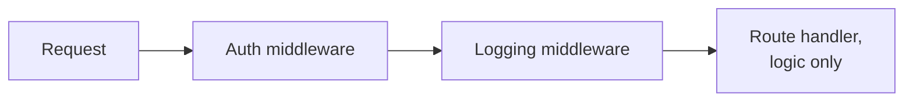
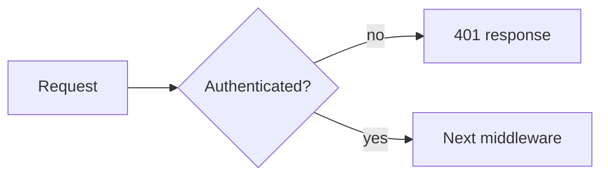

# What is Middleware?

A single route handler that checks authentication, logs the request, and then runs its own business logic is doing three unrelated jobs in one function.

# Starting small

Consider an API with one route, its handler checking an auth header, logging the request, then running its actual logic, all inline.



With a single route this is mildly repetitive at worst, there's only one place that logic lives.

# Where it breaks

A second, a third, a tenth route gets added, and each one needs the same auth check and the same logging, copied into every handler. Changing how authentication works now means finding and updating that logic in every single handler instead of one place, and it's easy to add a new route and simply forget to copy the check at all.



Middleware solves this by pulling each cross-cutting concern out into its own small function, composed once in front of every route, so a handler only ever contains the logic specific to that route.



# The Chain

Each middleware function receives the request, does its own job, and then either passes control to the next middleware in the chain or short-circuits by responding directly without ever reaching the handler.



Registering that chain in order looks like this.

```javascript
function authMiddleware(req, res, next) {
  if (!isValidToken(req.headers.authorization)) {
    return res.status(401).send("Unauthorized");
  }
  next();
}

app.use(authMiddleware);
app.use(loggingMiddleware);
app.get("/orders", getOrdersHandler);
```

An auth middleware that rejects an unauthenticated request never calls `next()`, which means logging middleware and the route handler both never run for that request at all.

# Ordering Matters

Middleware runs in the order it's registered, and that order changes what each step actually sees. Logging registered before auth captures every request, rejected or not, logging registered after auth only ever sees requests that already passed authentication.


Rate limiting is usually placed before authentication rather than after, an unauthenticated flood of requests should still be throttled, not allowed to reach and waste time on the auth check itself for every single one.

# In-Process, Not Out-of-Process

`proxies.md` covers a reverse proxy doing some of this same work, TLS termination, routing, sometimes even auth, but entirely out-of-process, before a request ever reaches the application at all. Middleware runs inside the application process itself, as part of the same request-handling code the route handlers live in.

That distinction matters operationally. A reverse proxy can be swapped or reconfigured without touching application code, while middleware changes ship as part of the application's own deployment, and middleware has direct access to in-process application state a proxy never sees.

# What gets traded away

Middleware trades away a small amount of per-request overhead, every request passes through every registered step even when a given step has nothing to do, for not duplicating that logic across every handler.

It also trades away simplicity for indirection, tracing what actually happens to a request means reading through a chain of middleware in order rather than one self-contained function, which can make a single handler harder to understand in isolation.
