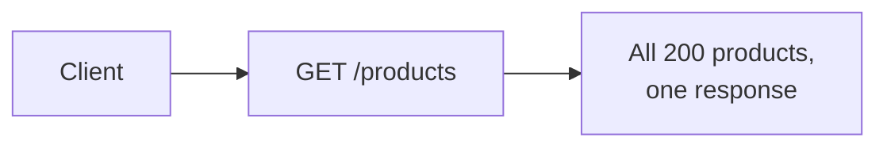
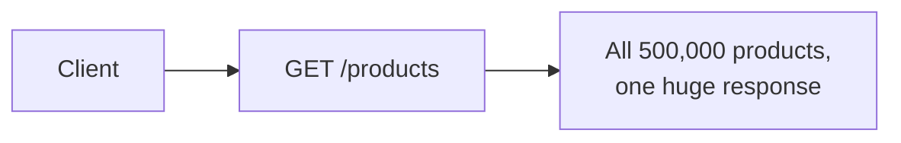
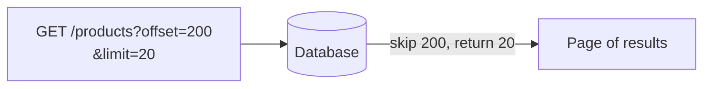
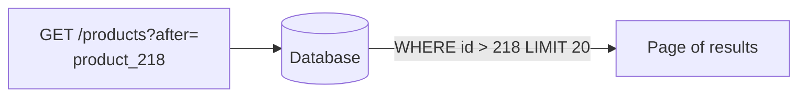
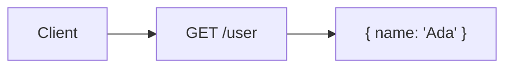
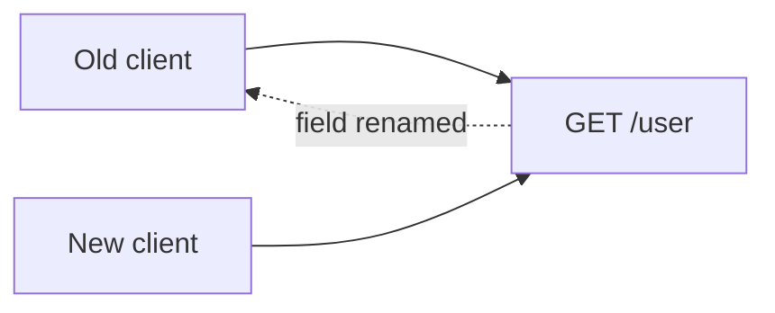

# What are Pagination and Versioning?

An API that stays useful as it grows runs into two separate problems. One is returning too much data in a single response once a dataset gets large, pagination. The other is changing a contract that existing clients already depend on without breaking them, versioning. They're unrelated problems that happen to show up on the same growth curve, which is why they're covered together here.

# Pagination

# Starting small

Consider an endpoint listing products, returning the entire catalog in one response.



At a couple hundred products this is fine, the response is small and fast either way.

# Where it breaks

The catalog grows to hundreds of thousands of products, and returning all of them in one response means a huge payload, a slow query, and a client that has to hold all of it in memory just to show the first page of results.



Splitting the results into pages fixes the payload size, but how a page is identified changes what breaks next.

# Offset Pagination

Offset pagination asks for a page by position, skip this many rows, then return this many more, the same shape as a SQL `LIMIT`/`OFFSET` clause.



The query underneath is a plain `LIMIT`/`OFFSET` pair.

```sql
SELECT * FROM products ORDER BY id LIMIT 20 OFFSET 200;
```

Jumping to any page number directly is offset pagination's clear advantage, a client can ask for page 50 without having seen pages 1 through 49 first. The database still has to scan and discard every skipped row to get there, though, so later pages get slower as the offset grows. Worse, if a row is inserted or deleted while a user is paging through results, every subsequent page can shift, showing a duplicate or skipping an item entirely.

# Cursor Pagination

Cursor pagination asks for a page relative to the last item actually seen, rather than a numeric position, return everything after this specific item.



The anchor point replaces the offset entirely.

```sql
SELECT * FROM products WHERE id > 218 ORDER BY id LIMIT 20;
```

Because the query anchors to a specific item rather than a row count, it stays fast regardless of how deep into the results a client is, and it stays stable even if rows are inserted or deleted elsewhere in the table. What it gives up is offset's ability to jump straight to an arbitrary page, a cursor only knows how to move forward or backward from where it already is.

# Versioning

# Starting small

Consider an API with a single shape, one endpoint, one client consuming it, no reason yet to think about change.



At this stage the contract can change freely, there's nobody else depending on the old shape.

# Where it breaks

A second client starts depending on that same endpoint, and now a needed change, renaming a field, restructuring the response, would break whichever client hasn't updated yet if it just went out unannounced.



Versioning solves this by letting both the old and new contract exist side by side, so a client upgrades on its own schedule instead of being forced to the moment the API changes.

# URL Versioning

URL versioning puts the version directly in the path, `/v1/user` versus `/v2/user`, so old and new clients simply call different URLs.

```
GET /v1/user  ->  { name: "Ada" }
GET /v2/user  ->  { fullName: "Ada Lovelace" }
```

It's the most visible and easiest to explore, a version is right there in the URL, pasteable into a browser, obvious in a log line. The cost is maintaining parallel routes, and often parallel implementations, for as long as any client still depends on an older version.

# Header Versioning

Header versioning keeps one URL and moves the version into a request header instead, `GET /user` with a custom header specifying which contract the caller expects.

```
GET /user
Api-Version: 2
```

URLs stay clean and stable regardless of version, which some teams consider more correct, a resource's identity shouldn't change just because its representation does. It's harder to explore casually, though, since a header isn't visible by just looking at a URL, and testing a specific version means remembering to set it every time.

# Content Negotiation

Content negotiation reuses the standard HTTP `Accept` header to select a version, treating each version as a distinct media type rather than a custom header value.

```
GET /user
Accept: application/vnd.myapi.v2+json
```

This leans on an existing HTTP mechanism instead of inventing a new header, which fits naturally for an API that already varies its response format by `Accept`. It shares header versioning's downside, the version is invisible without inspecting the request, and it adds the extra step of defining and registering a custom media type per version.

# How to choose

Offset pagination fits a UI that needs to jump to an arbitrary page number, and a dataset stable enough, or small enough, that page drift from concurrent writes isn't a real concern.

Cursor pagination fits a large, frequently-changing dataset, or an infinite-scroll style feed where jumping to a specific page number was never a real requirement anyway.

URL versioning fits an API where version visibility and ease of exploration matter most, public APIs with many external consumers, especially.

Header versioning or content negotiation fit a team that wants resource URLs to stay stable and treats the version as metadata about the request rather than part of the resource's identity.

# What gets traded away

Offset pagination trades away performance and stability at scale for the simplicity of jumping to any page directly.

Cursor pagination trades away arbitrary page-jumping for results that stay fast and stable no matter how deep a client pages or how much the underlying data changes concurrently.

URL versioning trades away route and implementation simplicity, maintaining several versions in parallel, for making the version obvious and easy to test.

Header versioning and content negotiation trade away that visibility for keeping a resource's URL identity stable across every version of its representation.
