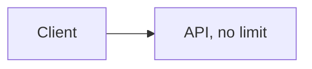
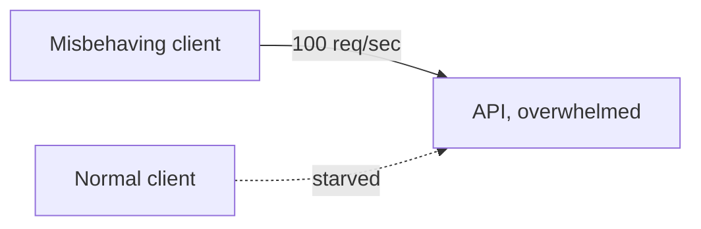
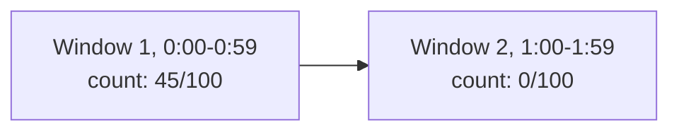
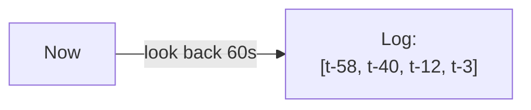
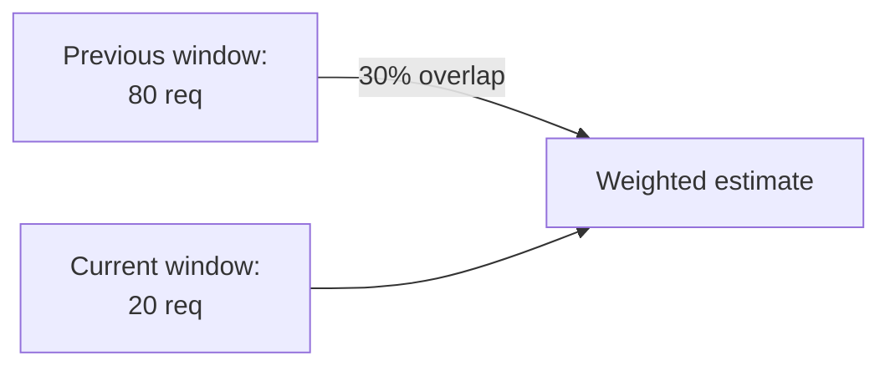
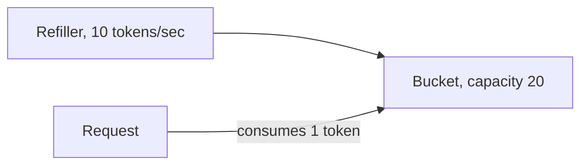
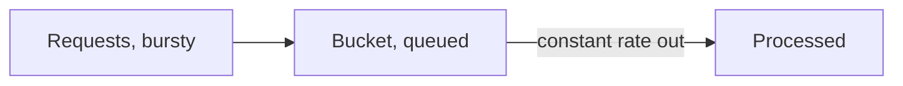

# What is Rate Limiting?

An API with no limit on how often a client can call it trusts every caller to behave reasonably.

# Starting small

Consider an endpoint with no rate limiting at all, serving whatever volume of requests happens to arrive.



At normal traffic, a handful of well-behaved clients calling occasionally, this is never a problem worth solving.

# Where it breaks

A single client starts sending far more requests than intended, a retry loop with a bug, a scraper, or a straightforward abuse attempt, and the API has no way to say no. That one client can consume enough capacity to slow the service down for every other caller at the same time.



A rate limiter fixes this by rejecting or delaying requests once a client crosses a threshold, protecting the service's capacity for everyone else.

# The shared problem

Every algorithm in this file answers the same underlying need, deciding whether the next request from a given client should be allowed through, given how many it has already sent recently.

Five are worth knowing well, fixed window counter, sliding window log, sliding window counter, token bucket, and leaky bucket, each trading accuracy against memory and complexity differently.

# Fixed Window Counter

A fixed window counter divides time into fixed blocks, one minute each, say, and simply counts requests within the current block, resetting to zero the moment a new block starts.



It is the simplest of the five to reason about.

- A counter and a window start time are the only state needed per client, incremented on every request and checked against the limit.
- The counter resets completely the instant a new window begins, with no memory of the previous window at all.
- Storage cost is constant regardless of traffic volume, one integer and one timestamp per client.

Checking and incrementing that counter is one atomic step.

```python
def allow_request(client_id, limit=100, window_seconds=60):
    window = int(time.time() // window_seconds)
    key = f"{client_id}:{window}"
    count = redis.incr(key)
    redis.expire(key, window_seconds)
    return count <= limit
```

The flaw shows up right at the boundary between two windows. A client can send 100 requests in the last second of one window and another 100 in the first second of the next, 200 requests in two seconds, twice the intended limit, simply because the reset happened to land between them.

# Sliding Window Log

A sliding window log fixes that boundary problem by keeping a timestamped log of every request, and counting only the ones that fall within the last window's duration measured from right now, not from a fixed clock boundary.



Precision is the whole point here.

- Every request's timestamp is stored, and checking a new one means counting how many stored timestamps fall within the trailing window.
- Old timestamps outside the window get pruned, so the log only ever holds requests that could still count against the limit.
- Because the window always trails the current moment rather than a fixed clock tick, the two-window burst problem cannot happen.

Pruning the old entries happens on every check, before counting what's left.

```python
def allow_request(client_id, limit=100, window_seconds=60):
    now = time.time()
    key = f"log:{client_id}"
    redis.zremrangebyscore(key, 0, now - window_seconds)
    count = redis.zcard(key)
    if count < limit:
        redis.zadd(key, {str(now): now})
        return True
    return False
```

That precision costs memory proportional to request volume, a client sending close to the limit needs its full timestamp log stored, which does not scale as cheaply as a fixed counter once there are many high-volume clients to track.

# Sliding Window Counter

A sliding window counter approximates the sliding log's accuracy without storing every timestamp, weighting the previous fixed window's count by how much of it still overlaps the current trailing window.



This hybrid keeps the fixed window's cheap storage while smoothing out its edge case.

- Only two counters are stored per client, the current window's count and the previous window's count, not a full log.
- The estimated count blends both, `current_count + previous_count * overlap_percentage`, so a request right after a window boundary still accounts for the tail end of the previous window's traffic.
- The result is an approximation, not exact like the sliding log, but close enough for almost every real rate-limiting need.

The blend itself is a single weighted formula.

```python
def allow_request(client_id, limit=100, window_seconds=60):
    now = time.time()
    current_window = int(now // window_seconds)
    elapsed_fraction = (now % window_seconds) / window_seconds
    prev_count = get_count(client_id, current_window - 1)
    cur_count = get_count(client_id, current_window)
    estimate = prev_count * (1 - elapsed_fraction) + cur_count
    return estimate < limit
```

Trading exactness for constant, small storage is the whole reason this variant exists, and it is the one most production rate limiters actually default to.

# Token Bucket

A token bucket holds a fixed capacity of tokens, refilled at a steady rate, and every request consumes one token, only going through if the bucket still has one to spend.



Allowing controlled bursts is the defining feature here, not just an edge case to tolerate.

- The bucket's capacity sets the maximum burst size, a client can spend every token it has saved up in one instant if it has been idle.
- The refill rate sets the sustained long-term rate, independent of how bursty the capacity allows short-term traffic to be.
- An empty bucket simply rejects requests until enough time passes for new tokens to accumulate.

Refilling and spending both happen in the same check.

```python
def allow_request(client_id, capacity=20, refill_rate=10):
    bucket = get_bucket(client_id)
    now = time.time()
    elapsed = now - bucket.last_refill
    bucket.tokens = min(capacity, bucket.tokens + elapsed * refill_rate)
    bucket.last_refill = now
    if bucket.tokens >= 1:
        bucket.tokens -= 1
        return True
    return False
```

Deliberately allowing bursts up to the bucket's capacity is exactly what makes token bucket a poor fit for a service that needs a perfectly smooth, constant request rate, which is the gap leaky bucket closes.

# Leaky Bucket

A leaky bucket queues incoming requests and processes them at a fixed, constant rate, the reverse framing of token bucket, capacity limits how many requests can queue up, not how large a burst can pass through at once.



Smoothing traffic to a fixed output rate is the entire design goal.

- Requests arriving faster than the leak rate simply queue up in the bucket, up to its capacity.
- A bucket that fills completely starts rejecting new requests outright, the same way an overflowing physical bucket spills over.
- Output is always at the same steady rate no matter how bursty the input was, unlike token bucket's willingness to let a burst straight through.

Leaking and queuing both happen in the same check, mirroring token bucket's refill logic in reverse.

```python
def allow_request(client_id, capacity=20, leak_rate=10):
    queue = get_queue(client_id)
    now = time.time()
    leaked = (now - queue.last_leak) * leak_rate
    queue.size = max(0, queue.size - leaked)
    queue.last_leak = now
    if queue.size < capacity:
        queue.size += 1
        return True
    return False
```

That constant output rate is ideal for protecting a downstream system that genuinely cannot handle bursts at all, but it means a legitimate burst of traffic gets throttled down to the same steady trickle as a malicious one, with no distinction between the two.

# How to choose

Fixed window counter fits a rough, low-stakes limit where the boundary-burst inaccuracy is an acceptable tradeoff for the simplest possible implementation.

Sliding window log fits a limit that must be exact, and where the traffic volume per client is low enough that storing a full timestamp log is cheap.

Sliding window counter fits the common case, most production rate limiters default here, accurate enough with constant, cheap storage.

Token bucket fits an API that wants to allow legitimate bursts, a client catching up after being idle, while still enforcing a sustained rate over time.

Leaky bucket fits protecting a downstream system that needs a perfectly smooth, constant rate of work no matter how bursty the traffic arriving at the front looks.

# What gets traded away

Fixed window counter trades away accuracy at window boundaries for the cheapest possible storage and the simplest logic.

Sliding window log trades away memory, a full log per client, for being exactly correct with no approximation.

Sliding window counter trades away exactness for storage that stays small and constant regardless of traffic volume.

Token bucket trades away a smooth, constant output rate for the ability to let a legitimate burst through all at once.

Leaky bucket trades away burst tolerance entirely for a perfectly steady output rate, treating every burst the same whether it is legitimate or not.
