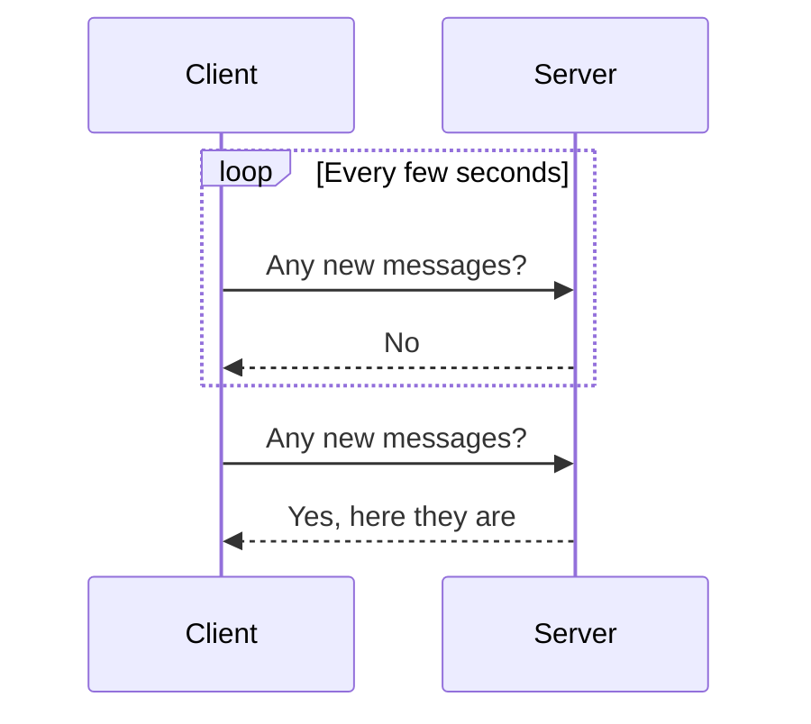
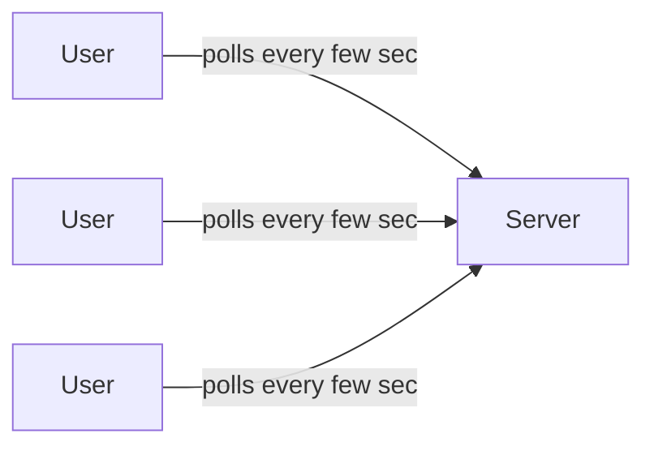
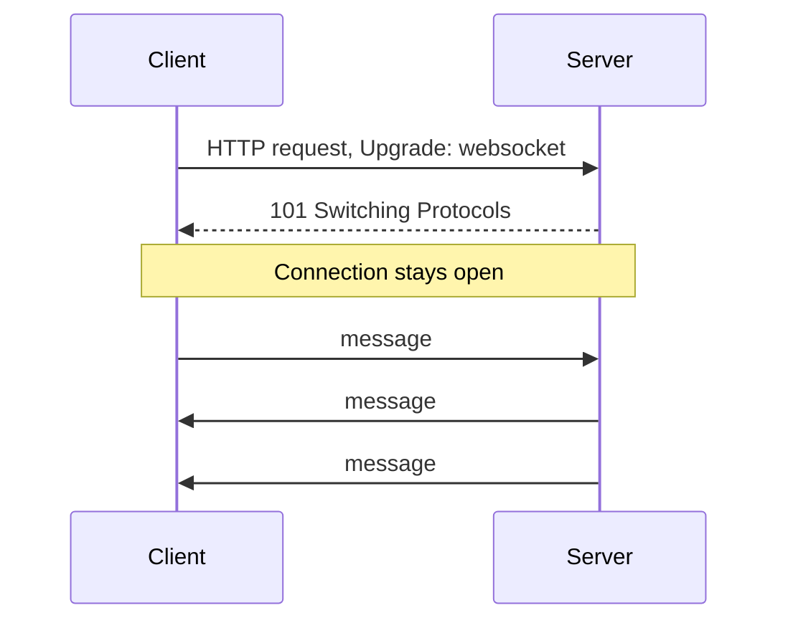
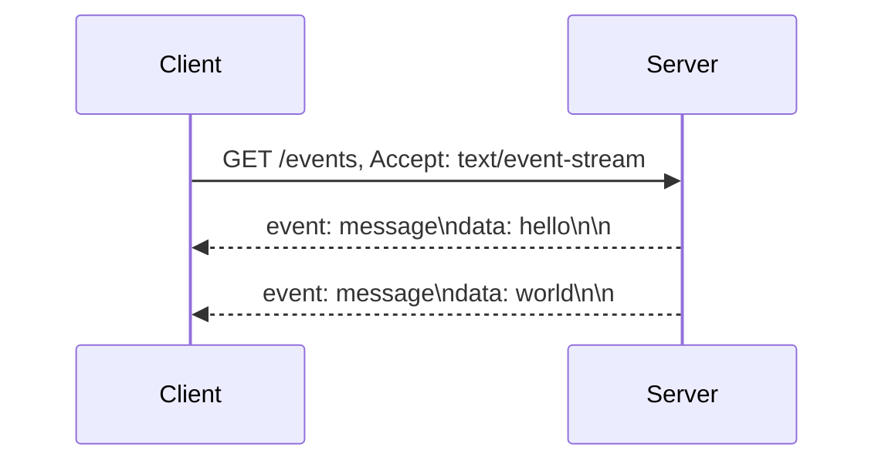

# What is Real-Time Communication?

`request-response.md` covers APIs where the client always asks first. Real-time communication exists for the opposite case, when the server has something new to say before the client ever asks.

# Starting small

Consider a chat application where the client polls the server every few seconds asking whether new messages have arrived. Most of those requests come back empty, but the client cannot know that without asking.



At a small scale this is wasteful but tolerable, a few extra requests a minute per user barely registers.

# Where it breaks

The application grows to thousands of concurrent users, all polling on the same interval, and now the server is fielding a constant stream of requests that are almost always answered with nothing new. Worse, a message sent right after a poll still has to wait for the next interval before the recipient sees it, real messages delayed by the same mechanism meant to reduce waste.



Polling less often reduces server load but increases that delay, polling more often reduces the delay but multiplies the wasted requests, there is no interval that fixes both at once. A connection the server can push through as soon as something happens removes the tradeoff, no interval to tune, no wasted requests asking for nothing.

# WebSockets

A WebSocket starts as a normal HTTP request that upgrades into a persistent, bidirectional connection, kept open for as long as the client and server both need it.



A WebSocket's conventions follow from that bidirectionality:

- Once upgraded, either side can send a message at any time, without waiting for the other to ask first, unlike an HTTP request-response cycle.
- The connection carries arbitrary framed messages, not necessarily HTTP requests anymore, so the application defines its own message format on top.
- A dropped connection has to be detected and reconnected explicitly, there is no automatic retry built into the protocol the way a browser's EventSource has for SSE.

Opening a WebSocket from the browser looks like this.

```javascript
const socket = new WebSocket("wss://chat.example.com/socket");
socket.onmessage = (event) => console.log(event.data);
socket.send("hello");
```

A WebSocket's bidirectionality fits a chat application well, since a client needs to both send and receive messages over the same connection, but that flexibility means building reconnection and message framing by hand.

# Server-Sent Events

SSE opens a single, long-lived HTTP connection that only the server writes to, streaming a sequence of events down to the client over time.



SSE's conventions reflect that one-directional design:

- Communication only flows server to client, a client that needs to send data back does so over a regular, separate HTTP request.
- The browser's EventSource API reconnects automatically if the connection drops, without the application needing to implement that logic itself.
- Because it is plain HTTP, SSE passes through existing infrastructure, proxies, load balancers, that already understands HTTP, without needing the protocol upgrade a WebSocket requires.

Consuming an SSE stream from the browser looks like this.

```javascript
const events = new EventSource("/events");
events.onmessage = (event) => console.log(event.data);
```

SSE's built-in reconnection and plain-HTTP transport make it simpler to adopt for a one-directional feed, a live score ticker or a notification stream, but it offers no way for the client to push data back over that same connection.

# What gets traded away

WebSockets trade away SSE's automatic reconnection and HTTP-native simplicity for true bidirectionality, a real requirement for chat, but unnecessary complexity for a feed the client never needs to talk back on.

SSE trades away that bidirectionality entirely, fitting a one-directional stream well, but requiring a separate request path the moment the client needs to send anything back to the server.
