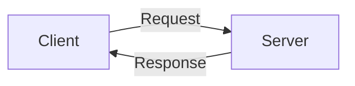
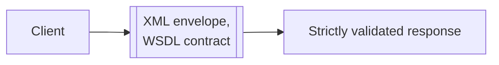
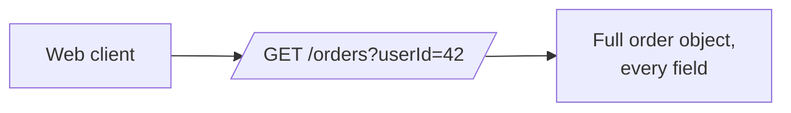
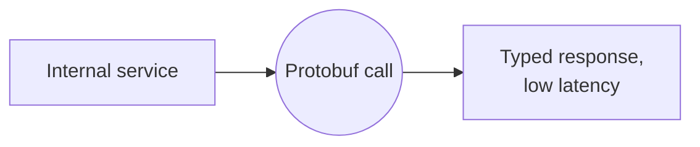
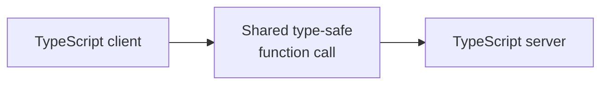

# What is Request-Response?

A client asks a server for something, and the server answers once, in the same exchange. That single ask-and-answer shape is the oldest and still most common way two systems talk to each other, unlike a persistent connection or an inbound callback, which answer a different question entirely.



As a backend starts serving more than one kind of client, web, mobile, third-party developers, or other internal services, it needs a consistent contract for exposing data and behavior across that boundary. Different styles have grown up around that same request-response shape, each trading off flexibility, performance, and simplicity in a different way.

# The shared problem

Every style in this file exists to solve the same underlying need, letting a client ask a server for data or trigger an action, in a way both sides agree on ahead of time.

That agreement covers the shape of a request, the shape of a response, and the rules for what counts as success or failure.

Many approaches have been built to answer that problem, but five are worth knowing well, SOAP, REST, GraphQL, gRPC, and tRPC, spanning from the oldest still in use to the newest still gaining adoption.

# SOAP

SOAP predates REST, an XML-based protocol built on a strict specification. WSDL, the Web Services Description Language, defines the contract, XML Schema defines the types, and optional extensions such as WS-Security (Web Services Security) and WS-Transaction (Web Services Transaction) add enterprise-grade guarantees on top.

Every request and response is a full XML envelope, validated against that formal contract before either side accepts it.



SOAP's conventions keep everything explicit and validated ahead of time:

- Contract-first design, the WSDL document defines every operation and type before any implementation exists, and both client and server generate their code from that same file.
- Errors travel back as a standardized SOAP fault element inside the envelope, not an HTTP status code, since SOAP treats HTTP as just a transport underneath its own protocol.

A screen showing a user's orders, each with its product name, starts with a call to fetch the orders.

```xml
<soap:Envelope xmlns:soap="http://schemas.xmlsoap.org/soap/envelope/">
  <soap:Body>
    <GetOrdersRequest xmlns="http://example.com/orders">
      <UserId>42</UserId>
    </GetOrdersRequest>
  </soap:Body>
</soap:Envelope>
```

The response carries order totals but only a product ID, no name, so a second call is needed per product.

```xml
<soap:Envelope xmlns:soap="http://schemas.xmlsoap.org/soap/envelope/">
  <soap:Body>
    <GetProductRequest xmlns="http://example.com/products">
      <ProductId>501</ProductId>
    </GetProductRequest>
  </soap:Body>
</soap:Envelope>
```

Each of those extra calls carries the same envelope overhead, compounding a cost REST already has to pay.

That same rigor is why SOAP still runs inside banking, healthcare, and government systems that adopted it decades ago. None of them have had a reason to migrate off a working, audited integration.

It is also why almost nobody chooses it for a new system today. The XML overhead and tooling complexity outweigh its guarantees once a system does not need them.

# REST

REST models a system as a set of resources, each addressed by a URL and manipulated through a small set of HTTP methods:

- GET retrieves a resource, and is safe and cacheable since it never changes state.
- POST creates a resource, or triggers an action that is not guaranteed to be idempotent.
- PUT replaces a resource entirely, and is idempotent, since sending it twice leaves the same result as sending it once.
- PATCH updates part of a resource, without the same idempotency guarantee PUT has.
- DELETE removes a resource.
- QUERY is the newest addition, still working through standardization, built for read requests too complex to express safely in a URL.

GET was never meant to carry a request body. Once a search or filter needed more structure than a URL's query string could hold, teams were stuck choosing between a URL that hit length limits or a POST that gave up GET's safe, cacheable, idempotent guarantees.

QUERY closes that gap, a method that behaves like GET for safety and caching, but is allowed to carry a structured body the way POST does.



REST's conventions exist to make a URL guessable without documentation:

- Resource names are plural nouns, `/users` not `/user`.
- A child resource nests under its parent only when it has no standalone identity, like `/users/42/addresses`. A resource addressed on its own elsewhere, like an order on a receipt page, stays flat with a filter instead, `/orders?userId=42` rather than `/users/42/orders`.
- The verb lives in the HTTP method, never in the path, `/users/42/deactivate` breaks the pattern that `PATCH /users/42` already covers.
- Status codes carry meaning, 2xx for success, 4xx when the client's request is wrong, 5xx when the server's side failed.

A screen showing a user's orders, each with its product name, starts with one call.

```
GET /orders?userId=42 HTTP/1.1
```

```
[
  {
    "id": 101,
    "productId": 501,
    "total": 49.99,
    "items": [{ "sku": "A1", "qty": 2 }],
    "shippingAddress": "221B Baker Street",
    "createdAt": "2024-01-04T10:15:00Z"
  }
]
```

The response has no product names, only IDs, so the client has to look each one up separately.

```
GET /products/501 HTTP/1.1
GET /products/502 HTTP/1.1
```

```
{ "id": 501, "name": "Mechanical Keyboard" }
{ "id": 502, "name": "USB-C Cable" }
```

One call for the order list, then one more per distinct product, the classic N+1 problem.

A fixed endpoint shape cuts both ways. Sometimes it returns fields nobody asked for, and other times, like this one, it leaves out related data entirely, forcing the client to make additional calls to fill the gap.

That second cost, extra round trips for related data, is what eventually pushes some consumers toward GraphQL instead.

# GraphQL

GraphQL exposes a single endpoint and lets the client describe the exact shape of the response it wants in the query itself, rather than accepting whatever shape a fixed endpoint returns.

A mobile client can ask for just a user's name and avatar, while a web dashboard asks for the same user plus their full order history, both from the same schema.


GraphQL's conventions center on one shared schema instead of many fixed endpoints:

- A single schema is shared by every consumer, queries read data, mutations change it, and fields are named after what they represent rather than the underlying database column names.
- Pagination follows the Relay-style connection pattern, edges, nodes, and a cursor, instead of a raw offset, so a client can page through results without depending on how the server stores them.
- Deeply nested queries are discouraged, since each nested level can multiply the number of underlying calls the server has to make.

The same screen in GraphQL asks for the order totals and product names together, in one query.

```graphql
query {
  orders(userId: 42) {
    total
    product {
      name
    }
  }
}
```

```json
{
  "data": {
    "orders": [
      { "total": 49.99, "product": { "name": "Mechanical Keyboard" } },
      { "total": 12.50, "product": { "name": "USB-C Cable" } }
    ]
  }
}
```

That one query replaces REST's three separate calls from the client's point of view, since the nested `product` field resolves as part of the same round trip.

It does not automatically fix how many times the server itself queries its data store for those products. A naive resolver run once per order still issues one query per order internally, the same N+1 problem, just moved from the network down to the database.

Solving that server-side cost takes a batching layer such as DataLoader inside the resolver, merging those per-order lookups into a single batched query. Without it, GraphQL only relocates the N+1 problem, it does not remove it.

# gRPC

gRPC, short for gRPC Remote Procedure Calls, originated at Google and defines a service contract upfront using Protocol Buffers, a schema that specifies exact request and response types. Client and server code is generated from that same schema in whatever language each side is written in.

Calls travel over HTTP/2 as compact binary payloads instead of readable JSON, and HTTP/2 lets many calls share a single connection instead of opening a new one each time.



gRPC's conventions protect the wire format from breaking silently:

- The field number in every message, `= 1`, `= 2`, not the field name, is what actually goes on the wire. Renaming a field is safe, reusing or reassigning its number is not, since an old client with a cached schema will decode the wrong field entirely.
- Services and methods follow verb-based RPC naming, `GetUser`, `CreateOrder`, rather than REST's noun-based resource paths, since a call is a function invocation, not a resource being fetched.

A contract for fetching a user's orders together with product names looks like this, decided once by whoever designed the schema.

```protobuf
service OrderService {
  rpc GetOrders (GetOrdersRequest) returns (OrderList);
}

message GetOrdersRequest {
  int32 user_id = 1;
}

message Order {
  int32 id = 1;
  double total = 2;
  string product_name = 3;
}

message OrderList {
  repeated Order orders = 1;
}
```

A client calling `GetOrders` gets the combined data back directly, but only because this exact shape was already built into the schema.

```
request:  GetOrdersRequest { user_id: 42 }
response: OrderList { orders: [ Order { id: 101, total: 49.99, product_name: "Mechanical Keyboard" } ] }
```

If a different combination were needed instead, say orders with shipping status, a new field or a new RPC would have to be added first. The client cannot ask for a different shape on its own the way a GraphQL client can.

That tradeoff, a fixed but fast contract, is why gRPC dominates service-to-service calls inside a single system, where every millisecond of overhead repeats across dozens of internal calls per request.

The same properties make it a poor fit for a public API a browser needs to call directly, since browsers cannot easily speak raw gRPC and a binary payload cannot be inspected with curl.

# tRPC

tRPC, read as TypeScript Remote Procedure Call, skips a schema language entirely and instead shares TypeScript types directly between client and server. Calling a backend function looks and type-checks exactly like calling a local one.

There is no REST endpoint to design, no GraphQL schema to maintain, and no code generation step the way gRPC needs.



tRPC's conventions lean entirely on the shared TypeScript types instead of a separate schema:

- Procedures are organized into routers, one router per resource area, `userRouter`, `orderRouter`.
- Every procedure declares its input schema with a validation library such as Zod, so a malformed request is rejected before the handler ever runs.
- Procedures are named `query` for reads and `mutation` for writes, mirroring GraphQL's read and write split, but type-checked at compile time through shared types instead of a schema file.

A procedure joining orders to product names looks like this, again decided ahead of time by whoever wrote it.

```typescript
export const orderRouter = router({
  getOrdersWithProducts: publicProcedure
    .input(z.object({ userId: z.number() }))
    .query(({ input }) =>
      db.order.findMany({
        where: { userId: input.userId },
        include: { product: true },
      })
    ),
});
```

Calling that procedure returns the combined, fully typed result, inferred without any schema file to maintain.

```typescript
const orders = await trpc.getOrdersWithProducts.query({ userId: 42 });
// orders: [{ id: 101, total: 49.99, product: { name: "Mechanical Keyboard" } }]
```

That convenience is scoped to a single ecosystem, both ends have to be TypeScript, usually in the same codebase or monorepo.

That is why tRPC shows up in full-stack TypeScript products rather than in APIs meant for external or polyglot consumers.

# How to choose

SOAP fits when a working, audited integration already exists, or when a partner or regulator mandates its formal contract:

- A banking or insurance integration built years ago, still running, with no business reason to touch it.
- A government or enterprise partner whose own compliance requirements mandate SOAP specifically.

REST fits public-facing resources that mostly stand on their own, without deep or client-varying relationships:

- Listing all products with pagination, `GET /products?page=2`.
- Fetching a single product's details, `GET /products/501`.
- A public blog, catalog, or content API consumed by a browser or a simple mobile app.

GraphQL fits when different consumers need different, often nested, slices of the same data:

- A product page that needs the product, its reviews, and related items together, with web and mobile wanting different depths of the same data.
- A dashboard aggregating several underlying resources into a single view.
- Third-party developers building against the same API with needs too varied to serve from fixed endpoints.

gRPC fits internal, service-to-service calls where both ends are owned by the same team and speed matters:

- A checkout service calling an internal inventory service dozens of times per request.
- Any call where both client and server are backend services, never a browser.

tRPC fits a full-stack TypeScript product where the same team owns both ends of the codebase:

- A Next.js app calling its own backend routes, both written in TypeScript in the same repository.
- An internal admin tool where development speed matters more than ever having external consumers.

# What gets traded away

SOAP trades away simplicity and performance for its guarantees, every call carries the overhead of a full XML envelope and a contract that is slow to change.

REST trades away per-client flexibility, since a fixed endpoint shape that suits one consumer will eventually over-fetch or under-fetch for another as the number of different clients grows.

GraphQL trades away simple HTTP caching and hands the N+1 problem to the backend team, since every query can shape a unique response, and resolvers now need their own batching layer to stay efficient, a cost REST never has to think about.

gRPC trades away human-readability and native browser support, since payloads are binary protobuf rather than plain JSON, which means both ends need generated client code instead of a raw curl command.

tRPC trades away reach, since it only works when both client and server share the same TypeScript types, which rules it out for public APIs or any consumer outside that codebase.
