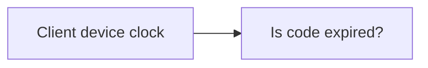
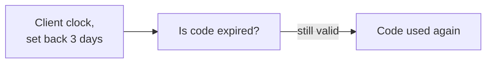
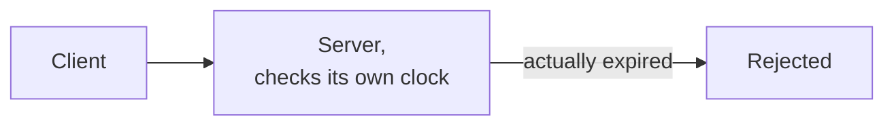
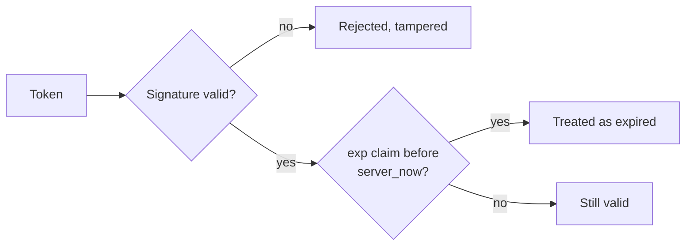
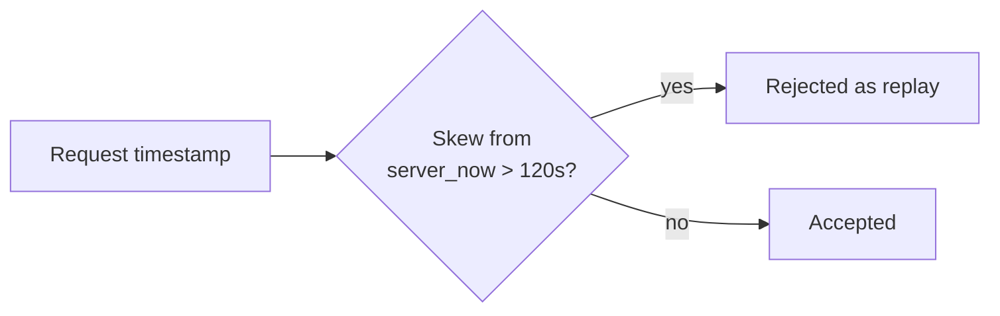

# What is Server Time?

A client's clock is just a setting on that device, one a user can change freely and an attacker can manipulate deliberately. Anything a server decides based on a timestamp the client provided is only as trustworthy as that clock.

# Starting small

Consider a one-time discount code that expires after 24 hours, checked by comparing the current time on the user's own device against an expiry timestamp stored locally.

For a normal user with a correctly set clock, this works exactly as intended, the code stops working a day after it was issued.

# Where it breaks

A user sets their device clock backward, by accident or on purpose, and that same check now compares the expiry against a time that never actually arrived. The discount code, the session, the one-time link, whatever was supposed to expire, simply doesn't, for as long as the client controls what "now" means.

The fix is refusing to let the client's clock decide anything that matters. Every time-sensitive check has to be made against the server's own clock, which the client cannot touch at all.

# Session and Token Expiry

A session or token's expiry has to be recorded at issuance time using the server's clock, and re-checked against the server's clock on every request, never against anything the client sends or stores locally.

A signed token, a JWT, for instance, can safely carry its own expiry claim, since the signature prevents the client from editing that timestamp without invalidating the token entirely. What the server must never do is trust an unsigned, client-editable expiry value on its own.

# Replay Protection

A request that includes a timestamp and a signature, the same shape `webhooks.md` covers for verifying a sender, can also be replayed by an attacker who captured a valid request earlier and resends it unchanged.

Comparing that timestamp against the server's own clock closes most of the gap, a request timestamped more than a couple of minutes in the past or future gets rejected outright, since a legitimate request should always arrive close to when it claims to have been sent.

A timestamp check alone still allows an exact replay within that short window, which is why real replay protection usually pairs it with a nonce, a value the server remembers having seen once and refuses to accept a second time.

# Rate Limits and Server Time

Every rate-limiting algorithm in `rate-limiting.md` measures "now" using the server's own clock when it decides which window a request falls into. If a client's stated timestamp were ever used for that decision instead, a client could simply claim an earlier or later time to land in a window with room left, defeating the limiter entirely.

# What gets traded away

Trusting only the server's clock means legitimate requests near a boundary can occasionally be rejected due to ordinary clock skew between a client and the server, network latency alone can push a genuinely honest request outside a strict tolerance window. Most systems handle this by allowing a small grace period, a couple of minutes, rather than an exact match, accepting a little replay risk in exchange for not rejecting real traffic over trivial clock drift.
