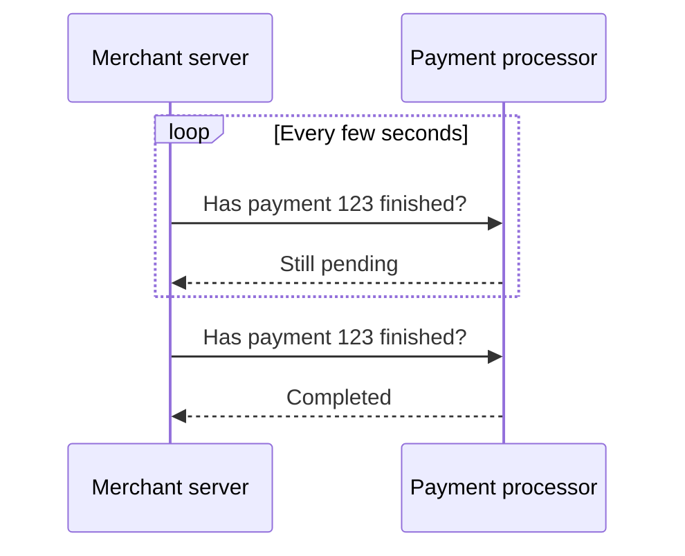
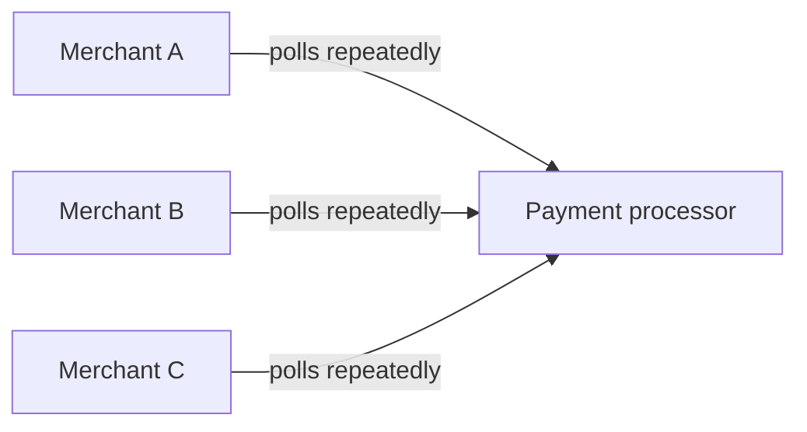
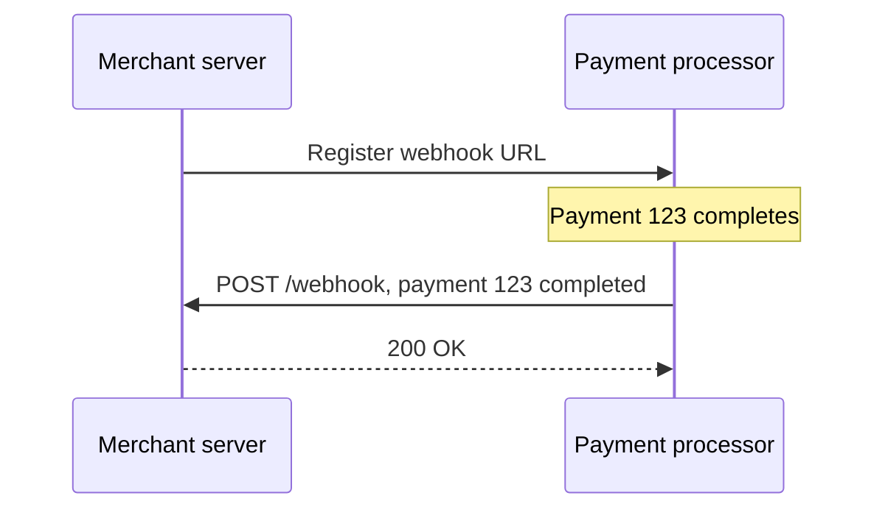

# What is a Webhook?

`real-time.md` covers a client staying connected to hear about updates as they happen. A webhook solves the same problem between two servers instead, one server telling another about an event by calling it directly, rather than being asked.

# Starting small

Consider a payment processor that a merchant's server checks periodically, asking whether a given payment has finished processing. Most checks come back with the same answer as the last one, still pending.



At low volume this is a minor inefficiency, a handful of wasted requests per payment barely matters.

# Where it breaks

The merchant now processes thousands of payments a day, each one polled repeatedly until it resolves, and most of those requests return nothing new. The payment processor is fielding load proportional to how anxiously merchants poll, not to how many payments actually change state, and a payment that finishes right after a poll still waits for the next one before the merchant finds out.



A webhook inverts the relationship. The merchant registers a URL once, and the payment processor calls that URL itself the moment a payment's state actually changes, no polling, no wasted requests, and no delay beyond the call itself.



# Delivery and Retries

A webhook call is still just an HTTP request, and the receiving server can be down, slow, or unreachable at the exact moment it fires. A sender that cares about reliable delivery retries a failed call, usually with exponential backoff, rather than treating one failed attempt as final.

Because retries mean the same event can arrive more than once, an idempotency key included with each webhook payload lets the receiver recognize and ignore a duplicate delivery of an event it already processed.

# Verifying Authenticity

A webhook endpoint is a public URL, and anything reachable at a public URL can be called by anyone, not just the expected sender. A signature, computed by the sender over the payload using a shared secret and sent as a header, lets the receiver verify a request actually came from the expected source before acting on it.

Verifying that signature looks like this.

```python
expected = hmac.new(webhook_secret, request.body, hashlib.sha256).hexdigest()
if not hmac.compare_digest(expected, request.headers["X-Signature"]):
    raise ValueError("invalid webhook signature")
```

# What gets traded away

A webhook trades away the simplicity of polling, where the receiver alone controls when and how often it asks, for a design where the receiver must run a publicly reachable endpoint at all times, ready to accept a call whenever the sender decides to make one.

It also trades away guaranteed ordering, network retries and independent delivery attempts mean two events can arrive out of the order they actually happened in, requiring the receiver to check timestamps or sequence numbers rather than trusting arrival order.
