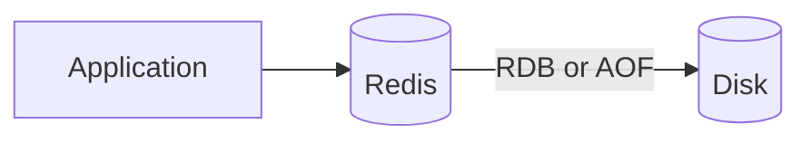
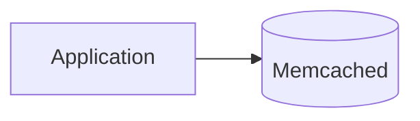

# What are Cache Engines?

`caching.md` covers placement, eviction, and invalidation in the abstract. This file grounds that theory in the two engines most teams actually reach for.

# The shared problem

Both engines exist to hold data in memory for fast, repeated reads, but they disagree on how much a cache is allowed to be, a simple key-value store, or a fuller data structure server in its own right.

That disagreement is easiest to see at two moments. One is the instant the cache actually fills up, both have to evict something to make room for a new write, and what gets evicted, and how precisely, is not the same story at all. The other is the moment one instance is no longer enough, and the cache has to spread across several machines.

Both threads run through the sections below.

# Redis

Redis stores data as one of several native structures, strings, lists, sets, sorted sets, and hashes, rather than treating every value as an opaque blob, and it can persist that data to disk.



Being more than a plain cache shows up in a few concrete ways.

- Native structures let an application do work inside the cache itself, incrementing a counter or pushing onto a list, instead of reading a value out, modifying it, and writing it back.
- Persistence, through periodic RDB snapshots or an append-only AOF log, means a restart can recover Redis's data instead of starting completely cold.
- Pub-sub messaging and Lua scripting are both built in, letting Redis take on roles beyond caching, a lightweight message broker or a place to run small atomic operations server-side.

When memory fills up, `maxmemory-policy` decides what happens next, and it is a real choice, not a fixed behavior.

```
maxmemory-policy allkeys-lru
```

`allkeys-lru` evicts the least recently used key regardless of whether it has a TTL, the right call for a pure cache. `volatile-ttl` instead evicts whichever key is closest to expiring anyway, useful when some keys are cache and others are meant to persist.

Redis does not track exact access recency for every key, that would cost too much memory at scale. Its LRU is approximated by sampling a handful of random keys and evicting the oldest among just that sample, tunable through `maxmemory-samples` if the approximation needs to be tighter.

A sorted set is what a leaderboard actually reaches for, exactly the kind of structure a plain key-value cache cannot express directly.

```python
redis.zadd("leaderboard", {"player1": 100})
redis.zrevrange("leaderboard", 0, 9, withscores=True)
```

Scaling past one instance is handled the same way, natively. Redis Cluster divides the whole keyspace into 16,384 fixed hash slots, each assigned to a primary node, and a client can ask any node which slot a key belongs to and get redirected there directly. Resharding moves whole slots between nodes while the cluster keeps serving traffic, and each primary can carry its own replicas for failover, all without a second system bolted on.

That combination of structures, persistence, a configurable eviction policy, and native clustering is what makes Redis a natural fit for a cache that needs to do more than store and return plain values, but the extra capability comes with more surface area to operate and tune than a plain key-value store needs.

# Memcached

Memcached stores data purely as key-value pairs, with no structures beyond that and no persistence, a restart clears everything it held.



That narrower scope trades toward raw throughput instead.

- A multithreaded design puts multiple CPU cores to work for a single instance out of the box, where Redis is primarily single-threaded per instance.
- With no structures beyond plain values, any real logic, reading a value out, modifying it, writing it back, has to live in the application instead of inside the cache.
- Nothing persists to disk, so a restart or crash leaves the cache simply empty afterward, refilled gradually as requests miss and fall through to the database.

Its eviction story is where the memory model actually shows its shape. Memcached pre-allocates memory into slabs, each slab subdivided into fixed-size chunks, and a value gets placed into whichever chunk size it fits, wasting the leftover space in that chunk as internal fragmentation.

Eviction runs LRU within that one slab class only. A 50-byte item landing in a 96-byte chunk wastes 46 bytes, and if that 96-byte slab class fills up, Memcached evicts its own oldest entry there, even if a 1024-byte slab class sitting right next to it is nearly empty.

```python
memcached.set("product:42", product_json)
value = memcached.get("product:42")
```

That scoping means Memcached can be evicting items under memory pressure in one slab class while another sits mostly idle, since chunks are never reassigned between classes on the fly. In practice this rewards keeping value sizes reasonably uniform, mixing many tiny values with a few huge ones wastes more memory than the raw total would suggest.

Scaling past one instance is where that same independence shows up again. Memcached nodes have no idea of each other's existence, there is no cluster to join. Spreading data across several instances is entirely a client-side job, consistent hashing in the client library decides which node a key belongs to, and the server side stays exactly as simple as a single instance.

That independence cuts both ways. Adding or removing a node reshuffles key ownership at the client, and a node that goes down loses every key it held, with no replica anywhere to take over, the cache just refills from the database on the next miss.

That simplicity and multithreading make Memcached a strong fit for a pure, high-throughput key-value cache, but it gives up everything Redis offers beyond that, no structures, no persistence, no pub-sub, no native clustering, and its slab-scoped eviction needs some awareness of value-size distribution to use efficiently.

# How to choose

Redis fits a cache that needs to double as more than a cache, atomic counters, a leaderboard, a lightweight queue, or data that should survive a restart, and a cache expected to outgrow one instance without a second system managing the split.

Memcached fits a workload that only ever needs plain key-value caching at high throughput, with value sizes uniform enough that slab-scoped eviction is not a concern, and a team willing to own sharding and failover at the client.

# What gets traded away

Redis trades away Memcached's simplicity and native multithreading for a richer feature set, configurable eviction, and built-in clustering, more capability to reason about, in exchange for versatility a plain cache does not offer.

Memcached trades away that versatility, no structures, no persistence, no pub-sub, no native clustering, and an eviction policy scoped to a slab class, for a narrower, simpler cache that is easier to run and reason about at high throughput.
