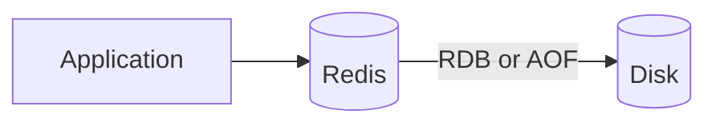
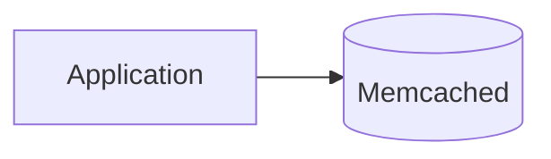

# What are Cache Engines?

`caching.md` covers placement, eviction, and invalidation in the abstract. This file grounds that theory in the two engines most teams actually reach for.

# The shared problem

Both engines exist to hold data in memory for fast, repeated reads, but they disagree on how much a cache is allowed to be, a simple key-value store, or a fuller data structure server in its own right.

# Redis

Redis stores data as one of several native structures, strings, lists, sets, sorted sets, and hashes, rather than treating every value as an opaque blob, and it can persist that data to disk.



Redis's conventions follow from being more than a plain cache:

- Native data structures let an application do work inside the cache itself, incrementing a counter or pushing onto a list, instead of reading a value out, modifying it, and writing it back.
- Persistence, through periodic RDB snapshots or an append-only AOF log, means a Redis restart can recover its data instead of starting completely cold.
- Pub-sub messaging and Lua scripting are both built in, letting Redis take on roles beyond caching, a lightweight message broker or a place to run small atomic operations server-side.

Using a sorted set for a leaderboard looks like this.

```python
redis.zadd("leaderboard", {"player1": 100})
redis.zrevrange("leaderboard", 0, 9, withscores=True)
```

Redis's structures and persistence make it a natural fit for a cache that needs to do more than store and return plain values, but that extra capability comes with more surface area to operate and tune than a plain key-value store needs.

# Memcached

Memcached stores data purely as key-value pairs, with no structures beyond that and no persistence, a restart clears everything it held.



Memcached's conventions reflect that narrower, simpler scope:

- A multithreaded design lets it use multiple CPU cores for a single instance out of the box, where Redis is primarily single-threaded per instance.
- With no structures beyond plain values, complex operations have to happen in the application, reading a value out, modifying it, and writing it back, rather than inside the cache.
- Because nothing persists to disk, a restart or crash means the cache is simply empty afterward, refilled gradually as requests miss and fall through to the database.

Getting and setting a value looks like this.

```python
memcached.set("product:42", product_json)
value = memcached.get("product:42")
```

Memcached's simplicity and multithreading make it a strong fit for a pure, high-throughput key-value cache, but it gives up everything Redis offers beyond that, no structures, no persistence, no pub-sub.

# How to choose

Redis fits a cache that needs to double as more than a cache, atomic counters, a leaderboard, a lightweight queue, or data that should survive a restart.

Memcached fits a workload that only ever needs plain key-value caching at high throughput, without needing anything the value itself does not already contain.

# What gets traded away

Redis trades away Memcached's simplicity and native multithreading for a richer feature set, more capability to configure and reason about, in exchange for versatility a plain cache does not offer.

Memcached trades away that versatility, no structures, no persistence, no pub-sub, for a narrower, simpler cache that is easier to run and reason about at high throughput.
