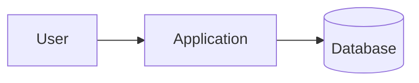
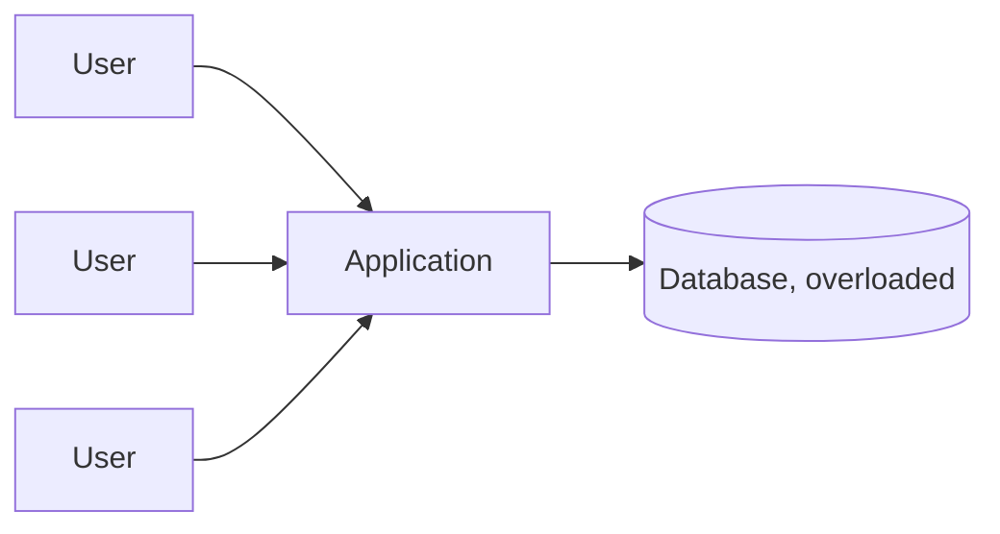
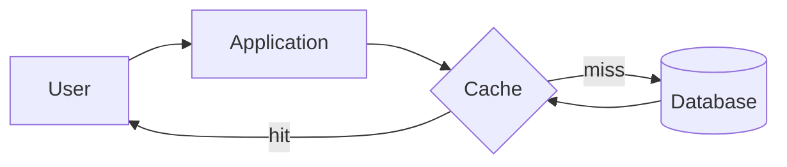

# What is Caching?

A cache stores a copy of data that is expensive to produce, so a later request for the same data can be answered from the copy instead of redoing the work.

# Starting small

Consider a product page that queries the database for the product's details on every request. A handful of visitors a minute means a handful of queries a minute, and the database answers each one in a few milliseconds without strain.

At that volume nobody notices, every request is cheap, and the database has plenty of headroom to spare.

# Where it breaks

The same product goes viral, and now thousands of requests a second hit that page, each one running the same query against the same rows. The database starts spending most of its time answering identical questions over and over, and its response time climbs for every request, including ones that have nothing to do with that product.

A cache sitting in front of the database answers the repeated question once and reuses that answer for every subsequent request, until the underlying data actually changes.

# Placement

A cache can sit in different places along the path a request takes, each catching repeated work at a different layer. A client-side cache avoids the network entirely for data the browser already has. A CDN edge cache, covered in `cdn.md`, avoids a trip back to the origin server. An application-level cache, the focus of this file, sits between the application and its database, avoiding a repeated query for data the application itself has already fetched once.

# Eviction

A cache cannot hold every piece of data forever, memory is finite, so it needs a policy for deciding what to remove when it fills up. Least recently used, LRU, evicts whatever has gone the longest without being read, on the assumption that data nobody has asked for recently is the least likely to be asked for next.

Least frequently used, LFU, evicts whatever has been read the fewest times overall, which behaves differently from LRU when something was popular in the past but has gone quiet recently, LRU evicts it quickly, LFU holds onto it longer on the strength of its historical popularity.

# Invalidation

A cached value is only useful while it still matches the underlying data. Time-to-live, TTL, expires an entry automatically after a fixed duration, simple to reason about, but it means a stale value can still be served for however long is left on its TTL after the real data changes.

Write-through invalidation clears or updates the cached entry the moment the underlying write happens, keeping the cache accurate at all times, at the cost of adding that invalidation step to every write path that touches cached data.

# What gets traded away

A cache trades away strict consistency for speed, a cached value read a second after the real data changed is, briefly, wrong, and how long that window stays open depends entirely on the TTL or invalidation strategy chosen.

It also trades away simplicity, a system without a cache has exactly one source of truth to reason about, a system with one now has two representations of the same data that can, even if briefly, disagree.
