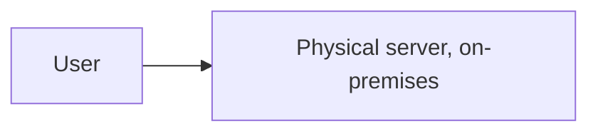
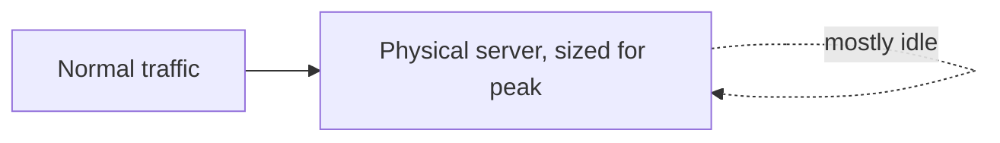
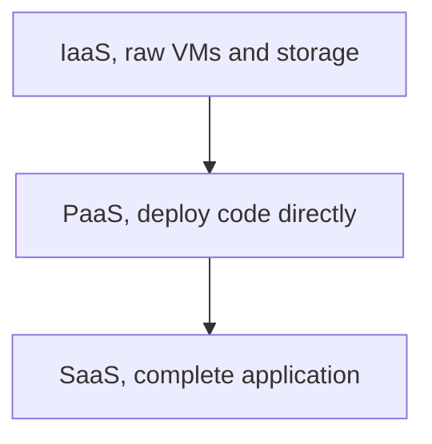

# What is Cloud Computing?

Cloud computing rents computing infrastructure, servers, storage, networking, on demand from a provider, rather than a team buying and running physical hardware itself.

# Starting small

Consider a company running its application on a physical server sitting in its own office, bought outright and maintained by whoever is around to do it. For a small, steady amount of traffic, that one machine handles everything without complaint.

At that scale, buying hardware once and running it indefinitely is simple and cheap enough, there is no bill to a provider each month, just the upfront cost of the machine.

# Where it breaks

Traffic grows unevenly, quiet most of the month, then far higher during a sale or a seasonal spike, and the one server bought for average load either sits idle most of the time or falls over during the moments that matter most. Buying a second, bigger server to cover the spike means paying for capacity that goes unused the rest of the month, and a hardware failure now means someone physically replacing a part before the application comes back at all.

A cloud provider fixes the idle-capacity problem by billing for what actually gets used, and letting capacity scale up during a spike and back down afterward, rather than a company owning fixed hardware sized for its worst day.

# IaaS, PaaS, and SaaS

Infrastructure as a service, IaaS, rents raw compute, storage, and networking, virtual machines a team still configures and manages themselves, just without owning the physical hardware underneath.

Platform as a service, PaaS, rents a layer above that, a place to deploy application code directly, where the provider handles the underlying servers, operating system, and scaling entirely.

Software as a service, SaaS, rents a complete, already-running application, an email or CRM product a team just uses, with no infrastructure or code of its own involved at all.

# Elasticity

Elasticity is the ability to add or remove capacity automatically as demand changes, rather than a team provisioning for the worst case and leaving it running permanently. A service configured to scale out during a traffic spike and back in afterward pays roughly in proportion to what it actually uses, instead of paying for peak capacity around the clock.

# Regions and Availability Zones

A region is a geographic location a provider operates in, and an availability zone is an isolated data center within that region, built so that a failure in one zone does not take down another in the same region.

Spreading a system's servers across multiple availability zones protects against a single data center failure, and choosing a region close to users reduces the latency their requests have to travel, the same distance problem `cdn.md` addresses for static content.

# What gets traded away

Cloud computing trades away the fixed, one-time cost of owning hardware for an ongoing bill that scales with usage, which is cheaper at uneven or unpredictable load, but can cost more over time than owning hardware outright for a workload that is large and steady enough to justify it.

It also trades away direct physical control, hardware sits in a provider's data center rather than a company's own, which is why regulatory or data residency requirements sometimes push a workload back toward infrastructure a team runs itself.
