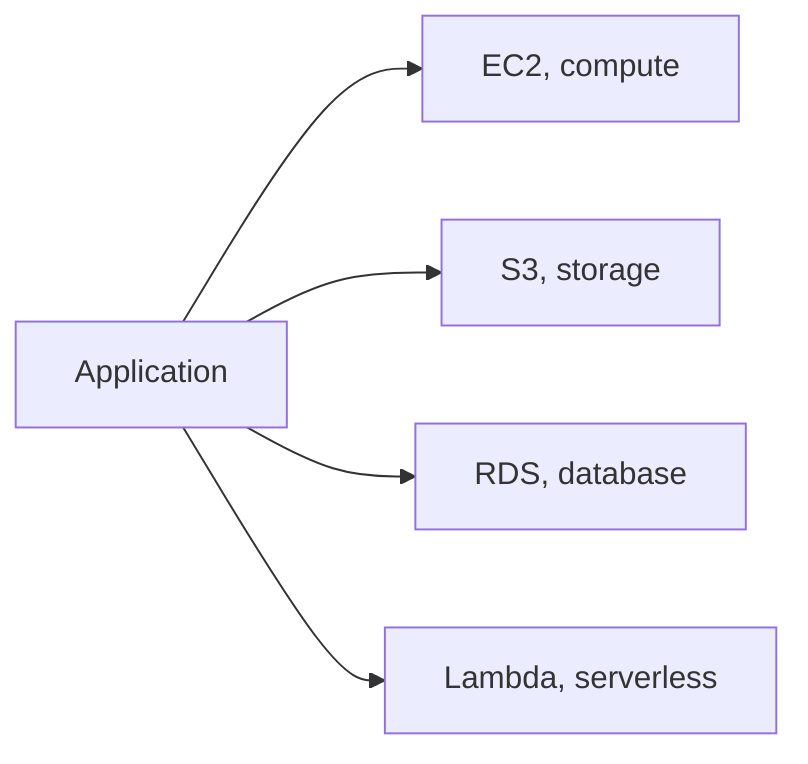
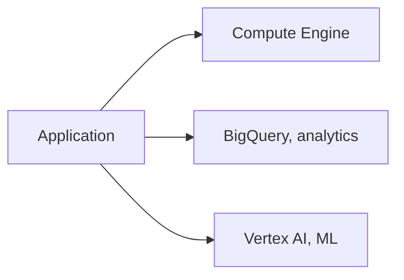
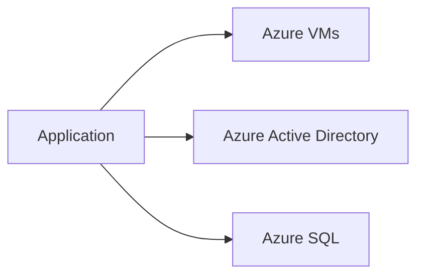

# What are Cloud Providers?

`cloud.md` covers IaaS, PaaS, SaaS, and elasticity in the abstract. This file grounds that theory in the three providers most systems actually get built on.

# The shared problem

Every provider in this file rents the same underlying things, compute, storage, networking, on demand, but each has grown its own breadth of services, its own strengths, and its own gravity once a system commits to it.

# AWS

AWS was the first major cloud provider at real scale, and its breadth of services remains the largest of the three, EC2 for virtual machines, S3 for object storage, Lambda for serverless functions, RDS and DynamoDB for databases, among hundreds of others.



AWS's conventions follow from that breadth and maturity:

- IAM controls permissions across every service through one unified policy model, roles and policies attached to users, services, or resources.
- Nearly every AWS service integrates natively with the others, S3 triggering Lambda, Lambda writing to DynamoDB, without needing a separate integration layer.
- Its sheer number of services and configuration options means more flexibility, but also a steeper learning curve than a provider with a narrower catalog.

Launching a virtual machine looks like this.

```python
ec2.run_instances(ImageId="ami-12345", InstanceType="t3.micro", MinCount=1, MaxCount=1)
```

AWS's breadth and maturity are why it remains the default choice for a system with no strong pull toward a competitor, but that same breadth means more decisions to make about which of several overlapping services to use for a given job.

# Google Cloud Platform

GCP grew out of the infrastructure Google built for its own products, and it leads with strengths in data analytics and machine learning, BigQuery for large-scale analytics, and Vertex AI for machine learning workloads.



GCP's conventions reflect that data and infrastructure heritage:

- BigQuery separates storage from compute for analytics queries, paying for the data scanned per query rather than for a database kept running around the clock.
- Kubernetes originated at Google, and GKE, its managed Kubernetes offering, is frequently cited as one of the smoothest managed Kubernetes experiences available.
- Its networking is built on Google's own global backbone, the same infrastructure its own products run on, rather than a network built up service by service over time.

Running a BigQuery query looks like this.

```python
client.query("SELECT user_id, COUNT(*) FROM events GROUP BY user_id").result()
```

GCP's strength in analytics and Kubernetes make it a natural fit for a data-heavy or container-native workload, but its catalog outside of those areas is narrower than AWS's, with fewer alternatives for a given problem.

# Microsoft Azure

Azure's biggest pull is deep integration with the rest of Microsoft's ecosystem, Active Directory, Office 365, and Windows Server, making it the default for an organization already standardized on Microsoft tooling.



Azure's conventions center on that enterprise and Microsoft integration:

- Azure Active Directory extends the same identity system many enterprises already use on-premises, into the cloud, rather than introducing a separate identity model.
- Hybrid cloud tooling, Azure Arc among it, is built specifically for a company running some infrastructure on-premises and some in Azure at once.
- Enterprise agreements and licensing for existing Microsoft products often bundle favorably with Azure, a financial pull as much as a technical one.

Provisioning a virtual machine looks like this.

```python
compute_client.virtual_machines.begin_create_or_update(resource_group, "vm1", vm_params)
```

Azure's enterprise and Microsoft-ecosystem integration make it the natural fit for an organization already built around Windows Server and Active Directory, but a team without that existing investment gets comparatively little pull toward Azure specifically.

# How to choose

AWS fits a system with no strong existing pull toward a competitor, or one that wants the widest catalog of services to choose from.

GCP fits a workload centered on large-scale data analytics or machine learning, or a team already committed to Kubernetes as its deployment model.

Azure fits an organization already standardized on Microsoft's ecosystem, Active Directory, Windows Server, or existing enterprise licensing agreements.

# What gets traded away

AWS trades away GCP's narrower, more opinionated analytics tooling and Azure's enterprise identity integration for sheer breadth, more services, more overlapping options, and more decisions to make among them.

GCP trades away AWS's breadth outside of data and Kubernetes for depth in those two areas specifically.

Azure trades away being the default choice-neutral provider for deep alignment with Microsoft's ecosystem, a strong pull for an organization already there, and little pull otherwise.
