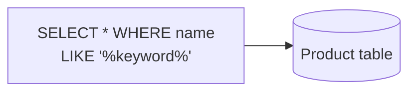
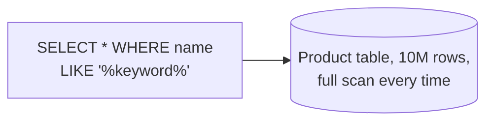
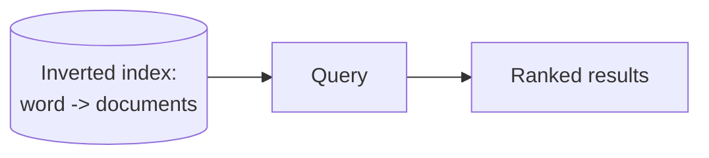
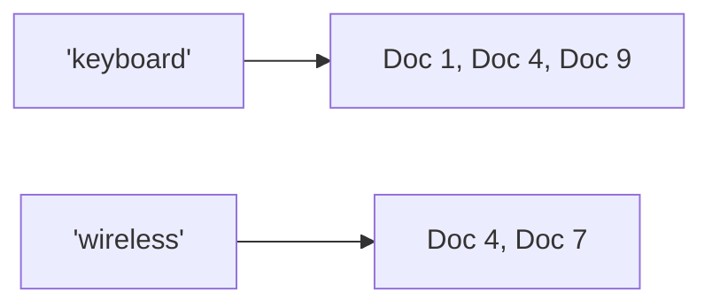
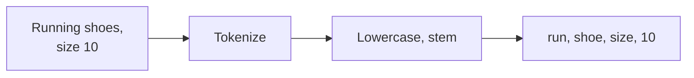

# What is Full-Text Search?

A relational database's text search means scanning a column for a substring match, checking every row against the query one at a time.

# Starting small

Consider searching a product catalog for items matching a keyword, using a plain `LIKE` query against a database column.



At a few thousand products this is fast enough, and it returns matches in whatever order the database happens to scan the table.

# Where it breaks

The catalog grows to millions of products, and that same `LIKE` query now has to scan every single row to find matches, since there is no structure mapping a word back to the rows that contain it. Worse, results come back with no sense of relevance, a product with the keyword once in a long description ranks the same as one with the keyword in its title, and a typo in the query returns nothing at all.



A search engine solves this by building an inverted index ahead of time, a structure mapping each word directly to the documents containing it, so a query becomes a fast lookup instead of a scan, and by scoring how relevant each match actually is instead of just finding it.



# The Inverted Index

An inverted index flips the natural document-to-words direction around, instead of a document listing which words it contains, each word lists which documents contain it.



Looking up which documents mention a term is then a direct lookup on that term, not a scan across every document to check whether it happens to appear.

# Tokenization and Analysis

Before a document's text goes into the index, it passes through an analysis pipeline, lowercasing every word, stripping punctuation, and stemming words down to a shared root so that "running," "runs," and "ran" all match a search for "run."



The exact same pipeline runs over the query text at search time, so a query for "Runs" gets stemmed to the same root the indexed documents were stemmed to, which is what lets a search match text that isn't written identically to the query.

# Relevance Scoring

Once an inverted index narrows a query down to the documents containing a term at all, something still has to decide which of those documents is the best match, not just which ones qualify.

BM25, the scoring function most modern engines default to, ranks a document higher when a query term appears often within it, but lowers that weight for terms that appear across most documents in the index anyway, since a term everywhere is less informative than one concentrated in a few places.

```
score(doc, query) = sum over each query term of:
    term_frequency_in_doc * inverse_document_frequency(term)
```

A search for "wireless keyboard" ranks a product titled exactly that above one that only mentions "wireless" once deep in a long, unrelated description, because the term frequency and the rarity of the match both favor the first document.

# What gets traded away

Building and maintaining an inverted index costs write-time work a simple row scan never pays, every document indexed has to be tokenized, analyzed, and written into potentially many different term postings, which is why full-text search engines are usually a separate system from the primary database rather than a feature bolted directly onto it.

Relevance scoring also trades away the simplicity of an exact, deterministic match. Two engines, or the same engine with different tuning, can rank the same query differently, which makes search results harder to reason about and test than a plain `WHERE` clause ever was.
