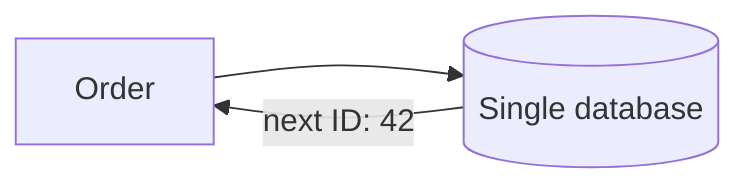
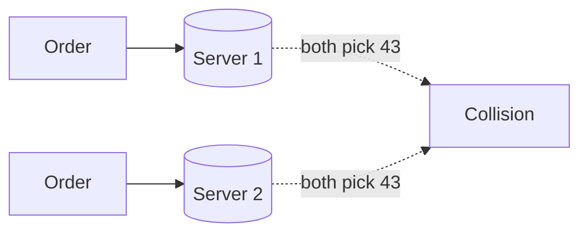
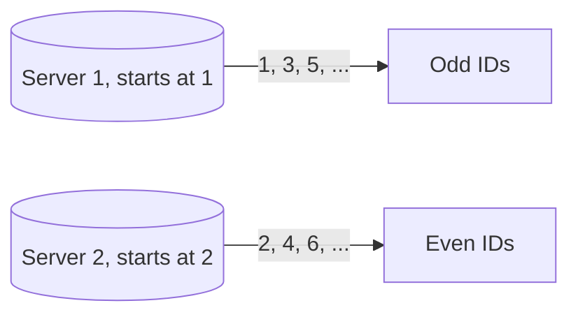
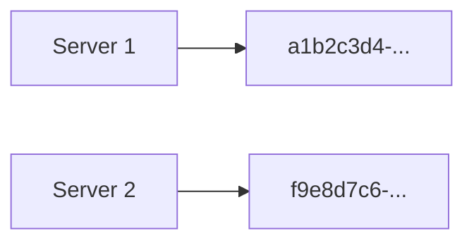
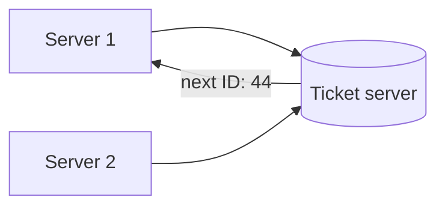
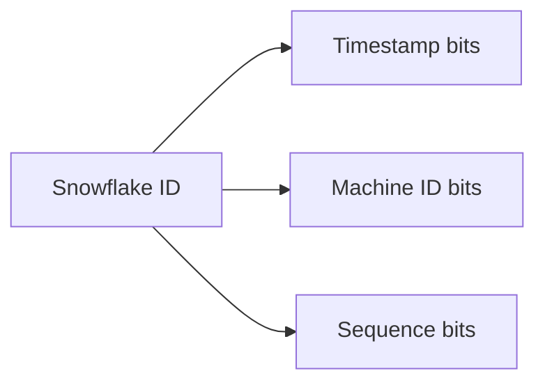

# What is Distributed ID Generation?

A single database's auto-increment primary key hands out unique IDs by counting up from the last one, one number at a time, on one machine.

# Starting small

Consider an orders table on a single database instance, each new order getting the next integer in sequence, 1, 2, 3, and so on.



At that scale this is trivial. The database itself already guarantees the next ID is unique, since only one machine is ever handing them out.

# Where it breaks

The database gets sharded or replicated across multiple machines to keep scaling, and now more than one server can accept a write for the same table at the same time.



Plain auto-increment on each server independently produces the same next number on more than one machine at once, a collision. Generating IDs across many machines without them colliding, without needing to ask each other first, is the real problem.

# The shared problem

Every approach in this file answers the same underlying need, handing out an ID that no other machine will also hand out, at a rate that keeps up with real traffic.

Four approaches are worth knowing well, multi-master replication, UUID, ticket servers, and Twitter's Snowflake, each trading coordination overhead against how far it actually scales.

# Multi-master replication

Multi-master replication solves the collision by configuring each database server with a different starting point and a shared increment, so their auto-increment sequences never land on the same number.



Two servers configured this way, one incrementing from an odd start, one from an even start, both stepping by two, never produce the same ID again. Each server still generates IDs entirely on its own, no coordination needed at request time.

```sql
-- Server 1
SET @@auto_increment_increment = 2;
SET @@auto_increment_offset = 1;

-- Server 2
SET @@auto_increment_increment = 2;
SET @@auto_increment_offset = 2;
```

That scheme works cleanly for two servers, but it does not scale smoothly. Adding a third server means recalculating and reconfiguring the increment and offset on every existing server, and IDs still are not sortable by creation time across servers, since each one is only counting within its own slice of the number line.

# UUID

A UUID, universally unique identifier, is a 128-bit number generated locally with no coordination at all, random enough that two machines generating one at the same moment essentially never produce the same value.



Generating one needs nothing from any other server, not even knowledge that other servers exist.

```python
import uuid
order_id = uuid.uuid4()
```

That independence is also the cost. A UUID is twice the storage of a 64-bit integer, and because it is random, it has no relationship to creation time, inserting random UUIDs as a database's primary index causes the index to be written to in random order instead of appending at the end, which fragments it and hurts write performance at scale.

# Ticket servers

A ticket server is a single, centralized service whose only job is handing out the next unique ID, the approach Flickr used, moving the auto-increment logic off the actual data servers and onto one dedicated server.



Any server needing a new ID just asks the ticket server for one, and that one server's own auto-increment column guarantees no collision.

```sql
BEGIN;
REPLACE INTO Tickets64 (stub) VALUES ('a');
SELECT LAST_INSERT_ID();
COMMIT;
```

Centralizing the counter removes the multi-master coordination problem entirely, but it reintroduces the exact single point of failure distributing the database was meant to avoid. If the ticket server goes down, nothing anywhere can get a new ID until it recovers, and running multiple ticket servers for redundancy brings the original collision problem right back.

# Twitter Snowflake

Snowflake packs a 64-bit ID out of a timestamp, a machine ID, and a per-millisecond sequence number, so any machine can generate IDs entirely on its own, with no server-to-server coordination and no single point of failure.



Because the timestamp occupies the high bits, IDs generated later always sort after IDs generated earlier, something neither UUID nor the ticket-server approach guarantees.

```python
def next_id(machine_id, sequence, last_timestamp):
    timestamp = current_millis()
    return (timestamp << 22) | (machine_id << 12) | sequence
```

That timestamp is also Snowflake's real dependency. The scheme assumes every machine's clock is reasonably synchronized, if one server's clock drifts backward, it can generate an ID that collides with or sorts behind an ID it already issued, which is exactly the caveat `server-time.md` covers in more depth.

# How to choose

Multi-master replication fits a small, fixed number of database servers where reconfiguring the increment scheme by hand for every new server is still tolerable.

UUID fits a system that values zero coordination above all else, and does not need IDs to be sortable by creation time or as compact as a 64-bit integer.

Ticket servers fit a system that already accepts a centralized service for something else, and needs IDs simpler to reason about than Snowflake's bit-packing, in exchange for that one server becoming a dependency.

Snowflake fits a high-throughput, distributed system that needs both no coordination between machines and roughly time-ordered IDs, provided the machines' clocks can be kept in sync.

# What gets traded away

Multi-master replication trades away easy scaling past a handful of servers for simplicity when there are only a couple.

UUID trades away storage size and index-friendliness for needing absolutely no coordination or shared state between machines.

Ticket servers trade away the single-point-of-failure risk they reintroduce for the simplest possible mental model, one place hands out every ID.

Snowflake trades away a dependency on synchronized clocks for IDs that are compact, roughly sortable by time, and require no server-to-server coordination at all.
