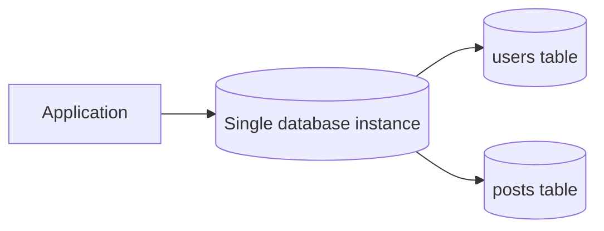
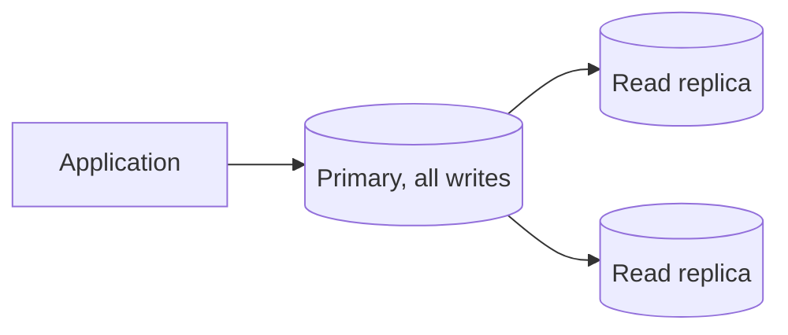
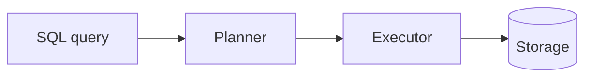
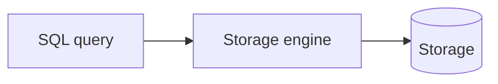
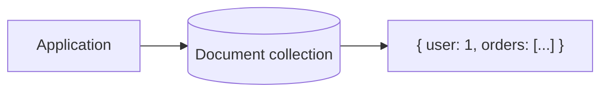
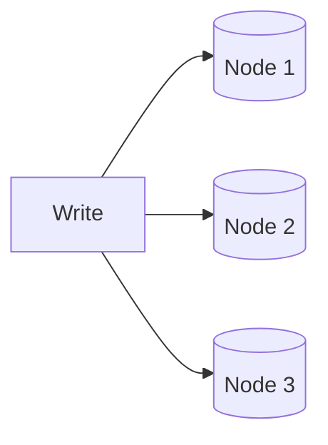
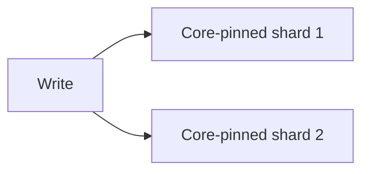
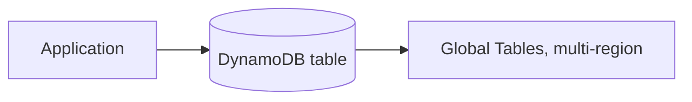

# What are Database Providers?

`sql-vs-nosql.md` sets out the conceptual split, schema-first versus schema-flexible, single-primary versus leaderless. This file grounds that split in the real systems teams actually choose between.

# Starting small

Consider a social app storing user profiles and posts in a single relational database, one schema, one machine. A signup writes a row to `users`, a post writes a row to `posts` with a foreign key back to its author, and a profile page joins the two in one query.



At a few thousand users this works fine. A single relational database is enough at this scale.

Every write lands on the same machine, every query is a fast, well-indexed lookup, and nobody thinks about where the data actually lives.

# Where it breaks

Growth changes two things at once. The tables' rows outgrow what fits comfortably in memory, and write volume outgrows what a single machine can absorb, especially once posts start carrying likes, comments, and view counters updated on every request.

A single writer becomes the ceiling. Adding a read replica helps read traffic, but every post, like, and comment still funnels through the same one machine to be written, and that machine cannot be scaled out, only scaled up, until it hits a hardware limit.



Past that point, a single machine is no longer enough no matter how it is tuned, and the answer shifts to a high-scale, distributed solution built to spread writes across many machines instead of one.

Different systems respond to that shift differently. Some relax schema strictness to make data easier to spread across many machines. Some remove the single-writer bottleneck entirely by letting every node accept writes. Others try to keep a relational database's guarantees while still scaling writes out.

# The shared problem

Every provider in this file answers the same underlying question, how to store and query data reliably, but they disagree on how much structure to enforce upfront and how they scale past one machine.

Many systems answer that differently, but seven are worth knowing well, Postgres, MySQL, MongoDB, Cassandra, ScyllaDB, DynamoDB, and CockroachDB, spanning relational, document, wide-column, and a newer category that tries to avoid picking a side at all.

Two ordinary operations expose what each of them is actually built on more clearly than a plain write does. The first, and the one that matters most, is a query nobody planned for, finding every post from users in a specific city, say. A join answers it without a second thought in some of these systems and requires modeling around ahead of time in others. The second is deletion, a user closing their account and asking for their posts to be removed sounds like the same simple `DELETE` everywhere, but what it actually costs, and when, is where these seven systems stop looking alike too.

Both threads run through every section below, the query question first, since it is the one that decides whether an idea is even expressible, and deletion second.

# Postgres

Postgres is a general-purpose relational database that treats extensibility as a core design goal. Custom types, operators, and even new index types can be added through extensions rather than waiting on the core project to support them.



A few things follow from that extensibility-first design.

- A schema is defined upfront with typed columns, and migrations formalize any change to that schema over time.
- pgvector for vector search and PostGIS for geospatial queries attach to the same running instance as extensions, rather than requiring a separate specialized database.
- MVCC, multi-version concurrency control, lets readers and writers avoid blocking each other, by keeping multiple versions of a row around instead of locking it.

The city-wide query is unremarkable here.

```sql
SELECT posts.*
FROM posts
JOIN users ON users.id = posts.user_id
WHERE users.city = 'Jakarta';
```

A join across `users` and `posts` filtered by city answers it in one statement, no upfront modeling required, a point worth remembering once the same question comes up for Cassandra and DynamoDB later in this file.

Deletion is where the MVCC bullet above actually gets interesting. Every row carries hidden `xmin` and `xmax` columns marking which transaction created it and which one deleted it.

Deleting a user's posts looks like an ordinary statement.

```sql
DELETE FROM posts WHERE user_id = 42;
```

Under MVCC, that delete does not actually remove anything from disk. Each row is marked invisible to future transactions and left exactly where it was.

Every one of those rows is now a dead tuple, still occupying space, still showing up in a sequential scan, just invisible to new queries. Enough of that accumulating across a busy table is what Postgres calls bloat, and it is why autovacuum exists as a background process at all.

```sql
VACUUM (VERBOSE, ANALYZE) posts;
```

Regular `VACUUM` marks that space reusable without shrinking the file on disk, so the table can grow again into its own bloat before ever giving space back to the operating system. `VACUUM FULL` reclaims it for real by rewriting the table into a compacted copy, but it holds an exclusive lock for the duration, which is exactly why nobody runs it casually on a live table.

That extensibility is why Postgres has become the default choice for a workload that started relational but grew a need for something extra, without justifying a second, specialized database on top.

# MySQL

MySQL is also a general-purpose relational database, historically paired with PHP and Apache as the classic LAMP stack default. What sets its conventions apart from Postgres shows up mostly in scope, not syntax.



- A storage engine is selected per table, InnoDB by default and transactional, or MyISAM, older and faster for read-heavy, non-transactional workloads.
- Replication is simple to set up and heavily documented, part of why MySQL became the default for so much of the web's hosting infrastructure.
- Its data types and extensibility stay intentionally narrower than Postgres's, a smaller surface area to tune in exchange for giving up that extension ecosystem.

The same city-wide join runs unchanged here too.

```sql
SELECT posts.*
FROM posts
JOIN users ON users.id = posts.user_id
WHERE users.city = 'Jakarta';
```

Unremarkable, since MySQL is just as fully relational as Postgres on that front.

What actually happens underneath a delete is not the same story as Postgres at all. InnoDB implements MVCC through undo logs rather than Postgres's inline row versions.

```sql
DELETE FROM posts WHERE user_id = 42;
```

A delete here leaves the current row's slot in the clustered index and writes the information needed to reconstruct the prior version into a separate undo segment. A background purge thread cleans up undo entries once no transaction still needs them, automatically, with no table-wide maintenance pass to schedule.

That difference is the whole reason MySQL avoids Postgres's specific bloat problem. A team that needs Postgres's extensibility feels MySQL's limits quickly. A team that just needs deletes to clean up after themselves without a vacuum schedule to manage often prefers not having to think about it at all.

# MongoDB

MongoDB stores data as BSON documents, a binary form of JSON, letting a record hold nested arrays and objects without needing a join to a separate table.



That document-first model shapes the rest of it.

- Collections hold documents the way tables hold rows, but documents in the same collection do not need identical fields.
- A replica set provides redundancy and failover, with all writes for a given shard routed through a single primary at a time.
- Sharding distributes collections across multiple replica sets once one no longer has capacity, keyed by a chosen shard key.

The city-wide query is where MongoDB sits in between Postgres and what Cassandra does further down.

```javascript
db.posts.aggregate([
  { $lookup: { from: "users", localField: "userId", foreignField: "_id", as: "user" } },
  { $match: { "user.city": "Jakarta" } },
]);
```

A `$lookup` stage like that can join across collections, but it is comparatively expensive at scale, so most MongoDB schemas embed the relationship upfront instead, the same query-first instinct Cassandra requires, just applied once at schema-design time rather than enforced by the database on every query.

Whether a user's posts live as a separate collection or as an embedded array inside the user document is that same modeling decision made upfront. Deleting them is unremarkable on its own.

```javascript
db.posts.deleteMany({ userId: 42 });
```

The more interesting mechanic is how that delete reaches a replica set at all. Every write, deletes included, is appended to the oplog, a capped collection each secondary continuously tails to replay the same operations in the same order.

MongoDB's flexible documents fit data that is already nested in the application, but write throughput within a single shard is still bottlenecked by that shard's one primary, the same ceiling a relational database's writes eventually hit.

# Cassandra

Cassandra is leaderless. Every node in the cluster can accept a write for any key, replicating it to other nodes based on a configurable replication factor rather than funneling through one primary.



That leaderless design forces a different modeling habit.

- Data gets denormalized and duplicated across tables around the queries it needs to serve, rather than normalized the way SQL is.
- CQL, Cassandra Query Language, reads like SQL but drops joins entirely, since a query must be answerable from a single partition.
- Tunable consistency lets a team choose, per query, how many replicas must acknowledge a write or read before it counts as successful.

The city-wide query is where that first bullet stops being abstract. Asking for every post from users in a specific city has no answer against `posts` as written, it is partitioned by `user_id`, not by city, so no single partition holds what the query needs.

The fix is a second table, modeled around this exact question ahead of time and kept in sync with `posts` on every write.

```sql
CREATE TABLE posts_by_city (
    city text,
    user_id int,
    post_id int,
    body text,
    PRIMARY KEY (city, user_id, post_id)
);

SELECT * FROM posts_by_city WHERE city = 'Jakarta';
```

That second table is what makes the query answerable at all. A query nobody planned for at modeling time simply cannot run until a table like this exists and has already been backfilled with the data it needs.

That same leaderless design is what makes deletion the single most misunderstood operation in Cassandra. There is no coordinator forcing every replica to agree on a deletion the instant it runs.

```sql
DELETE FROM posts WHERE user_id = 42;
```

Instead Cassandra writes a tombstone, a marker recording that the data was deleted at a given timestamp, and replicates that tombstone the same way it replicates any other write. Every subsequent query touching that partition has to read past the tombstone until it is finally purged during compaction, after a configurable grace period, `gc_grace_seconds`, long enough for the delete to propagate to every replica first.

Delete a large batch of a user's posts all at once, and every one of those tombstones sits there being scanned on every read until compaction catches up. That is exactly why Cassandra's own operational guidance is to spread bulk deletes out over time rather than firing them all at once.

That leaderless design is what lets Cassandra absorb enormous, evenly distributed write throughput across regions, but it costs MongoDB's richer secondary queries and aggregation pipeline, and it hands the operator a tombstone budget to manage that a single-primary system never has to think about.

# ScyllaDB

ScyllaDB is a wire-compatible reimplementation of Cassandra, rewritten in C++ with a shard-per-core architecture instead of running on the JVM.



The rewrite is the whole story, not the interface.

- Speaking the same CQL and drivers as Cassandra means existing application code, and often existing data, can move over with minimal changes.
- Avoiding the JVM removes Java's garbage collection pauses, the direct cause of the latency spikes large Cassandra deployments suffer under heavy load.
- Pinning each CPU core to its own slice of data and requests squeezes more throughput out of the same hardware Cassandra runs on.

The `posts_by_city` modeling requirement from Cassandra is not something ScyllaDB fixes.

```sql
CREATE TABLE posts_by_city (
    city text,
    user_id int,
    post_id int,
    body text,
    PRIMARY KEY (city, user_id, post_id)
);
```

Wire compatibility means every constraint Cassandra has around unplanned queries, ScyllaDB has too, this table definition runs unchanged, and nothing about the faster runtime underneath changes what the query language can express.

The delete-and-tombstone story is inherited wholesale as well.

```sql
DELETE FROM posts WHERE user_id = 42;
```

Speaking the same CQL means that statement produces the same tombstone with the same grace period on ScyllaDB too. What changes is how predictably compaction chews through those tombstones afterward, since it never has to compete with a JVM garbage collector for CPU time.

Discord migrated its message storage from Cassandra to ScyllaDB specifically to escape those GC-driven spikes at scale, though Cassandra's larger install base still means more accumulated operational knowledge and tooling to lean on.

# DynamoDB

DynamoDB is AWS's fully managed key-value and document database, descended from the same 2007 Dynamo paper that inspired Cassandra, but offered as a service with no cluster to run.



Its managed nature trades query flexibility for operational simplicity.

- Every table requires a partition key, and most real access patterns also need a secondary index defined upfront, since DynamoDB has no equivalent of CQL or SQL's ad hoc querying.
- Reads can be requested as eventually consistent, cheaper, or strongly consistent, more expensive, chosen per request rather than fixed for the whole table.
- Global Tables replicate a table across regions automatically, the managed equivalent of the multi-datacenter replication a self-hosted Cassandra cluster would need to configure by hand.

The city-wide query lands in the same place it did for Cassandra, just with a managed name attached to the fix. Answering it means defining a Global Secondary Index on `city` ahead of time.

```python
table.query(
    IndexName="city-index",
    KeyConditionExpression=Key("city").eq("Jakarta"),
)
```

Without that index already in place, the query is not slow, it is simply not possible, the same modeling-upfront constraint as Cassandra's `posts_by_city`, just enforced through an index definition instead of a second table.

Deleting a user's posts only works efficiently if `user_id` was already chosen as the partition key.

```python
table.delete_item(Key={"user_id": 42, "post_id": 501})
```

A single delete like that is cheap. The operational risk shows up when deletes, or any writes, cluster onto one partition key, a batch cleanup job hammering the same key range, for instance.

Every partition has a hard ceiling, roughly 3,000 read or 1,000 write capacity units. DynamoDB's adaptive capacity only responds by splitting a hot partition, a process AWS calls split-for-heat, after detecting the imbalance, which can take several minutes to kick in.

Until it does, requests against that key get throttled. A table using a Local Secondary Index makes this worse, since an LSI enforces a 10 GB limit per partition key's item collection, which blocks DynamoDB from splitting that partition to relieve the heat at all.

DynamoDB removes essentially all the operational burden of running Cassandra or ScyllaDB, but that convenience assumes every access pattern, including which key absorbs bursts of writes or deletes, was modeled correctly ahead of time.

# CockroachDB

CockroachDB answers a different question than the rest of this file, can a database keep full SQL and ACID transactions while still scaling horizontally the way Cassandra or DynamoDB do. It replicates data using the Raft consensus protocol across nodes.


Carrying SQL's guarantees into a distributed system costs something at every layer.

- Ranges of data are automatically split and rebalanced across nodes as a table grows, similar in spirit to sharding but handled by the database itself rather than by an application developer.
- A standard SQL interface with full JOIN support means code written for Postgres is largely compatible with CockroachDB with minimal changes.
- Every write has to be acknowledged by a majority of replicas before it commits, a real latency tax a leaderless system like Cassandra never pays.

The second bullet closes the query thread that ran through this whole file.

```sql
SELECT posts.*
FROM posts
JOIN users ON users.id = posts.user_id
WHERE users.city = 'Jakarta';
```

The city-wide join that Cassandra needed a second table for, and DynamoDB needed a Global Secondary Index for, is once again just a join here, the one part of Postgres's world CockroachDB kept intact while scaling out everything else.

The third bullet is easiest to see through the same delete statement that ran on Postgres and MySQL earlier.

```sql
DELETE FROM posts WHERE user_id = 42;
```

What makes that commit safe without a single point of failure is the leaseholder, the one replica in a range's Raft group that is also elected the Raft leader. It appends the delete to its own Raft log and notifies its followers.

The moment a majority of replicas, not all of them, have durably logged it, the write commits. A follower that has not yet replied usually catches up moments later, but the commit was never waiting on it.

CockroachDB still runs its own background garbage collection to reclaim old MVCC versions, conceptually the same job Postgres's vacuum does, just tuned by a retention window, `gc.ttlseconds`, rather than triggered by table-level bloat.

CockroachDB is the rare case that gets to skip the SQL versus NoSQL tradeoff instead of picking a side, at the cost of that consensus latency, which is why it fits a workload that needs both strong consistency and horizontal scale, rather than one willing to trade consistency for Cassandra's raw throughput.

# How to choose

Postgres fits a relational workload that is likely to need more than plain SQL eventually, vector search or geospatial queries, without wanting to run a second specialized database.

MySQL fits a straightforward relational workload where simplicity, a long operational track record, and not having to schedule vacuum runs matter more than Postgres's extensibility.

MongoDB fits data that is naturally nested and does not need to be joined across many other entities, without needing Cassandra-level write throughput.

Cassandra and ScyllaDB fit extremely high, evenly distributed write throughput across regions, with ScyllaDB specifically worth the migration once JVM garbage collection pauses become a real production problem, and both demand real discipline around how queries and deletes are planned for ahead of time.

DynamoDB fits a team that wants Cassandra-style scale without running a cluster themselves, and is willing to model every access pattern, including which keys absorb bursts of writes, upfront in exchange for that.

CockroachDB fits a workload that genuinely needs both strong consistency and horizontal scale at once, payments or inventory that must not be wrong, spread across regions.

# What gets traded away

Postgres and MySQL both trade away easy horizontal write scaling. Reads scale well through replicas, but writes across many machines need manual sharding that fights the relational model's assumptions. Postgres pays for its inline MVCC with vacuum overhead that MySQL's undo-log approach mostly avoids.

MongoDB trades away Cassandra's write throughput for richer queries and a more familiar document model.

Cassandra and ScyllaDB trade away MongoDB's secondary queries and joins for raw, leaderless write throughput, and both hand the operator a query-modeling and tombstone budget that a single-primary system never has to manage.

DynamoDB trades away query flexibility for operational simplicity. Every access pattern, and every hot key, has to be anticipated in advance.

CockroachDB trades away the low write latency a leaderless system offers, consensus means every write waits on a quorum, in exchange for not having to choose between consistency and scale at all.
