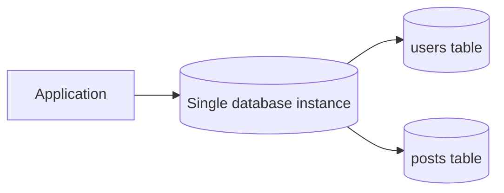
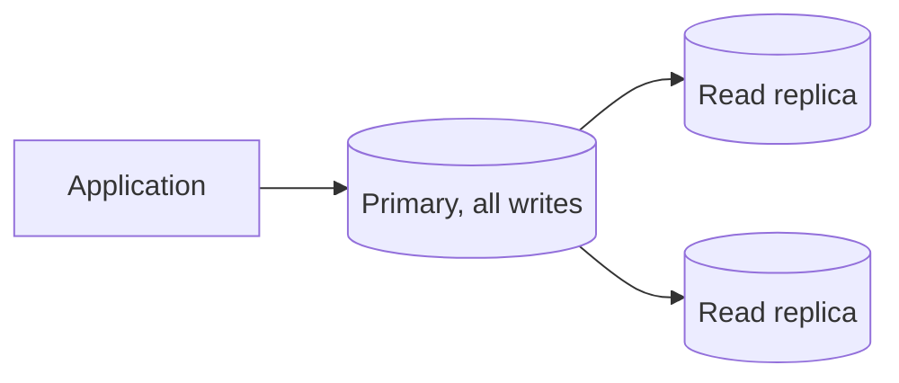
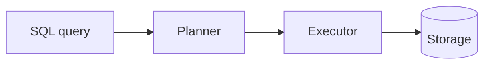
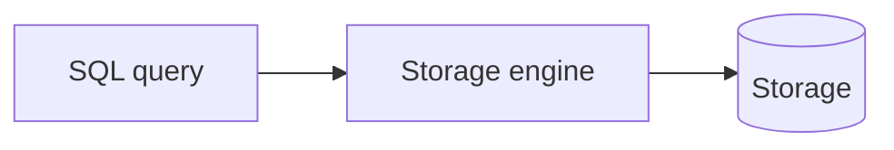
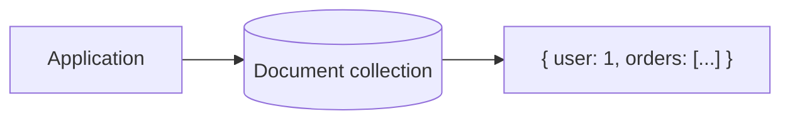
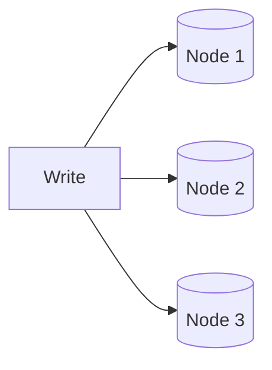
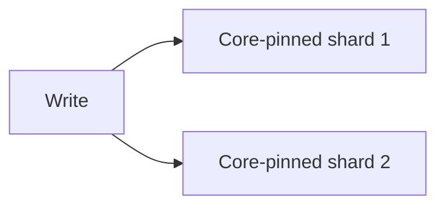
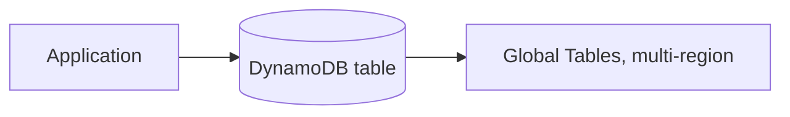
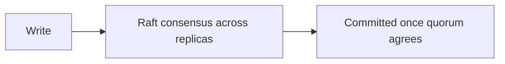

# What are Database Providers?

`sql-vs-nosql.md` sets out the conceptual split, schema-first versus schema-flexible, single-primary versus leaderless. This file grounds that split in the real systems teams actually choose between.

# Starting small

Consider a social app storing user profiles and posts in a single relational database, one schema, one machine. A signup writes a row to `users`, a post writes a row to `posts` with a foreign key back to its author, and a profile page joins the two in one query.



At a few thousand users this works fine. A single relational database is enough at this scale, every write lands on the same machine, every query is a fast, well-indexed lookup, and nobody thinks about where the data actually lives.

# Where it breaks

Growth changes two things at once, the tables' rows outgrow what fits comfortably in memory, and write volume outgrows what a single machine can absorb, especially once posts start carrying likes, comments, and view counters updated on every request.

A single writer becomes the ceiling. Adding a read replica helps read traffic, but every post, like, and comment still funnels through the same one machine to be written, and that machine cannot be scaled out, only scaled up, until it hits a hardware limit.



Past that point, a single machine is no longer enough no matter how it is tuned, and the answer shifts to a high-scale, distributed solution built to spread writes across many machines instead of one. Different systems respond to that shift differently. Some relax schema strictness to make data easier to spread across many machines, some remove the single-writer bottleneck entirely by letting every node accept writes, and some try to keep a relational database's guarantees while still scaling writes out.

# The shared problem

Every provider in this file answers the same underlying question, how to store and query data reliably, but they disagree on how much structure to enforce upfront and how they scale past one machine.

Many systems answer that differently, but seven are worth knowing well, Postgres, MySQL, MongoDB, Cassandra, ScyllaDB, DynamoDB, and CockroachDB, spanning relational, document, wide-column, and a newer category that tries to avoid picking a side at all.

# Postgres

Postgres is a general-purpose relational database that treats extensibility as a core design goal. Custom types, operators, and even new index types can be added through extensions rather than waiting on the core project to support them.



Postgres's conventions center on that extensibility:

- A schema is defined upfront with typed columns, and migrations formalize any change to that schema over time.
- Extensions like pgvector for vector search and PostGIS for geospatial queries attach to the same running instance, rather than requiring a separate specialized database.
- MVCC, multi-version concurrency control, lets readers and writers avoid blocking each other, at the cost of needing periodic vacuuming to clean up old row versions it leaves behind.

A simple query looks like this.

```sql
CREATE INDEX idx_users_email ON users (email);
SELECT * FROM users WHERE email = 'user@example.com';
```

Postgres's extensibility is why it has become the default choice for a workload that started relational but grew a need for something extra, vector search or geospatial queries, without justifying a second specialized database.

# MySQL

MySQL is also a general-purpose relational database, historically paired with PHP and Apache as the classic LAMP stack default. It prioritizes straightforward setup and fast reads on simple queries over Postgres's extensibility.



MySQL's conventions reflect that narrower, simpler feature set:

- A storage engine can be selected per table, InnoDB, the default and transactional, versus MyISAM, older and faster for read-heavy, non-transactional workloads.
- Replication is simple to set up and heavily documented, part of why it became the default for so much web hosting infrastructure.
- Its data types and extensibility are intentionally narrower than Postgres, in exchange for a smaller surface area to tune and operate.

A simple query looks like this.

```sql
CREATE INDEX idx_users_email ON users (email);
SELECT * FROM users WHERE email = 'user@example.com';
```

MySQL's simplicity is a deliberate tradeoff. A team that needs Postgres's extensibility feels MySQL's limits quickly, but a team that just needs a relational database to work reliably out of the box often never notices what is missing.

# MongoDB

MongoDB stores data as BSON documents, a binary form of JSON, letting a record hold nested arrays and objects without needing a join to a separate table.



MongoDB's conventions are built around flexible, self-contained documents:

- Collections hold documents the way tables hold rows, but documents in the same collection do not need identical fields.
- A replica set provides redundancy and failover, with all writes for a given shard routed through a single primary at a time.
- Sharding distributes collections across multiple replica sets once one no longer has the capacity, keyed by a chosen shard key.

A document and query look like this.

```javascript
db.users.insertOne({ name: "Ada", orders: [{ id: 101, total: 49.99 }] });
db.users.find({ "orders.total": { $gt: 40 } });
```

MongoDB's flexible documents fit data that is already nested in the application, but write throughput within a single shard is still bottlenecked by that shard's one primary, the same ceiling a relational database's writes eventually hit.

# Cassandra

Cassandra is leaderless. Every node in the cluster can accept a write for any key, replicating it to other nodes based on a configurable replication factor rather than funneling through one primary.



Cassandra's conventions follow from that leaderless design:

- Data is modeled around the queries it needs to serve, denormalized and duplicated across tables as needed, rather than normalized into related tables the way SQL is.
- CQL, Cassandra Query Language, reads like SQL but has no joins, since a query must be answerable from a single partition.
- Tunable consistency lets a team choose, per query, how many replicas must acknowledge a write or read before it counts as successful.

A query looks like this.

```sql
SELECT * FROM orders WHERE user_id = 42;
```

That leaderless design is what lets Cassandra absorb enormous, evenly distributed write throughput across regions, but it costs MongoDB's richer secondary queries and aggregation pipeline. A query that was not planned for at modeling time is often not possible at all without rebuilding the table.

# ScyllaDB

ScyllaDB is a wire-compatible reimplementation of Cassandra, same CQL, same drivers, but rewritten in C++ with a shard-per-core architecture instead of running on the JVM.



ScyllaDB's conventions largely mirror Cassandra's, with the implementation swapped out underneath:

- Speaking the same protocol as Cassandra means existing drivers, and often existing data, can move to ScyllaDB with minimal application changes.
- Avoiding the JVM removes Java's garbage collection pauses, the direct cause of the latency spikes large Cassandra deployments can suffer under heavy load.
- The shard-per-core model pins each CPU core to its own slice of data and requests, squeezing more throughput out of the same hardware than Cassandra's JVM-based threading model.

The same CQL query runs unchanged.

```sql
SELECT * FROM orders WHERE user_id = 42;
```

ScyllaDB's performance ceiling is higher than Cassandra's on the same hardware, which is why Discord migrated its message storage from Cassandra to ScyllaDB specifically to escape those GC-driven latency spikes at scale, but Cassandra's larger install base still means more accumulated operational knowledge and tooling.

# DynamoDB

DynamoDB is AWS's fully managed key-value and document database, descended from the same 2007 Dynamo paper that inspired Cassandra, but offered as a service with no cluster to run yourself.



DynamoDB's conventions trade query flexibility for operational simplicity:

- Every table requires a partition key, and most real access patterns also need a secondary index defined upfront, since DynamoDB does not support ad hoc queries the way CQL or SQL loosely can.
- Reads can be requested as eventually consistent, cheaper, or strongly consistent, more expensive, chosen per request rather than fixed for the whole table.
- Global Tables replicate a table across regions automatically, the managed equivalent of the multi-datacenter replication a self-hosted Cassandra cluster would need to configure by hand.

A query looks like this.

```python
table.query(KeyConditionExpression=Key("user_id").eq(42))
```

DynamoDB removes essentially all the operational burden of running Cassandra or ScyllaDB, but that convenience assumes every access pattern was modeled correctly ahead of time. A query nobody anticipated usually means adding a new index and backfilling it, not just writing a new query.

# CockroachDB

CockroachDB answers a different question than the rest of this file, can a database keep full SQL and ACID transactions while still scaling horizontally the way Cassandra or DynamoDB do. It replicates data using the Raft consensus protocol across nodes, giving every write the same strong consistency a single-node relational database would provide, without a single point of failure.



CockroachDB's conventions carry over SQL's guarantees into a distributed system:

- Ranges of data are automatically split and rebalanced across nodes as a table grows, similar in spirit to sharding but handled by the database itself rather than by an application developer.
- A standard SQL interface and JOINs are fully supported, code written for Postgres is largely compatible with CockroachDB with minimal changes.
- Every write has to be acknowledged by a quorum of replicas before it commits, a real latency cost a leaderless system like Cassandra does not pay.

A query looks like standard SQL.

```sql
SELECT * FROM orders WHERE user_id = 42;
```

CockroachDB is the rare case that gets to skip the SQL versus NoSQL tradeoff instead of picking a side, at the cost of the write latency consensus requires, which is why it fits a workload that needs both strong consistency and horizontal scale, rather than one willing to trade consistency for Cassandra's raw throughput.

# How to choose

Postgres fits a relational workload that is likely to need more than plain SQL eventually, vector search or geospatial queries, without wanting to run a second specialized database.

MySQL fits a straightforward relational workload where simplicity and a long operational track record matter more than Postgres's extensibility.

MongoDB fits data that is naturally nested and does not need to be joined across many other entities, without needing Cassandra-level write throughput.

Cassandra and ScyllaDB fit extremely high, evenly distributed write throughput across regions, with ScyllaDB specifically worth the migration once JVM garbage collection pauses become a real production problem.

DynamoDB fits a team that wants Cassandra-style scale without running a cluster themselves, and is willing to model every access pattern upfront in exchange for that.

CockroachDB fits a workload that genuinely needs both strong consistency and horizontal scale at once, payments or inventory that must not be wrong, spread across regions.

# What gets traded away

Postgres and MySQL both trade away easy horizontal write scaling, reads scale well through replicas, but writes across many machines need manual sharding that fights the relational model's assumptions.

MongoDB trades away Cassandra's write throughput for richer queries and a more familiar document model.

Cassandra and ScyllaDB trade away MongoDB's secondary queries and joins for raw, leaderless write throughput.

DynamoDB trades away query flexibility for operational simplicity, every access pattern has to be known in advance.

CockroachDB trades away the low write latency a leaderless system offers, consensus means every write waits on a quorum, in exchange for not having to choose between consistency and scale at all.
