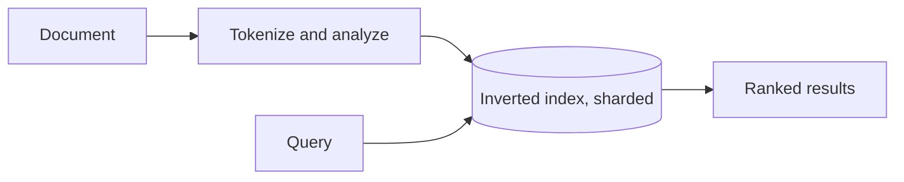
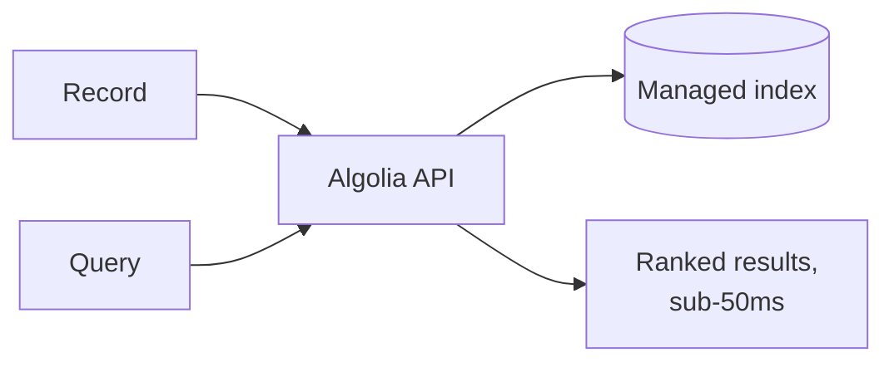

# What are Search Engines?

`full-text-search.md` covers why a plain database query breaks down at scale and how an inverted index, tokenization, and relevance scoring solve it in vendor-neutral terms. This file grounds that theory in the real products teams actually choose between.

# The shared problem

Every engine in this file answers the same underlying need, finding and ranking the documents most relevant to a query, quickly, across a dataset too large to scan row by row.

Three are worth knowing well, Elasticsearch, OpenSearch, and Algolia, each drawing a different line between self-hosting and managed convenience.

# Elasticsearch

Elasticsearch built its reputation on Apache Lucene's inverted-index engine, wrapped in a distributed system that shards and replicates an index across a cluster the same way a database shards a table.



That indexing pipeline is where its conventions live.

- Tokenization and analysis break a document's text into searchable terms, lowercasing, stemming plurals down to a root form, so "running" and "run" match the same query.
- Relevance scoring by default uses BM25, ranking a document higher when a query term appears often in it but rarely across the whole index, the more precise successor to the older TF-IDF scoring scheme.
- An index is split into shards distributed across a cluster, the same scaling model Cassandra or Elasticsearch's own underlying Lucene segments use, letting both indexing and querying scale horizontally.

Indexing a document and querying it looks like this.

```json
PUT /products/_doc/1
{ "name": "Mechanical Keyboard", "description": "A durable keyboard with tactile switches" }

GET /products/_search
{ "query": { "match": { "description": "tactile" } } }
```

Elasticsearch's combination of relevance scoring and horizontal scale is why it became the default for full-text search at real volume, but running and tuning a cluster, shard counts, replica counts, JVM heap sizing, is genuine, ongoing operational work.

# OpenSearch

OpenSearch is a fork of Elasticsearch, created after Elasticsearch's license change away from a fully open-source model, and it remains wire-compatible with Elasticsearch's API and query syntax for the most part.


Its conventions are, deliberately, almost identical to Elasticsearch's.

- The same query DSL, the same sharding and replication model, and largely the same client libraries carry over with minimal changes.
- It stays under a fully open-source license, which is the entire reason the fork exists, for teams unwilling to accept Elasticsearch's licensing terms.
- Apache Solr, also Lucene-based, is the other long-standing self-hosted option in this space, older than both and still used, though OpenSearch has become the more common Elasticsearch-compatible choice for new deployments.

The same index and query calls carry over almost unchanged.

```json
PUT /products/_doc/1
{ "name": "Mechanical Keyboard", "description": "A durable keyboard with tactile switches" }
```

OpenSearch's near-identical API means a team can move between it and Elasticsearch with relatively little rewrite, but it inherits the same cluster-operation burden, forking the code did not remove the work of running it.

# Algolia

Algolia is a fully managed, hosted search service, built around instant, typo-tolerant results for user-facing search boxes rather than large-scale log or analytics search.



Its conventions center on speed and typo tolerance for search-as-you-type specifically.

- Typo tolerance is built in by default, a query with a misspelled word still matches the intended term without extra configuration.
- Results are tuned to return in the tens of milliseconds, fast enough to re-query on every keystroke as a user types, the same use case `api/debounce-and-throttle.md` covers from the client side.
- There is no cluster to run at all, indexing and querying both go through Algolia's API, and scaling is entirely the vendor's problem.

Indexing and searching both go through simple API calls.

```python
index.save_object({"objectID": "1", "name": "Mechanical Keyboard"})
results = index.search("mechnical")  # typo tolerated
```

Algolia's speed and typo tolerance make it the natural fit for a user-facing search box, but it hands over both cost and infrastructure control to the vendor entirely, and it is not built for the log-analytics-style aggregation queries Elasticsearch and OpenSearch also handle well.

# How to choose

Elasticsearch fits a team that needs full-text search plus log or analytics aggregation, and is willing to run and tune a cluster for it.

OpenSearch fits the same use case as Elasticsearch, for a team that specifically needs to stay on a fully open-source license.

Algolia fits a user-facing search-as-you-type box where instant, typo-tolerant results matter more than owning the infrastructure underneath them.

# What gets traded away

Elasticsearch and OpenSearch both trade away operational simplicity for control, self-hosting means owning shard sizing, cluster health, and upgrades.

Algolia trades away that control and the ability to run heavy analytics-style queries, for zero infrastructure and speed tuned specifically for interactive search.
