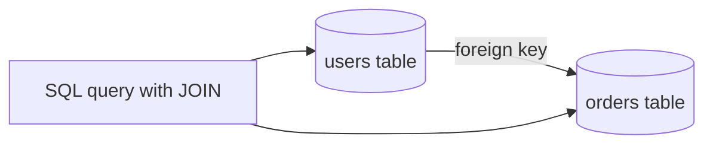
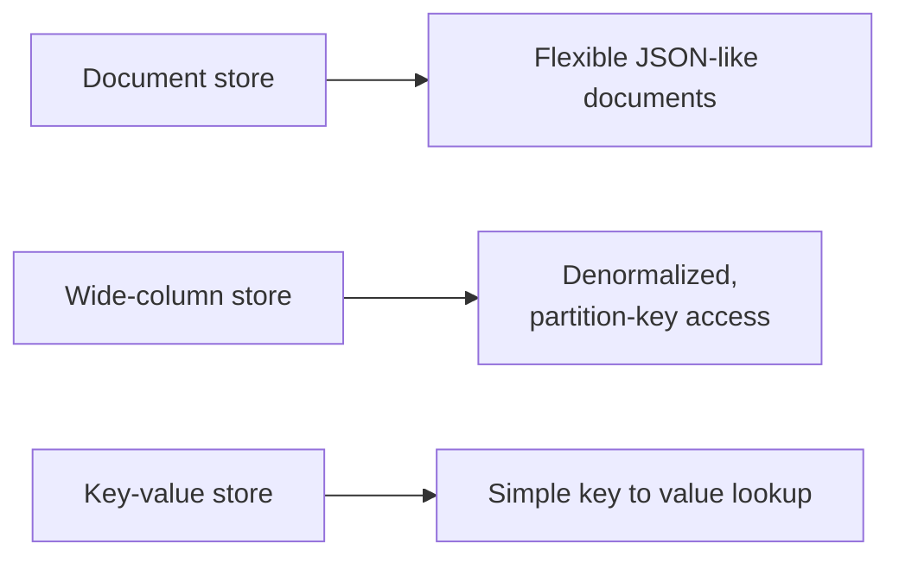

# SQL vs NoSQL

Every database has to decide upfront how strictly it enforces structure, and how it scales once one machine is not enough. SQL and NoSQL are the two broad answers to that question, not two competing products but two different sets of default tradeoffs.

# The shared problem

Every database exists to store data durably and let it be queried back, but they disagree on how much structure to require ahead of time, and how naturally they scale beyond a single machine.

# SQL

SQL databases require a schema defined upfront, tables with fixed columns and types, and relationships between tables enforced through foreign keys.

A relational database's real strength is the JOIN, combining rows from multiple tables in a single query, which requires the tables to actually be related through a well-defined schema in the first place.

Strong ACID transaction support is standard here, not an add-on.

# NoSQL

NoSQL is really an umbrella term for anything that is not the relational model. It splits further into shapes, document stores, wide-column stores, and key-value stores, each relaxing a different part of the relational model.

What ties these together is not a shared query language, the way SQL is shared across relational databases, but a shared willingness to relax strict schema enforcement or strong consistency in exchange for horizontal scale or query flexibility.

See [providers.md](providers.md) for how real systems, Postgres, MySQL, MongoDB, Cassandra, ScyllaDB, DynamoDB, and CockroachDB, ground these categories in practice.

# How to choose

SQL fits data with clear relationships that benefit from JOINs, and where strong transactional guarantees matter, financial records, inventory counts, anything where partial updates are unacceptable.

A document store fits data that is naturally nested and does not need to be joined across many other entities, a user profile with embedded preferences, for instance.

A wide-column store fits extremely high write throughput spread across many machines, when the access pattern is known ahead of time and can be modeled around a partition key.

A key-value store fits the simplest possible access pattern, look up a value by a single key, session data or a cache being the classic case.

# What gets traded away

SQL trades away easy horizontal write scaling. A relational database scales reads well through replicas, but scaling writes across many machines needs manual sharding that fights against the relational model's assumptions.

NoSQL trades away the convenience of JOINs and, in most cases, strict schema enforcement. Denormalizing data so it does not need to be joined means the same data can end up duplicated across multiple places, and keeping those copies consistent becomes the application's job instead of the database's.
