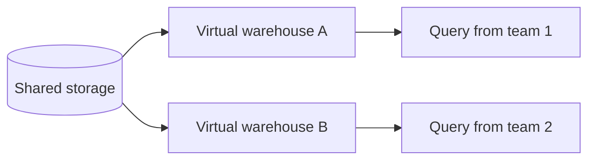
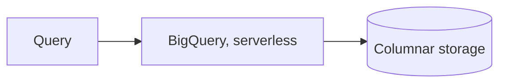
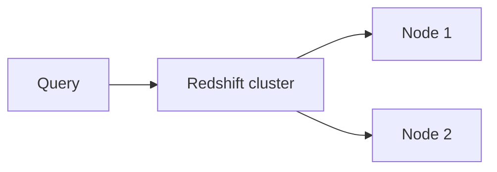

# What are Data Warehouses?

`warehousing.md` covers why a warehouse exists at all and how it shapes data differently from an OLTP database, star schema, fact and dimension tables, columnar storage. This file grounds that theory in the real products teams actually choose between.

# The shared problem

Every warehouse in this file answers the same underlying need, running heavy aggregate queries over huge datasets fast, without that workload competing with or being structured like an OLTP database.

Three are worth knowing well, Snowflake, BigQuery, and Redshift, each drawing a different line between storage, compute, and how much infrastructure a team has to manage themselves.

# Snowflake

Snowflake, made by Snowflake Inc., a standalone company rather than a division of a cloud provider, was the first of the three to fully separate storage from compute, data sits in one shared storage layer, and any number of independent compute clusters, called virtual warehouses, can query it at the same time without contending with each other.



That separation is what its conventions are built around.

- A virtual warehouse is just compute, it can be resized or suspended entirely without touching the underlying data, and billing follows compute usage, not data volume.
- Two teams running very different workloads, one light dashboard queries, one heavy batch transforms, can each get their own virtual warehouse against the same data without slowing each other down.
- Snowflake runs on top of AWS, Azure, or GCP rather than being tied to one cloud, which matters for a team that does not want its warehouse locked to whichever cloud the rest of its infrastructure happens to run on.

Querying it looks like ordinary SQL, the warehouse choice is a separate, explicit knob.

```sql
USE WAREHOUSE reporting_wh;
SELECT region, SUM(total) FROM orders WHERE order_date >= '2025-01-01' GROUP BY region;
```

Snowflake's storage-compute split is why two teams can hammer the same dataset from completely different angles without stepping on each other, but that flexibility costs more to reason about than a single fixed cluster does.

# BigQuery

BigQuery, Google's warehouse offering under GCP, goes a step further and removes the compute cluster from the picture entirely, there is nothing to provision or resize, a query just runs and BigQuery allocates whatever compute it needs behind the scenes.



Being serverless shapes everything about how it's used.

- Pricing is per query, based on bytes scanned, or a flat-rate commitment for predictable heavy usage, rather than paying for a cluster sitting idle between queries.
- It's built on Dremel, Google's internal query engine, which splits a query into a tree of workers to scan massive datasets in parallel automatically.
- Because there's no cluster to manage, there's also nothing to size correctly ahead of time, a query that needs more compute simply gets it.

Running the same report needs nothing beyond the query itself.

```sql
SELECT region, SUM(total) FROM `project.dataset.orders` WHERE order_date >= '2025-01-01' GROUP BY region;
```

Not having to manage compute at all is BigQuery's whole appeal, but per-query pricing on bytes scanned can get expensive fast on a poorly filtered query against a huge table, an accidental full scan costs real money immediately rather than just taking longer.

# Redshift

Redshift is AWS's native warehouse, historically built around provisioning a fixed-size cluster of nodes upfront, closer to a traditional database's operational model than Snowflake's or BigQuery's.



Its conventions carry over some of that more traditional heritage.

- A cluster is sized in advance, by node type and count, and resizing it, while now easier than in Redshift's earlier years, is still a more deliberate operation than Snowflake spinning up a new virtual warehouse.
- Redshift Spectrum can query data sitting directly in S3 without loading it into the cluster first, blurring the line between the warehouse and the data lake underneath it.
- Deep integration with the rest of AWS, IAM, S3, Kinesis, makes it the default choice for a team already standardized on that ecosystem.

The query itself looks the same as the other two.

```sql
SELECT region, SUM(total) FROM orders WHERE order_date >= '2025-01-01' GROUP BY region;
```

Redshift's provisioned-cluster model gives predictable cost for a steady, well-understood workload, but that predictability is exactly what Snowflake's and BigQuery's more elastic models trade away in the other direction.

# How to choose

Snowflake fits a team running genuinely varied workloads against the same data, several independent teams or query patterns that would otherwise contend for one shared cluster, and one that doesn't want to commit to a single cloud.

BigQuery fits a team that wants zero infrastructure to manage at all, and whose query patterns are well-filtered enough that per-query pricing stays predictable.

Redshift fits a team already deep in AWS, with a steady, well-understood workload where a provisioned cluster's more predictable cost outweighs the elasticity the other two offer.

# What gets traded away

Snowflake trades away the simplicity of a single fixed cluster for the flexibility of many independent virtual warehouses against shared storage, more power to tune, more to configure.

BigQuery trades away predictable, flat costs for true serverless convenience, an unfiltered query against a huge table can surprise a team on the bill before it surprises them with slowness.

Redshift trades away the elasticity the other two offer for the more familiar, predictable operational model of a provisioned cluster sized ahead of time.
