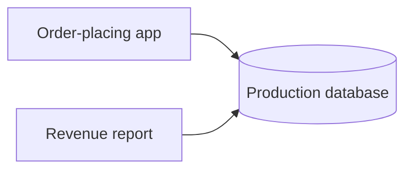
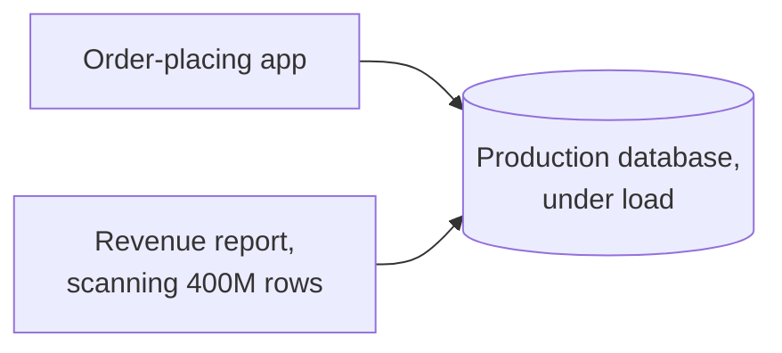
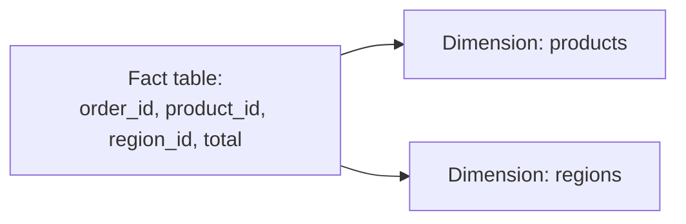
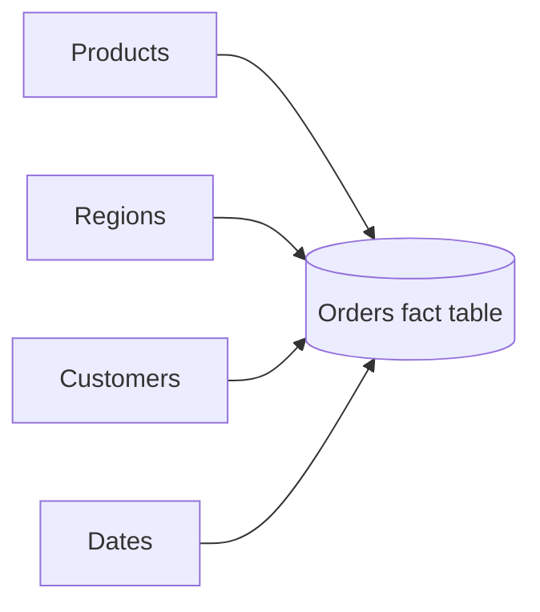
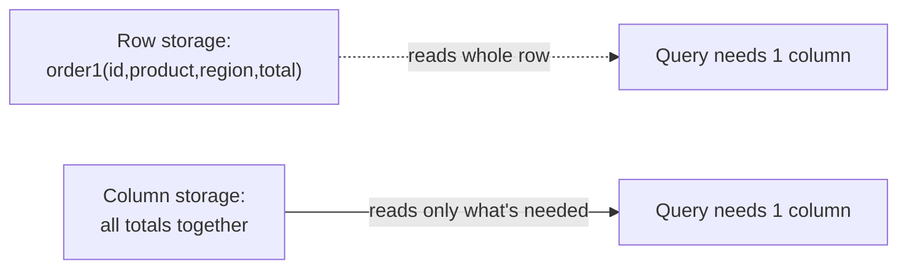

# What is Data Warehousing?

`providers.md` covers databases built to serve individual reads and writes quickly, the OLTP side of storage. A data warehouse answers a different question, scanning huge volumes of historical data to answer an aggregate question, the OLAP side, and it shapes its data very differently to do that well.

# Starting small

Consider running a report, total revenue by region for the past year, directly against the same production database that handles every order being placed right now.



At a modest data size this works fine. The report runs, takes a few seconds, and the production traffic barely notices.

# Where it breaks

A year of order history grows into hundreds of millions of rows, and that same report now means scanning nearly all of them to compute its aggregate. A row-oriented database reads a full row, every column, even though the report only needs two or three of them, and while that scan runs, it competes for the same disk and CPU that live order traffic depends on.



Running that report often enough starts slowing down the production workload it shares a machine with. A data warehouse solves this by moving analytical workloads onto separate infrastructure entirely, and by shaping the data itself around aggregate questions rather than individual-row lookups.

# Fact Tables and Dimension Tables

A fact table holds the actual measurements an analytical question is about, one row per order, per sale, per event, each row mostly numbers, a total, a quantity, a timestamp.



A dimension table holds the descriptive context around those facts, a products dimension with names and categories, a regions dimension with names and countries, each one small compared to the fact table it describes.

Separating facts from dimensions this way means the huge fact table stores only compact foreign keys and numbers, while the human-readable detail lives once in a small dimension table instead of being repeated on every single fact row.

# Star Schema

Arranging one central fact table surrounded by its dimension tables produces a shape called a star schema, the fact table at the center, a dimension table on each point.



That shape is deliberately simple to query. Answering "revenue by region" means joining the fact table to exactly one dimension, regions, rather than navigating a deep chain of normalized tables the way an OLTP schema often does.

```sql
SELECT r.region_name, SUM(f.total)
FROM orders_fact f
JOIN regions_dim r ON f.region_id = r.region_id
GROUP BY r.region_name;
```

A snowflake schema takes this further by normalizing dimensions themselves into sub-dimensions, a regions dimension split into countries and continents, trading a small amount of query simplicity for less duplicated dimension data.

# Columnar Storage

A row-oriented database stores an entire row together on disk, which means reading one column still means reading every other column in that row along with it. Columnar storage stores each column together instead, so a query touching three columns out of thirty only ever reads those three off disk.



That layout is also why columnar storage compresses so well, a column of region IDs repeating the same handful of values compresses far better than a row mixing IDs, totals, and text together, which is a direct part of why warehouses can scan hundreds of millions of rows in seconds.

# What gets traded away

A star schema trades away the write-side guarantees an OLTP schema optimizes for, updating a dimension value means updating it in one place, but a fact table is expected to be appended to constantly and rarely updated in place, not built for the frequent, small transactional writes `providers.md` covers.

Columnar storage trades away fast single-row lookups for fast aggregate scans, fetching every column of one specific order is slower here than in a row-oriented database, since those columns are scattered across separate column stores rather than sitting together.
