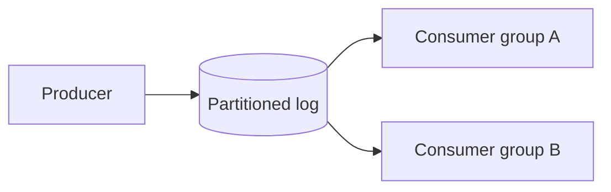
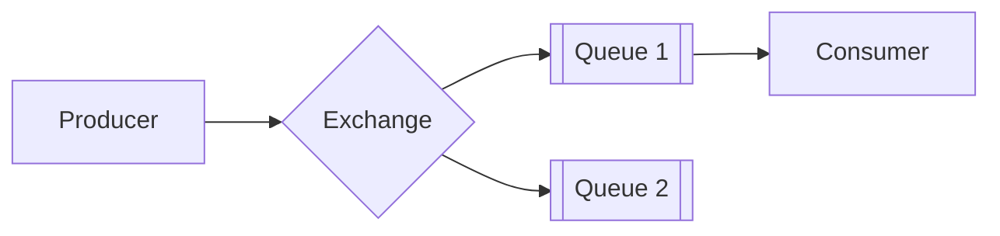
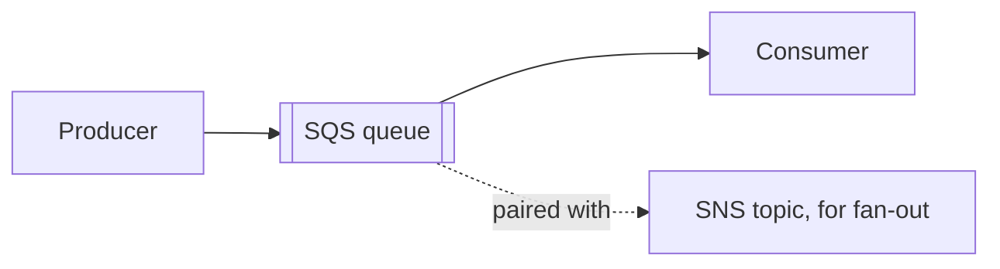

# What are Message Brokers?

`queue.md` and `pub-sub.md` cover the two shapes messaging comes in. This file grounds both shapes in the real brokers that implement them.

# The shared problem

Every broker exists to answer the same underlying need, accepting a message from a producer and reliably getting it to the right consumer or consumers, without the producer needing to know who is listening.

Many brokers answer that differently, but three are worth knowing well, Kafka, RabbitMQ, and SQS, each favored for a different shape of workload.

# Kafka

Kafka stores messages on an append-only log, partitioned across brokers, and retains them for a configurable period rather than deleting a message the moment it is consumed.



Kafka's conventions center on the log as the source of truth:

- A topic is split into partitions, and messages within a partition are strictly ordered, ordering across partitions is not guaranteed.
- Consumer groups let multiple consumers split a topic's partitions between them, each partition read by exactly one consumer within a group, while a separate consumer group reads the same messages independently.
- Because messages are retained rather than deleted on read, a new consumer group can replay history from the beginning, not just receive new messages going forward.

Producing and consuming looks like this.

```python
producer.send("orders", key=b"user-42", value=b"order placed")
for message in consumer:
    print(message.value)
```

Kafka's retention and replay are what make it a natural fit for both messaging and event-driven analytics at once, but that log-based model is heavier to operate than a simple queue, and a consumer has to track its own offset rather than relying on the broker to mark a message done.

# RabbitMQ

RabbitMQ routes messages through exchanges to queues based on routing rules, and once a message is consumed and acknowledged, it is gone, there is no retained log to replay.



RabbitMQ's conventions are built around flexible routing:

- An exchange receives a published message and routes it to zero or more bound queues based on the exchange type, direct, topic, or fanout, and the message's routing key.
- A queue behaves the classic queue way, one message, one consumer, removed once acknowledged, which is why fan-out here requires binding multiple queues to the same exchange rather than getting it for free the way Kafka's consumer groups do.
- Message priority and per-message TTLs are both natively supported, letting some messages jump the queue or expire unprocessed, options Kafka does not offer at the message level.

Publishing looks like this.

```python
channel.basic_publish(exchange="orders", routing_key="order.placed", body=b"order placed")
```

RabbitMQ's routing flexibility and lack of a retained log make it a natural fit for classic task-queue workloads, but replaying history is not possible the way it is with Kafka, once a message is acknowledged, it is simply gone.

# SQS

SQS is AWS's fully managed queue service, removing the operational burden of running a broker entirely, at the cost of a simpler feature set than Kafka or RabbitMQ.



SQS's conventions reflect its managed, queue-first design:

- A standard queue offers at-least-once delivery and best-effort ordering, a FIFO queue trades some throughput for strict ordering and exactly-once processing within a message group.
- SQS on its own is a queue, not a pub-sub system, fan-out is achieved by pairing it with SNS, which publishes to multiple SQS queues at once.
- Visibility timeout and dead-letter queues work the same way they do generically, both are native, managed features rather than something to configure by hand.

Sending and receiving looks like this.

```python
sqs.send_message(QueueUrl=queue_url, MessageBody="order placed")
messages = sqs.receive_message(QueueUrl=queue_url)["Messages"]
```

SQS removes essentially all the operational work of running Kafka or RabbitMQ, but it also has the smallest feature set of the three, no log retention, no complex routing, no message priority, just a reliable, managed queue.

# How to choose

Kafka fits a workload that needs both messaging and replayable event history, feeding an analytics pipeline from the same stream that also drives a notification service, at real throughput.

RabbitMQ fits a workload that needs flexible routing rules or message priority, and does not need to replay history once a message has been processed.

SQS fits a team that wants a queue running with no operational burden at all, and is willing to pair it with SNS if fan-out is needed.

# What gets traded away

Kafka trades away operational simplicity for retention and replay, running and tuning a Kafka cluster is real, ongoing work compared to a simple queue.

RabbitMQ trades away replay for routing flexibility, a message is gone the moment it is acknowledged, with no way to reprocess history after the fact.

SQS trades away features for zero operational burden, no native replay, no complex routing, fan-out only through a second service, SNS, bolted on alongside it.
