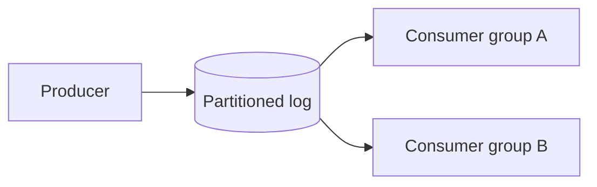
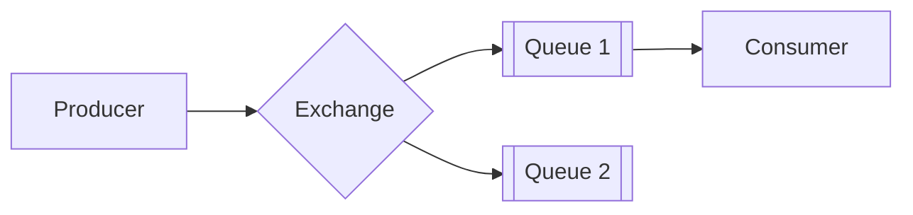
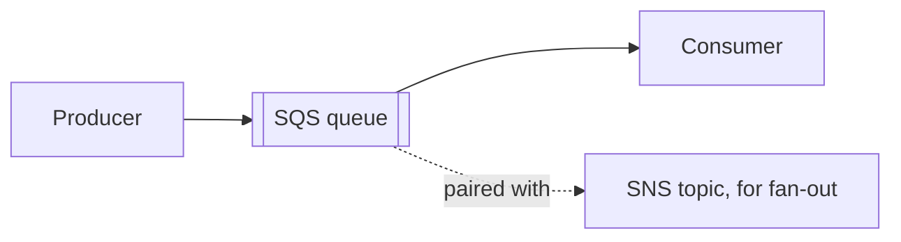

# What are Message Brokers?

`queue.md` and `pub-sub.md` cover the two shapes messaging comes in. This file grounds both shapes in the real brokers that implement them.

# The shared problem

Every broker exists to answer the same underlying need, accepting a message from a producer and reliably getting it to the right consumer or consumers, without the producer needing to know who is listening.

Many brokers answer that differently, but three are worth knowing well, Kafka, RabbitMQ, and SQS, each favored for a different shape of workload.

What actually separates them shows up clearest at the worst possible moment, a consumer crashing partway through handling a message. Whether that message gets lost, redelivered, or silently duplicated depends entirely on a mechanism each broker implements differently.

# Kafka

Kafka stores messages on an append-only log, partitioned across brokers, and retains them for a configurable period rather than deleting a message the moment it is consumed.



Treating the log as the source of truth, rather than a transient mailbox, shapes everything else about it.

- A topic is split into partitions, strictly ordered within a partition but not across them.
- Consumer groups split those partitions among themselves, each partition read by exactly one consumer in a group, while a separate group reads the same messages independently.
- Because nothing is deleted on read, a brand-new consumer group can replay a topic's full history instead of only seeing messages from the moment it subscribed.

Kafka has no idea a message was actually processed. It only knows what offset a consumer has committed, and that gap is exactly where the crash scenario plays out.

```python
for message in consumer:
    handle_order(message.value)
    consumer.commit()
```

Committing only after `handle_order` finishes is deliberate. If the consumer crashes mid-handle, the offset was never advanced, so once the group rebalances, whichever consumer picks up that partition starts from the same uncommitted offset and reprocesses the message, a duplicate rather than a loss.

Flip the order, commit before handling finishes, and a crash in between means that message's offset has already moved on, silently skipped forever. Kafka's default leans toward at-least-once for exactly this reason, and it is why a Kafka consumer's handler needs to be idempotent rather than trusting delivery to happen exactly once.

That retention and replay are what make Kafka a natural fit for both messaging and event-driven analytics off the same stream, but the log-based model is heavier to operate than a simple queue, and offset management is a responsibility the application carries, not something the broker quietly handles.

# RabbitMQ

RabbitMQ routes messages through exchanges to queues based on routing rules, and once a message is consumed and acknowledged, it is gone, there is no retained log to replay.



Its whole design centers on the exchange as the routing decision point.

- An exchange receives a published message and routes it to zero or more bound queues, based on the exchange type, direct, topic, or fanout, and the message's routing key.
- A queue itself still behaves the classic way, one message, one consumer, gone once acknowledged, which is why fan-out here means binding several queues to the same exchange rather than getting it for free the way Kafka's consumer groups do.
- Message priority and per-message TTLs are both natively supported, letting a message jump the queue or expire unprocessed, neither of which Kafka offers at the message level.

RabbitMQ's answer to the crash scenario is more direct than Kafka's, but it has its own dial to get wrong, prefetch count, how many unacknowledged messages a single consumer is allowed to hold at once.

```python
channel.basic_qos(prefetch_count=10)
channel.basic_consume(queue="orders", on_message_callback=handle_order, auto_ack=False)
```

An unacknowledged message stays claimed by that consumer. If the consumer's connection drops, every message it was still holding, up to that prefetch count, gets requeued for someone else to pick up.

A prefetch of 10 means at most 10 messages come back at once. A prefetch of 1,000, set to squeeze out more throughput, means a single crash returns a burst of 1,000 messages simultaneously, and if the handler downstream is not built to absorb that spike idempotently, the crash itself becomes the incident.

That routing flexibility fits classic task-queue workloads well, but the absence of a retained log means replaying history the way Kafka can simply is not on the table, once a message is acknowledged, it is gone for good.

# SQS

SQS is AWS's fully managed queue service, removing the operational burden of running a broker entirely, at the cost of the smallest feature set of the three.



Its managed, queue-first design shows up in a few specific ways.

- A standard queue gives at-least-once delivery and best-effort ordering, a FIFO queue trades some throughput for strict ordering and deduplicates identical messages within a five-minute window.
- Visibility timeout and dead-letter queues work exactly as described in `queue.md`, just as managed features rather than something configured by hand.
- SQS on its own is a queue, not a pub-sub system, so reaching multiple independent consumers means pairing it with SNS, which publishes into several SQS queues at once rather than SQS doing that natively.

SQS handles the crash scenario through that visibility timeout rather than an explicit ack protocol. A message becomes invisible to other consumers the moment it is received, and only actually deleted once the consumer says so explicitly.

```python
messages = sqs.receive_message(QueueUrl=queue_url)["Messages"]
process(messages[0])
sqs.delete_message(QueueUrl=queue_url, ReceiptHandle=messages[0]["ReceiptHandle"])
```

If that `delete_message` call never runs, because the consumer crashed, or the visibility timeout was simply set too short for how long processing actually takes, the message reappears in the queue once the timeout expires and another consumer picks it up, a duplicate.

SQS removes essentially all the operational work of running Kafka or RabbitMQ, but that convenience comes with no log retention, no complex routing, and no message priority, just a reliable, managed queue.

# How to choose

Kafka fits a workload that needs both messaging and replayable event history, feeding an analytics pipeline from the same stream that also drives a notification service, at real throughput.

RabbitMQ fits a workload that needs flexible routing rules or message priority, and does not need to replay history once a message has been processed.

SQS fits a team that wants a queue running with no operational burden at all, and is willing to pair it with SNS if fan-out is needed.

# What gets traded away

Kafka trades away operational simplicity for retention and replay. Running and tuning a Kafka cluster is real, ongoing work compared to a simple queue, and offset management is a responsibility the application has to get right.

RabbitMQ trades away replay for routing flexibility. A message is gone the moment it is acknowledged, with no way to reprocess history after the fact, and its prefetch setting directly controls how bad a single crash can get.

SQS trades away features for zero operational burden, no native replay, no complex routing, fan-out only through a second service, SNS, bolted on alongside it.
