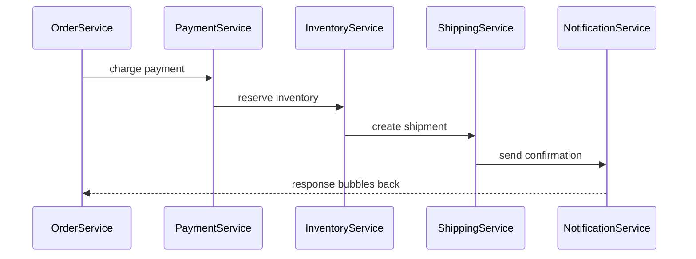
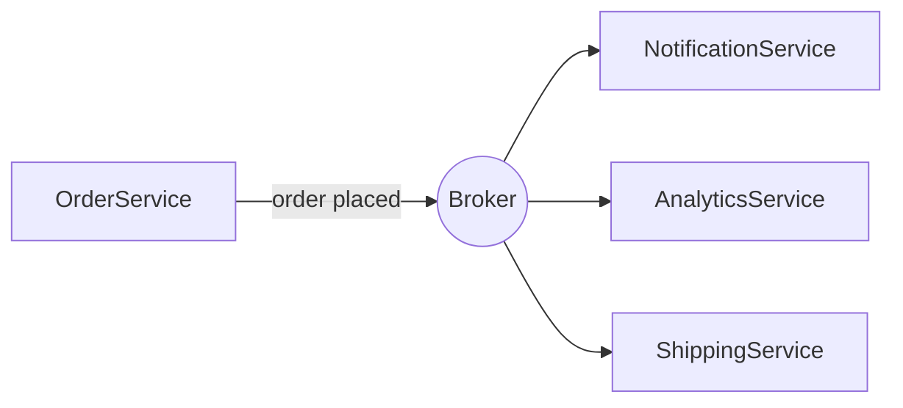
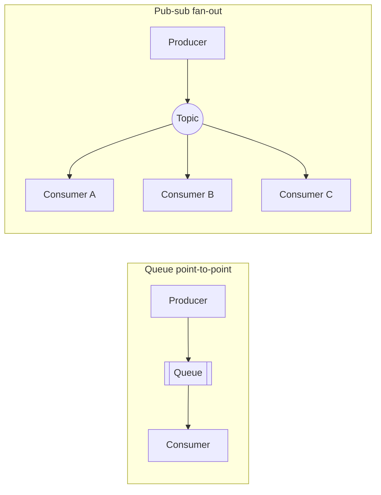

# What is a Messaging?

As systems grow, many move from a single monolith to a collection of microservices, and that split introduces a new question about how these services should talk to each other.

Messaging answers it by replacing a direct, synchronous call between two services with an asynchronous handoff through a broker, trading immediate consistency for decoupling, resilience to downstream failures, and independent scalibility.

# Starting small

Consider an e-commerce checkout built the naive way. `OrderService` calls `PaymentService`, which calls `InventoryService`, then `ShippingService` and `NotificationService`, one HTTP call after another. At small scale this works fine, traffic is low, every service responds quickly, and nobody notices the coupling.

# Where scale breaks it

The trouble starts once traffic grows or any one of those services gets slow. If `NotificationService` is down for a minute, the customer's checkout hangs or fails, even though sending an email has nothing to do with whether the order succeeded. Synchronous, direct calls tightly couple services that do not need to be coupled, and that coupling is what messaging exists to remove.

Messaging fixes this by putting a broker in the middle. `OrderService` publishes a message stating an order was placed, then moves on. Whoever cares about that event, whether notifications, analytics, or shipping, picks it up when ready, and `OrderService` never needs to know they exist.

# Why this matters

The core payoff is decoupling. Services no longer need to know about each other, only about the message format, so a new consumer such as fraud detection can be added without touching `OrderService` at all.

It also buys resilience. If `NotificationService` goes down for ten minutes, messages queue up and get processed once it recovers, so nothing is lost and nothing blocks the checkout.

It levels load, since a spike like Black Friday gets absorbed by the queue rather than overwhelming services built to handle everything synchronously in real time.

And it allows independent scaling, since `NotificationService` consumers can scale, deploy, or fail without any of that touching `OrderService`.

# The two shapes messaging comes in

- Queue (point-to-point) sends one message to one consumer, suited to a task that must happen exactly once, such as resizing an uploaded image.

- Pub-sub (fan-out) sends one message to many consumers, suited to an event several parties need to know about, such as an order being placed.

# What gets traded away

None of this comes free. Messaging buys decoupling and resilience at the cost of eventual consistency, since a notification email might arrive seconds after the order confirms rather than instantly. That makes it the wrong tool when logic needs a synchronous answer, such as whether a payment is approved right now.

It also costs debugging simplicity. A request's journey is no longer a single call stack but scattered across services and time, requiring distributed tracing to reconstruct what happened to a given order, a need direct calls never had.

And it introduces new failure modes a direct call never faced, such as a message processed twice or never picked up at all, which is exactly why delivery guarantees earn a dedicated file of their own.