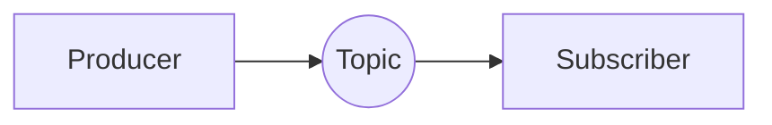
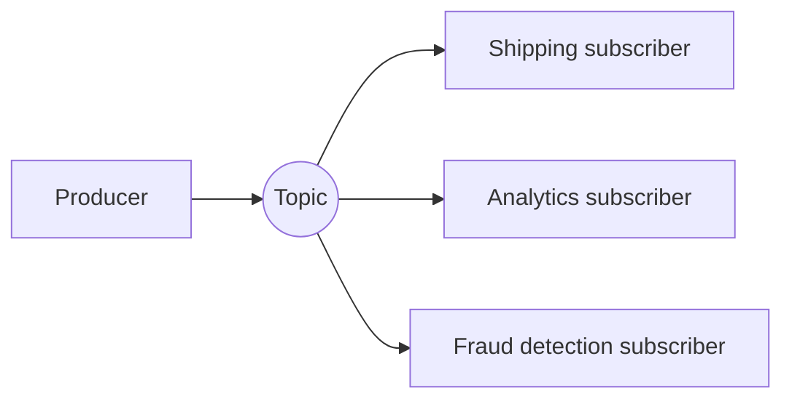

# What is Pub-Sub?

`messaging.md` introduces pub-sub as the other shape messaging comes in, one message, many consumers. This file goes deeper into how that fan-out actually works.

# Starting small

One publisher and one subscriber to a topic works the same as a queue would, a message goes in, the one subscriber picks it up.

# Where it breaks

A second team wants to know about the same event too, say analytics wants every order placed, alongside the shipping service that already consumes it. Bolting that on by having the shipping service call analytics directly reintroduces exactly the tight coupling messaging was meant to remove.

Pub-sub solves this at the broker level instead. Every subscriber to a topic gets its own copy of the message, independently of how many other subscribers exist, so adding a new one never requires touching the producer or any existing subscriber.

# Topics and Subscriptions

A topic is the named channel a producer publishes to, and a subscription is a consumer's registered interest in that topic. The broker's job is fanning out one published message to every current subscription.

Subscriptions are usually independent of each other, one slow or failing subscriber does not block or slow down delivery to the others, since each has its own copy to work through.

# Fan-out vs Competing Consumers

Fan-out means every subscriber gets every message, the pattern pub-sub is named for. Competing consumers means multiple instances of the same subscriber split the load between them, each message going to only one of them.

The two are not mutually exclusive. A single logical subscriber, the analytics service, say, can itself run multiple instances competing for messages within its own subscription, while still receiving its own full copy of the stream independently of what shipping or fraud detection receive.

# Filtering

A subscriber rarely wants every message published to a topic. Filtering lets a subscription specify a condition, only orders over a certain value, only events from a specific region, so the broker delivers a relevant subset instead of everything.

Filtering pushed to the broker means a subscriber does not have to receive and immediately discard messages it never cared about, but not every broker supports filtering with the same expressiveness.

# What gets traded away

Fan-out trades away the queue's guarantee that a message is handled exactly once by exactly one consumer, the same message is deliberately handled independently by every subscriber.

Independent subscriptions trade away a single, shared point of coordination, since nothing stops two subscribers from disagreeing about what a message means or how to react to it, that consistency has to be enforced by convention, not by the broker.

Filtering trades away simplicity for relevance, a subscription with a complex filter condition is harder to reason about and debug than one that simply receives everything published to a topic.
