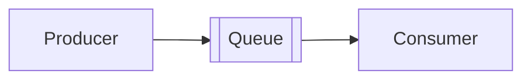
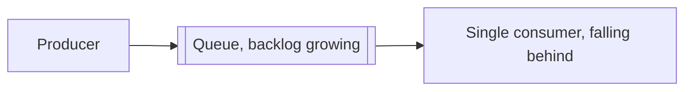

# What is a Queue?

`messaging.md` introduces queues as one of the two shapes messaging comes in, one message, one consumer. This file goes deeper into how a queue actually behaves once real traffic hits it.

# Starting small

A single consumer pulling tasks off a queue works fine when tasks arrive slower than they can be processed. A message comes in, the one consumer picks it up, processes it, and removes it.

# Where it breaks

Task volume grows past what one consumer can keep up with, and the queue starts backing up, tasks wait longer and longer before anything picks them up.

Adding more consumers reading from the same queue fixes the throughput problem, but it introduces new questions a single consumer never had to answer, what happens if a consumer crashes mid-task, what happens if the same message gets processed twice, and whether processing order matters at all once multiple consumers are involved.

# Visibility Timeout

A message is not deleted from the queue the moment a consumer picks it up. Instead, it becomes invisible to other consumers for a visibility timeout, and only gets deleted once that consumer explicitly acknowledges it finished.

If the consumer crashes before acknowledging, the message reappears in the queue once the timeout expires, and another consumer picks it up. This is what makes a queue resilient to a consumer dying mid-task, at the cost of a message potentially being processed more than once if the first consumer was actually still working when the timeout expired.

# Ordering

A standard queue does not guarantee that messages come out in the order they went in, especially once multiple consumers are pulling from it concurrently. A FIFO queue enforces strict ordering, but usually at a lower throughput ceiling, since it has to coordinate to preserve that order.

Most tasks do not actually need strict ordering, resizing an uploaded image does not care what order it happens relative to other uploads. Ordering matters when later messages depend on earlier ones actually having completed first.

# Dead-Letter Queues

A message that fails processing repeatedly, a malformed payload, a bug in the consumer, would otherwise loop forever, reappearing after every visibility timeout only to fail again.

A dead-letter queue catches a message after it has failed a configured number of times, moving it aside for a human to inspect rather than letting it clog the main queue indefinitely.

# What gets traded away

Visibility timeout trades away exactly-once delivery for resilience. A crashed consumer does not lose the message, but a slow one that finishes just after its timeout expires can cause the same message to be processed twice.

Multiple consumers trade away ordering guarantees for throughput, once more than one consumer reads from the same queue, nothing guarantees they finish in the order messages arrived.

A dead-letter queue trades away automatic recovery for visibility, a poison message stops looping forever, but it also stops processing entirely until a human looks at it.
