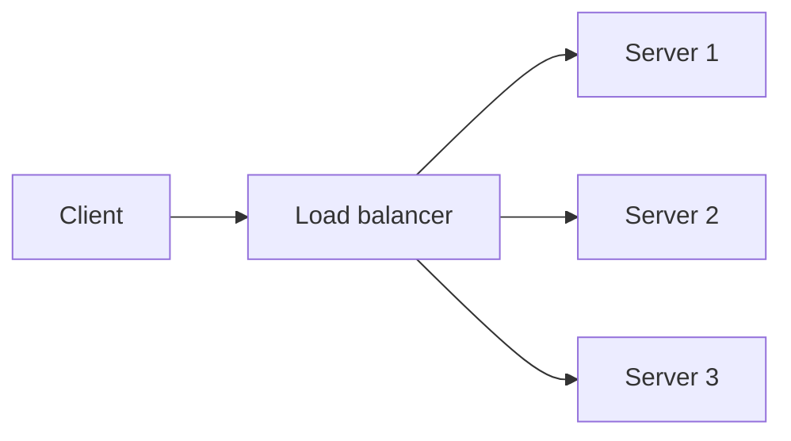
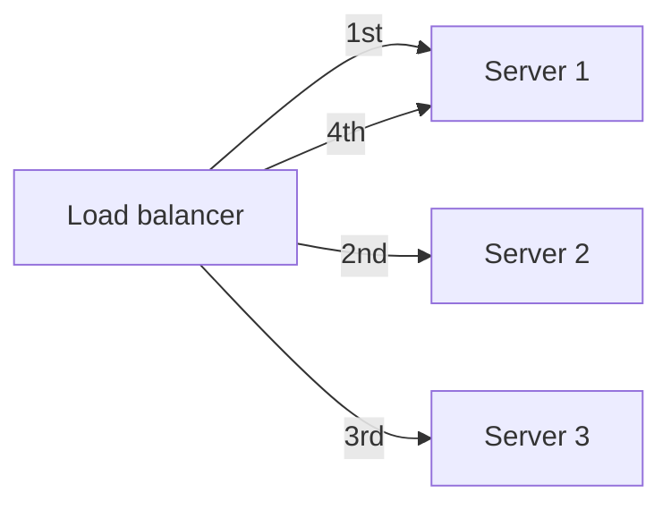
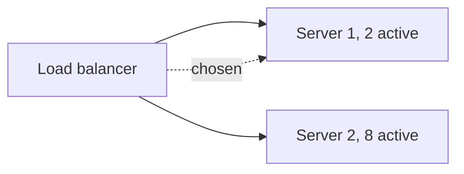

# What is Load Balancing?

A single server can only handle so many requests before it runs out of CPU, memory, or connections.

# Starting small

One server handling all traffic works fine at first. Requests come in, the server answers them, and nobody thinks about it.

# Where it breaks

Traffic grows, and that one server starts running out of capacity before it can answer everyone. Adding a second server does not fix this on its own, something still has to decide which server gets each new request.

Load balancing spreads incoming requests across multiple servers so no single one becomes the bottleneck, and so the system keeps working if any one server goes down.

# The shared problem

Every load balancing algorithm exists to answer the same underlying need, deciding which server in the pool handles the next request, without sending traffic to a server that is overloaded, slow, or already down.

Many algorithms answer that differently, but three are worth knowing well, round robin, least connections, and layer 7 routing, each trading simplicity against how much it actually knows about server load.

# Round Robin

Round robin sends each new request to the next server in the pool in turn, cycling back to the first once it reaches the last.

It requires no information about a server's current load at all, just a counter, which is what makes it simple to implement and reason about.

That simplicity is also its weakness. Round robin assumes every server has equal capacity and every request costs roughly the same to serve, an assumption that breaks the moment one server is slower or one request is far more expensive than the rest.

# Least Connections

Least connections sends a new request to whichever server currently has the fewest active connections, rather than blindly cycling through the pool.

This adapts to uneven request cost in a way round robin cannot. A server still working through a few slow requests naturally receives fewer new ones, since its connection count stays higher than an idle server's.

It still only measures connection count, not actual CPU or memory pressure, so a server bottlenecked on CPU with few open connections can still get picked as if it had capacity to spare.

# Layer 4 vs Layer 7

Layer 4 load balancing routes based on IP and port alone, without looking at the content of the request itself. AWS's Network Load Balancer and HAProxy's TCP mode both operate at this layer.

Layer 7 load balancing reads into the actual HTTP request, path, headers, cookies, before deciding where to send it. Nginx, HAProxy in HTTP mode, and AWS's Application Load Balancer all operate here.

That visibility enables routing rules layer 4 cannot express, sending `/api/*` to one pool and `/static/*` to another, for instance. It costs more, every request has to be parsed and inspected by the load balancer itself, latency and CPU that layer 4 never pays.

# Health Checks and Sticky Sessions

A health check periodically probes each backend server, and one that stops responding gets pulled out of the pool automatically, so traffic never routes to something already down.

Sticky sessions route a given client's requests to the same backend server every time, usually via a cookie. This is needed when a server holds session state in memory rather than in a shared store.

Sticky sessions solve that in-memory session problem without needing a shared store, but they work against load balancing's actual goal. A server holding a disproportionate share of long-lived sticky sessions stays hot regardless of how balanced new connections look.

# What gets traded away

Round robin trades adaptiveness for simplicity, it has no way to notice a server struggling under slow requests until a health check or timeout catches it.

Least connections trades some of that simplicity for better adaptiveness, but connection count is still just a proxy for load, not a direct measurement of it.

Layer 7 routing trades raw throughput for routing intelligence, parsing every request costs latency and CPU that layer 4 routing skips entirely.
