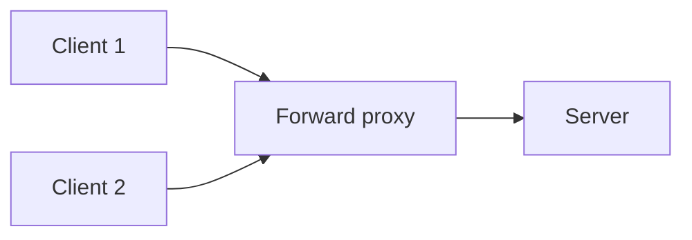
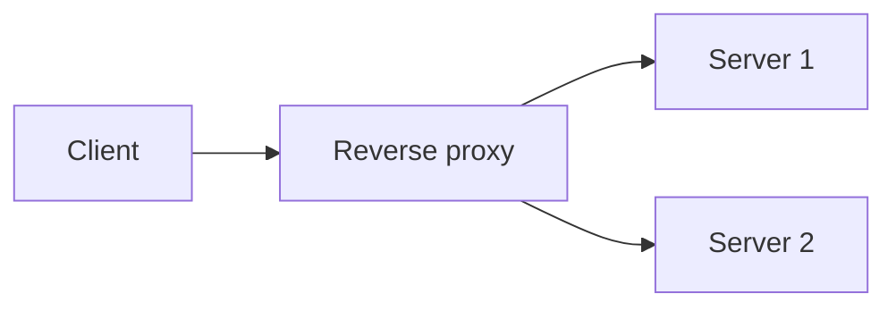

# What is a Proxy?

A proxy sits between a client and a server and relays traffic on someone's behalf. Which side it represents is what changes what it is actually for.

A forward proxy acts on behalf of the client. A reverse proxy acts on behalf of the server. Confusing the two is the most common mistake in this topic.

# Forward Proxy

A forward proxy sits in front of a group of clients, and the server on the other end sees only the proxy, not the individual client making the request.

A company routing all employee traffic through a single egress point, to enforce content filtering or hide internal client IPs, is a forward proxy. From the server's point of view, every request looks like it came from the same place.

# Reverse Proxy

A reverse proxy sits in front of a group of servers, and the client sees only the proxy, not which backend server actually handled the request.

A reverse proxy usually does more than just relay traffic. TLS termination means backend servers do not each need to manage certificates, and request routing by path or host happens in the same step, often alongside load balancing across the backend pool.

# Tech Stacks

Squid and mitmproxy answer the forward case, Nginx, HAProxy, Envoy, Traefik, and Caddy answer the reverse case, and the first real decision, forward or reverse, already narrows the field before any tool-specific tradeoff comes into play.

| Tool | Side | Defining trait | Fits | Trades away |
|---|---|---|---|---|
| Squid | Forward | Caches outbound traffic and enforces content filtering rules at scale | An office network controlling what thousands of employees can reach | Per-request visibility, it is built to police traffic for many users, not to show a human what one request contains |
| mitmproxy | Forward | Decrypts and displays traffic in real time for inspection | Debugging a single application's outbound calls | Squid's scale, it is not meant to sit in front of thousands of users |
| Nginx | Reverse | Started as a web server that grew reverse-proxy and load-balancing features on top | A team that wants one tool to serve static content and reverse proxy dynamic requests | Envoy's dynamic configuration and HAProxy's narrower throughput focus, for being a comfortable, mature default |
| HAProxy | Reverse | Strips the web-server layer away and focuses purely on proxying and load balancing | Deployments where raw throughput and load-balancing algorithm flexibility matter more than serving content directly | Nginx's convenience of also serving static content |
| Envoy | Reverse | Configured dynamically through an API, exposing retries, timeouts, and circuit breaking as config rather than code | A service mesh like Istio, where routing rules need to change constantly as services scale up and down | Simplicity, its dynamic configuration model and feature surface are more to learn than a static config file |
| Traefik | Reverse | Auto-discovers services by watching Docker or Kubernetes directly | A containerized environment where routing rules should update automatically as services deploy | Fine-grained manual control, a setup leaning entirely on auto-discovery can misbehave if discovery does |
| Caddy | Reverse | Automatic HTTPS, provisioning and renewing TLS certificates with zero configuration | A small project that wants a secure reverse proxy running quickly, without managing certificates by hand | Fine-grained configuration control that HAProxy or Envoy offer |

Envoy deserves a second look beyond the table. Its API-driven configuration is what let it become the default proxy inside service meshes specifically, a static Nginx or HAProxy config file is not built to change on every deploy, but a mesh with services scaling constantly needs exactly that.

# What gets traded away

A forward proxy protects and represents the client's identity, adding a layer every client request has to pass through. That also makes it a single point of failure for every client behind it.

A reverse proxy protects and represents the server's identity, centralizing TLS and routing conveniently. It becomes a single point of failure for every backend server behind it unless the proxy layer itself is made redundant.
