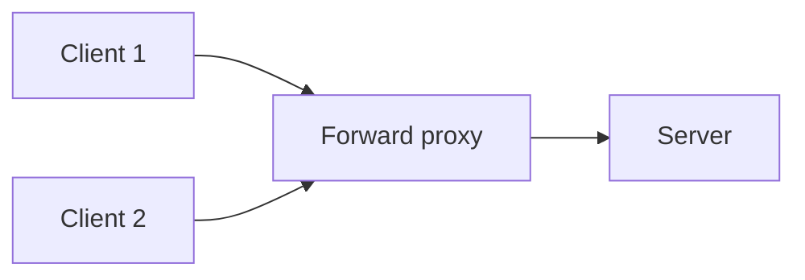
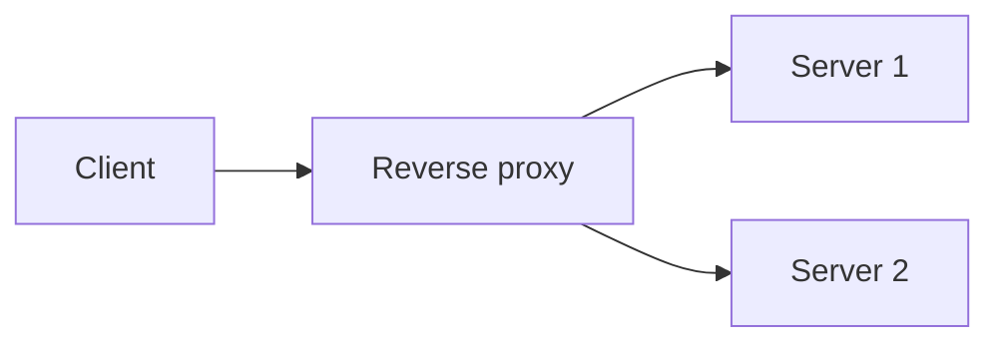

# What is a Proxy?

A proxy sits between a client and a server and relays traffic on someone's behalf. Which side it represents is what changes what it is actually for.

A forward proxy acts on behalf of the client. A reverse proxy acts on behalf of the server. Confusing the two is the most common mistake in this topic.

# Forward Proxy

A forward proxy sits in front of a group of clients, and the server on the other end sees only the proxy, not the individual client making the request.

A company routing all employee traffic through a single egress point, to enforce content filtering or hide internal client IPs, is a forward proxy. From the server's point of view, every request looks like it came from the same place.

# Reverse Proxy

A reverse proxy sits in front of a group of servers, and the client sees only the proxy, not which backend server actually handled the request.

A reverse proxy usually does more than just relay traffic. TLS termination means backend servers do not each need to manage certificates, and request routing by path or host happens in the same step, often alongside load balancing across the backend pool.

# Tech Stacks

Different real tools answer the forward and reverse cases above. Squid and mitmproxy cover the forward side, Nginx, HAProxy, Envoy, Traefik, and Caddy cover the reverse side, each built around a different priority.

## Squid

Squid is the classic open-source forward proxy, built for caching outbound traffic and enforcing content filtering rules at scale, the natural fit for an office network controlling what thousands of employees can reach.

## mitmproxy

mitmproxy trades Squid's scale focus for inspection. It is built to decrypt and display traffic in real time, which makes it the tool of choice for debugging a single application's outbound calls rather than policing an entire network.

## Nginx

Nginx started as a web server that grew reverse-proxy and load-balancing features on top, which is why it is still often the default, mature, fast, and just as comfortable serving static files as it is proxying to a backend pool.

## HAProxy

HAProxy strips that web-server layer away entirely and focuses purely on proxying and load balancing, which is what makes it the choice when raw throughput and fine-grained load-balancing algorithms matter more than serving content directly.

## Envoy

Envoy is built around dynamic configuration through an API rather than a static config file, and exposes fine-grained traffic control, retries, timeouts, circuit breaking, as configuration rather than code. That is why it became the standard proxy inside service meshes like Istio, where configuration needs to change constantly as services scale up and down.

## Traefik

Traefik leans into auto-discovery, watching Docker or Kubernetes directly and updating its routing rules as containers come and go, without a human manually editing a config file for every new service.

## Caddy

Caddy's defining feature is automatic HTTPS, provisioning and renewing TLS certificates with zero configuration, which makes it the fastest path to a secure reverse proxy for a small project that does not want to manage certificates by hand.

# How to choose

The first decision is always forward versus reverse, whose identity actually needs representing. Protecting or controlling a group of clients calls for a forward proxy, fronting a group of servers calls for a reverse proxy. Within each side, the real choice comes down to which tool's priorities match the job.

## Squid

Squid fits a network egress point where caching and content filtering for many users matters more than inspecting any single request in detail.

## mitmproxy

mitmproxy fits debugging or testing a single application's outbound traffic, not managing traffic for an entire network.

## Nginx

Nginx fits a team that wants one tool to serve static content and reverse proxy dynamic requests, without needing Envoy's dynamic configuration or HAProxy's narrower throughput focus.

## HAProxy

HAProxy fits a deployment where load-balancing performance and algorithm flexibility matter more than also serving content directly.

## Envoy

Envoy fits a service mesh or a system where routing rules, retries, and circuit breaking need to change dynamically through an API rather than a static config file.

## Traefik

Traefik fits a containerized environment, Docker or Kubernetes, where routing rules should update automatically as services are deployed, without manual config edits.

## Caddy

Caddy fits a small project that wants a secure reverse proxy running quickly, without managing TLS certificates by hand.

# What gets traded away

A forward proxy protects and represents the client's identity, adding a layer every client request has to pass through. That also makes it a single point of failure for every client behind it.

A reverse proxy protects and represents the server's identity, centralizing TLS and routing conveniently. It becomes a single point of failure for every backend server behind it unless the proxy layer itself is made redundant.

## Squid

Squid trades away per-request visibility for scale. It is built to police traffic for many users at once, not to show a human what a single request actually contains.

## mitmproxy

mitmproxy trades away that same scale, it is not meant to sit in front of thousands of users, only to inspect traffic for whoever is debugging it.

## Nginx

Nginx trades away Envoy's dynamic, API-driven configuration and HAProxy's narrower, higher-throughput focus for being a comfortable, mature default that does a bit of everything.

## HAProxy

HAProxy trades away the web-serving convenience Nginx offers. It expects something else to serve static content if that is needed at all.

## Envoy

Envoy trades away simplicity, its dynamic configuration model and feature surface are more to learn than a static Nginx or HAProxy config file.

## Traefik

Traefik trades away fine-grained manual control for automation. A setup that depends entirely on auto-discovery can behave unpredictably if that discovery mechanism misbehaves.

## Caddy

Caddy trades away some of the fine-grained configuration control HAProxy or Envoy offer, in exchange for near-zero setup effort.
