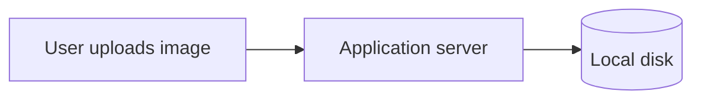
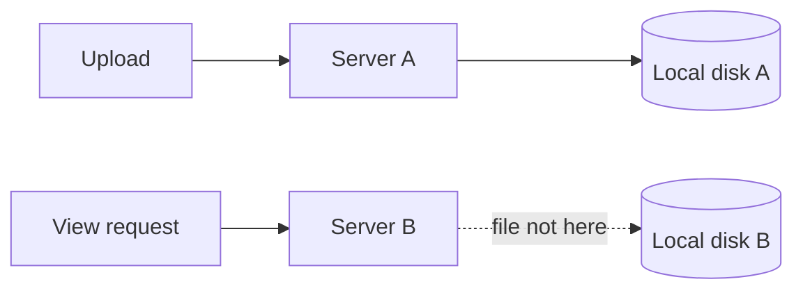
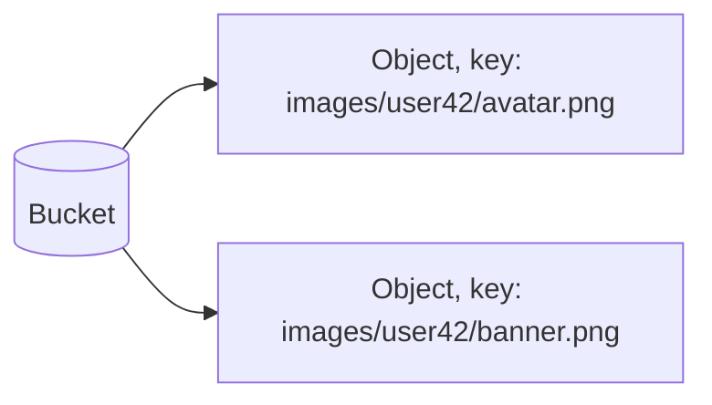

# What is Object Storage?

Object storage holds data as whole, immutable objects addressed by a key, rather than as files inside a directory tree or rows inside a database table.

# Starting small

Consider an application saving user-uploaded images directly to the local disk of the server handling the upload, one file per image, organized into folders. A handful of uploads a day is easy to serve back, the file is right there on disk.

At that scale this works fine, disk space is cheap, and there is only one server to look at when something goes wrong.

# Where it breaks

The application grows past a single server, and now uploads land on whichever server happened to handle that request, while a later request to view the image might hit a different server entirely, one that never received the file.

A shared network drive papers over this for a while, but it becomes a single point of failure and a throughput ceiling of its own, every server now depends on one drive that was never built to serve traffic at that scale, and disk failure means losing every file it held.

Object storage solves this by moving files out of any one server's local disk entirely, into a separate, distributed service built to store and serve objects at scale, replicated across multiple machines so no single disk failure loses anything.

# Buckets, Keys, and Objects

A bucket is the top-level container objects live in, roughly analogous to a drive or top-level folder. An object is the actual data being stored, along with metadata like its content type, and a key is the unique string that identifies it within a bucket, often written to look like a file path even though no real directory structure exists underneath it.

Retrieving an object only ever needs the bucket and its key, there is no need to know which physical machine actually holds the data.

# Immutability and Versioning

An object cannot be partially modified the way a row in a database can. Changing an object means uploading a new one under the same key, replacing it entirely rather than editing it in place.

Versioning keeps prior copies of an object around after it has been overwritten or deleted, so an accidental overwrite or deletion can be undone by restoring an earlier version instead of the data being permanently gone.

# Durability

Durability describes the odds that a stored object survives over time without being lost to hardware failure. Object storage achieves very high durability by replicating every object across multiple devices, and often multiple physical locations, so more than one simultaneous failure is required to actually lose it.

This is a different guarantee from availability, which describes whether the object can be fetched right now. An object can be perfectly durable, safely replicated, and still briefly unavailable during an outage.

# What gets traded away

Object storage trades away the fine-grained editing a filesystem or database offers, an object is replaced wholesale rather than modified in place, which fits large, mostly-static files far better than data that changes frequently in small pieces.

It also trades away the low latency of local disk, every read and write is a network call to the storage service, slower than reading a file already sitting on the same machine handling the request.
