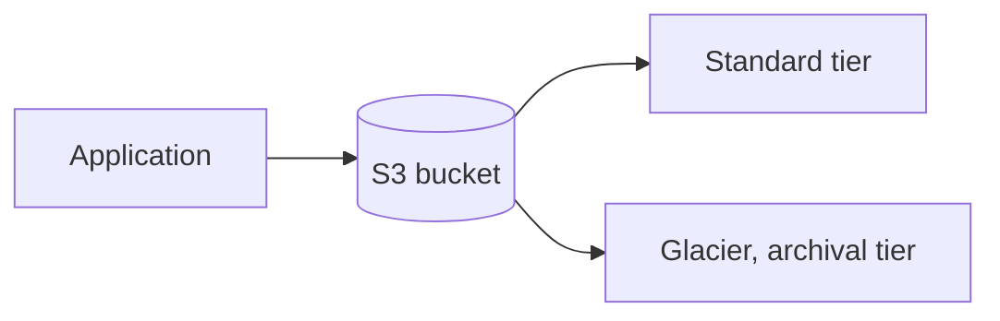
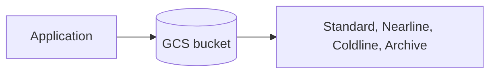
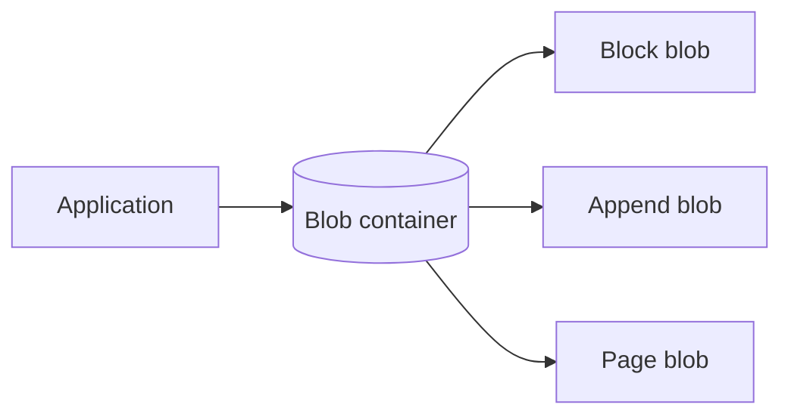
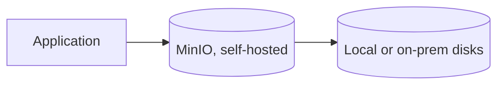

# What are Object Stores?

`object-storage.md` covers buckets, keys, and durability in the abstract. This file grounds that theory in the object stores teams actually choose between.

# The shared problem

Every object store answers the same underlying need, storing and serving objects durably at scale, addressed by a key rather than a filesystem path. Where they differ is who runs the infrastructure, and how tightly the store is bound to one cloud.

# Amazon S3

S3 is AWS's object storage service, and the one most other object stores measure themselves against, including MinIO, which speaks S3's own API.



S3's conventions center on tiering and deep AWS integration:

- Storage classes, Standard, Infrequent Access, Glacier, let the same bucket hold both actively-served objects and rarely-accessed archives at very different costs, without moving the data to a different service.
- Bucket policies and IAM together control access down to individual keys or prefixes, the same permission model the rest of AWS uses.
- Event notifications can trigger a Lambda function directly on an object being created or deleted, wiring storage into the rest of an AWS-based pipeline with no separate polling needed.

Uploading an object looks like this.

```python
s3.put_object(Bucket="user-uploads", Key="images/user42/avatar.png", Body=image_bytes)
```

S3's storage classes and native AWS event integration make it the natural default for a system already built on AWS, but that depth of integration is also what makes migrating away from it later more work than a plain key-value store would suggest.

# Google Cloud Storage

GCS is Google Cloud's equivalent, distinguished by a single, uniform API across storage classes rather than S3's more separated tier model.



GCS's conventions favor that uniformity:

- All storage classes share the same API and namespace, moving an object between Standard and Archive is a metadata change rather than a different set of calls.
- Object lifecycle rules automatically transition or delete objects based on age or access pattern, configured once at the bucket level.
- Strong global consistency was available in GCS earlier than in some competitors, meaning a write is immediately visible to every subsequent read, not just eventually.

Uploading an object looks like this.

```python
bucket.blob("images/user42/avatar.png").upload_from_string(image_bytes)
```

GCS's uniform API is simpler to reason about across storage classes than S3's more separated tiers, but it carries the same deep tie to its own cloud, natural for a system already built on Google Cloud, extra migration work otherwise.

# Azure Blob Storage

Azure Blob Storage is Microsoft's equivalent, organized around three blob types rather than a single generic object type, block blobs for most files, append blobs for data that only ever grows at the end, and page blobs for random-access data like virtual disks.



Azure Blob Storage's conventions follow from that typed model:

- Block blobs cover the common case, images, documents, backups, uploaded and read as a whole or in chunks.
- Append blobs are optimized specifically for appending, log files being written to continuously without needing to rewrite the whole object.
- Page blobs support random reads and writes at fixed offsets, the type Azure's own virtual machine disks are built on top of.

Uploading a block blob looks like this.

```python
blob_client.upload_blob(image_bytes, blob_type="BlockBlob")
```

Azure Blob Storage's typed blobs fit workloads with a clear shape, logs, disks, plain files, ahead of time, but a system already built on AWS or Google Cloud gets little benefit from switching just for that distinction.

# MinIO

MinIO is self-hosted, open-source object storage that implements the S3 API, letting an application written against S3 run unmodified against infrastructure a team runs itself.



MinIO's conventions center on that self-hosted, S3-compatible design:

- Speaking the S3 API means existing SDKs and tools built for S3 work against MinIO with only an endpoint URL changed.
- Running on a team's own hardware keeps data on-premises entirely, relevant when data residency or compliance rules require it.
- Erasure coding, rather than simple replication, protects against disk and node failure while using less raw storage overhead than storing full copies.

Uploading an object looks the same as it does for S3.

```python
minio_client.put_object("user-uploads", "images/user42/avatar.png", image_bytes, len(image_bytes))
```

MinIO's S3 compatibility removes lock-in to any one cloud and fits data that must stay on-premises, but running it means owning the operational work, hardware, upgrades, failure recovery, that S3, GCS, and Azure Blob Storage handle as a managed service.

# How to choose

Amazon S3, Google Cloud Storage, and Azure Blob Storage each fit best when the surrounding system already runs on that same cloud, the tightest integration comes from staying within one provider rather than picking a store in isolation.

MinIO fits data that has to stay on-premises for compliance or residency reasons, or a team that wants to avoid cloud lock-in while keeping S3-compatible tooling.

# What gets traded away

S3, GCS, and Azure Blob Storage all trade away portability for deep integration with their own cloud's other services, event triggers, IAM, lifecycle tooling, that only pay off fully within that same provider.

MinIO trades away that managed convenience for control, no vendor lock-in and full data residency, but every operational concern, scaling, failure recovery, upgrades, falls on whoever runs it.
