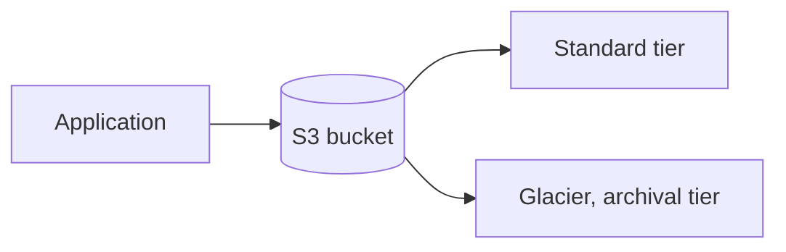
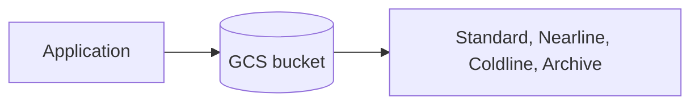
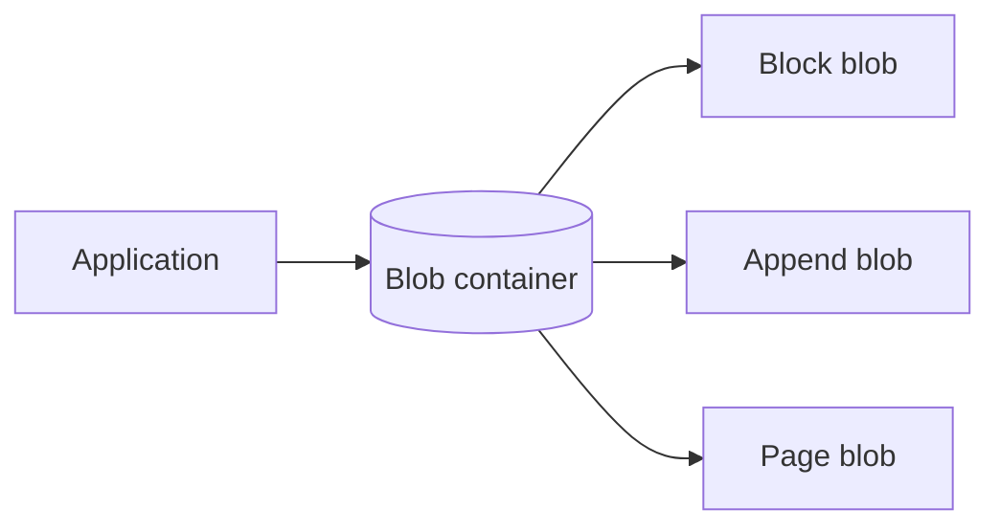
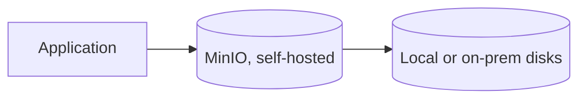

# What are Object Stores?

`object-storage.md` covers buckets, keys, and durability in the abstract. This file grounds that theory in the object stores teams actually choose between.

# The shared problem

Every object store answers the same underlying need, storing and serving objects durably at scale, addressed by a key rather than a filesystem path. Where they differ is who runs the infrastructure, and how tightly the store is bound to one cloud.

One question exposes that difference more concretely than durability numbers do. Upload the same key twice in a row, overwriting it, and ask what the very next read returns. That is a consistency guarantee, and not every store has always given the same answer.

# Amazon S3

S3 is AWS's object storage service, and the one most other object stores measure themselves against, including MinIO, which speaks S3's own API.



Storage classes and event-driven integration are what set its conventions.

- Storage classes, Standard, Infrequent Access, Glacier, let the same bucket hold both actively-served objects and rarely-accessed archives at very different costs, without moving the data to a different service.
- Bucket policies and IAM together control access down to individual keys or prefixes, the same permission model the rest of AWS uses.
- Event notifications can trigger a Lambda function directly on an object being created or deleted, wiring storage into the rest of an AWS-based pipeline with no separate polling needed.

For years, S3's answer to the overwrite question was not what most engineers assumed. New objects were read-after-write consistent from early on, but an overwrite of an existing key, or a delete, was only eventually consistent. A read immediately afterward could still return the old version or a 404.

Real infrastructure grew up around that gap. EMRFS Consistent View and the open-source S3Guard both existed purely to paper over it for tools like Hadoop that assumed a listing reflected reality.

```python
s3.put_object(Bucket="user-uploads", Key="images/user42/avatar.png", Body=image_bytes)
```

AWS closed that gap for good in December 2020. Every PUT, GET, and LIST is now strongly consistent by default, no configuration required, though plenty of production Hadoop or EMR pipelines written before then still carry a consistency workaround that is now dead weight.

S3's depth of AWS integration makes it the natural default for a system already built there, but that same depth is what makes migrating away from it later more work than a plain key-value store would suggest.

# Google Cloud Storage

GCS is Google Cloud's equivalent, distinguished by a single, uniform API across storage classes rather than S3's more separated tier model. On the overwrite question it never had S3's history to work around, strong consistency for both reads and listings was there from early on.



That uniformity carries through everything else about it.

- All storage classes share the same API and namespace, moving an object between Standard and Archive is a metadata change rather than a different set of calls.
- Object lifecycle rules automatically transition or delete objects based on age or access pattern, configured once at the bucket level.
- Strong consistency covers every operation uniformly, rather than reads and overwrites following different rules.

```python
bucket.blob("images/user42/avatar.png").upload_from_string(image_bytes)
```

GCS's uniform API is simpler to reason about across storage classes than S3's more separated tiers, but it carries the same deep tie to its own cloud, natural for a system already built on Google Cloud, extra migration work otherwise.

# Azure Blob Storage

Azure Blob Storage is Microsoft's equivalent, also strongly consistent on overwrite, and organized around three blob types rather than a single generic object type.



That typed model is the whole point.

- Block blobs cover the common case, images, documents, backups, uploaded and read as a whole or in chunks.
- Append blobs are optimized specifically for appending, a log file being written to continuously without needing to rewrite the whole object.
- Page blobs support random reads and writes at fixed offsets, the type Azure's own virtual machine disks are built on top of.

Uploading the common case, a block blob, needs only one call.

```python
blob_client.upload_blob(image_bytes, blob_type="BlockBlob")
```

That typed model fits workloads with a clear shape, logs, disks, plain files, known ahead of time, but a system already built on AWS or Google Cloud gets little benefit from switching just for that distinction.

# MinIO

MinIO is self-hosted, open-source object storage that implements the S3 API, letting an application written against S3 run unmodified against infrastructure a team runs itself.



That self-hosted, S3-compatible design shows up in three ways.

- Speaking the S3 API means existing SDKs and tools built for S3 work against MinIO with only an endpoint URL changed.
- Running on a team's own hardware keeps data on-premises entirely, relevant when data residency or compliance rules require it.
- Erasure coding, rather than simple replication, protects against disk and node failure while using less raw storage overhead than storing full copies.

The overwrite question barely applies here the way it does for a globally distributed service. A self-hosted cluster reads its own most recent write immediately, since there is no multi-region replication lag to reconcile in the first place.

```python
minio_client.put_object("user-uploads", "images/user42/avatar.png", image_bytes, len(image_bytes))
```

MinIO's S3 compatibility removes lock-in to any one cloud and fits data that must stay on-premises, but running it means owning the operational work, hardware, upgrades, failure recovery, that S3, GCS, and Azure Blob Storage handle as a managed service.

# How to choose

Amazon S3, Google Cloud Storage, and Azure Blob Storage each fit best when the surrounding system already runs on that same cloud, the tightest integration comes from staying within one provider rather than picking a store in isolation.

MinIO fits data that has to stay on-premises for compliance or residency reasons, or a team that wants to avoid cloud lock-in while keeping S3-compatible tooling.

# What gets traded away

S3, GCS, and Azure Blob Storage all trade away portability for deep integration with their own cloud's other services, event triggers, IAM, lifecycle tooling, that only pay off fully within that same provider.

MinIO trades away that managed convenience for control, no vendor lock-in and full data residency, but every operational concern, scaling, failure recovery, upgrades, falls on whoever runs it.
